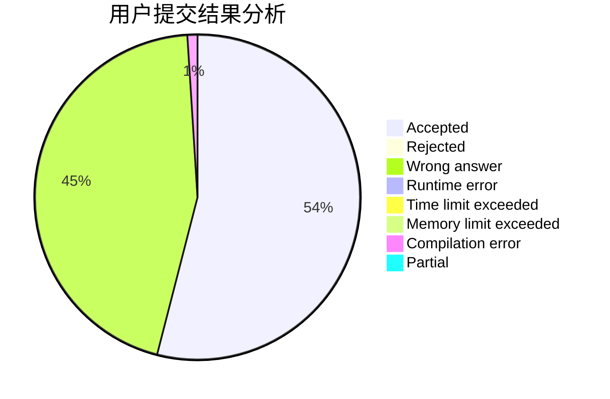
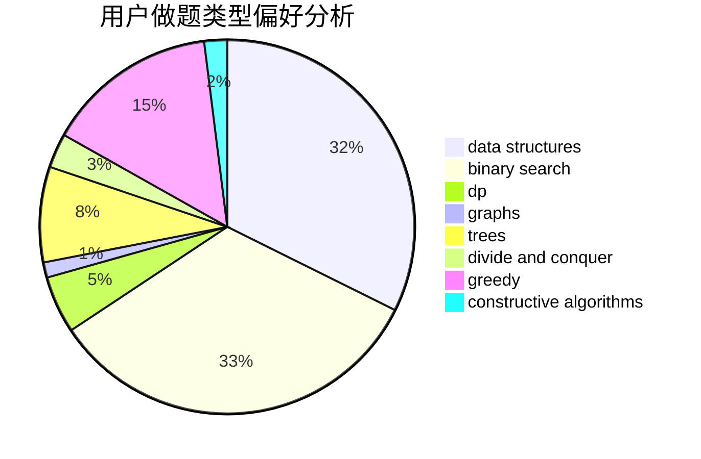
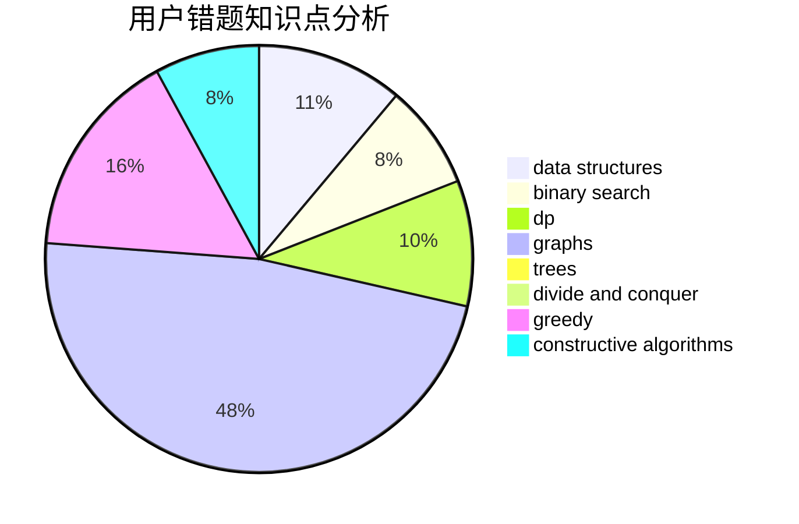

# Heart_Blue

<!-- tabs:start -->

#### **用户提交结果分析**

#### **用户做题类型偏好分析**

#### **用户错题知识点分析**

<!-- tabs:end -->
# 推荐题目
[1184E3](https://codeforces.com/contest/1184E/problem/3)		data structures,
                        dsu,
                        graphs,
                        trees		  
[864D](https://codeforces.com/contest/864/problem/D)		greedy,
                        implementation,
                        math		  
[286B](https://codeforces.com/contest/286/problem/B)		implementation		  
[691A](https://codeforces.com/contest/691/problem/A)		implementation		  
[1509B](https://codeforces.com/contest/1509/problem/B)		greedy		  
[1147D](https://codeforces.com/contest/1147/problem/D)		dfs and similar,
                        graphs		  
[200A](https://codeforces.com/contest/200/problem/A)		brute force,
                        data structures		  
[819B](https://codeforces.com/contest/819/problem/B)		data structures,
                        implementation,
                        math		  
[1256E](https://codeforces.com/contest/1256/problem/E)		dp,
                        greedy,
                        sortings		  
[725G](https://codeforces.com/contest/725/problem/G)		nan		  
