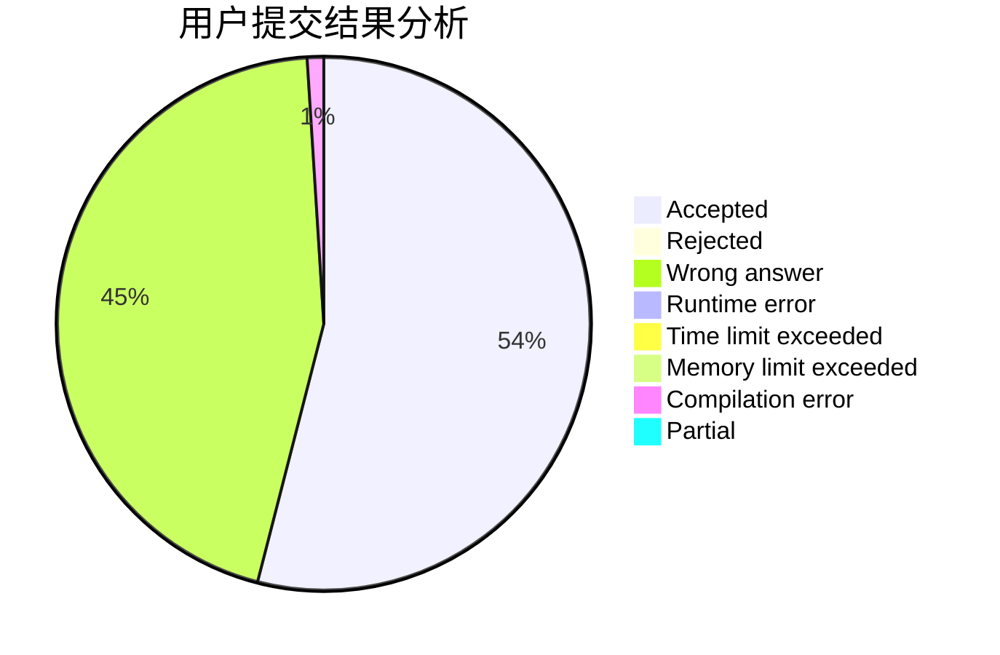
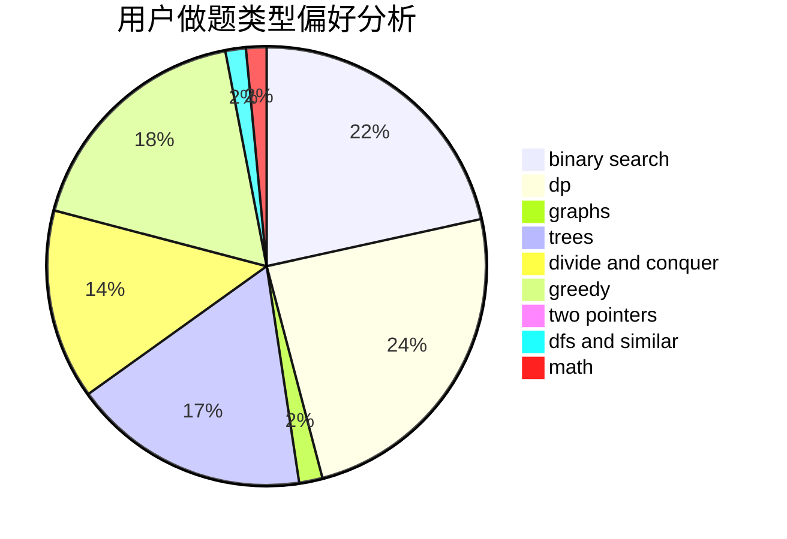

# Heart_Blue

<!-- tabs:start -->

#### **用户提交结果分析**

#### **用户做题类型偏好分析**

<!-- tabs:end -->
# 推荐题目
[1188E](https://codeforces.com/contest/1188/problem/E)
[884A](https://codeforces.com/contest/884/problem/A)
[300C](https://codeforces.com/contest/300/problem/C)
[710E](https://codeforces.com/contest/710/problem/E)
[15D](https://codeforces.com/contest/15/problem/D)
[1149C](https://codeforces.com/contest/1149/problem/C)
[225C](https://codeforces.com/contest/225/problem/C)
[839B](https://codeforces.com/contest/839/problem/B)
[12641](https://codeforces.com/contest/1264/problem/1)
[744B](https://codeforces.com/contest/744/problem/B)
