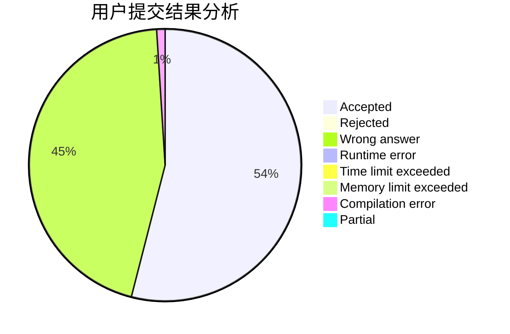
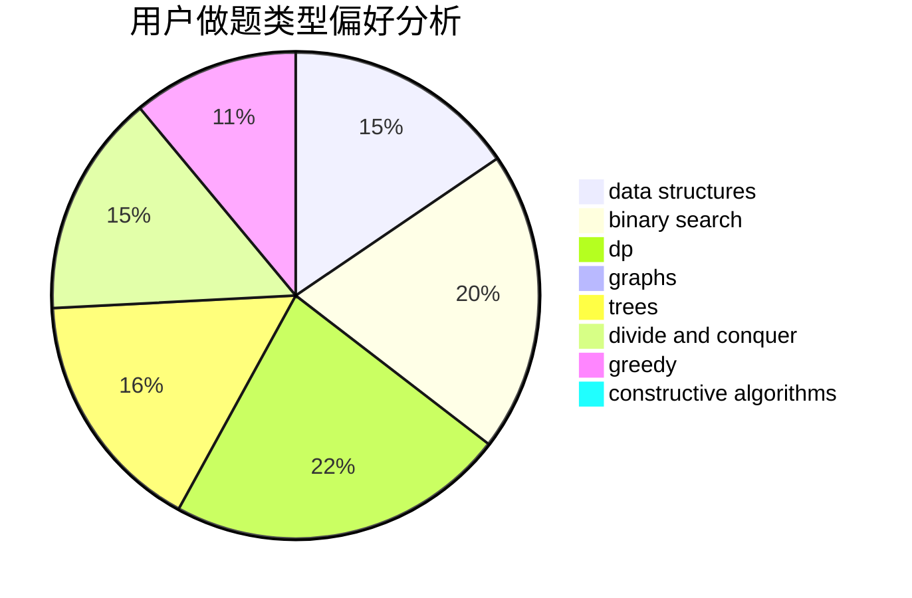
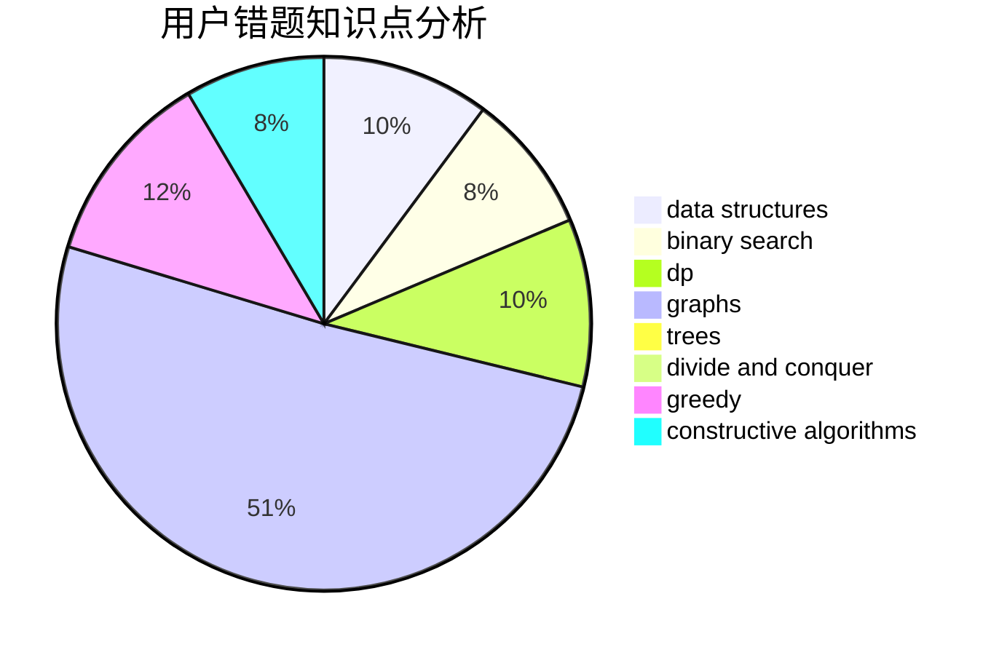

# Heart_Blue

<!-- tabs:start -->

#### **用户提交结果分析**

#### **用户做题类型偏好分析**

#### **用户错题知识点分析**

<!-- tabs:end -->
# 推荐题目
[1188E](https://codeforces.com/contest/1188/problem/E)		combinatorics		  
[884A](https://codeforces.com/contest/884/problem/A)		implementation		  
[300C](https://codeforces.com/contest/300/problem/C)		brute force,
                        combinatorics		  
[710E](https://codeforces.com/contest/710/problem/E)		dfs and similar,
                        dp		  
[15D](https://codeforces.com/contest/15/problem/D)		data structures,
                        implementation,
                        sortings		  
[1149C](https://codeforces.com/contest/1149/problem/C)		data structures,
                        implementation,
                        trees		  
[225C](https://codeforces.com/contest/225/problem/C)		dp,
                        matrices		  
[839B](https://codeforces.com/contest/839/problem/B)		brute force,
                        greedy,
                        implementation		  
[12641](https://codeforces.com/contest/1264/problem/1)		dsu,graphs,sortings,trees		  
[744B](https://codeforces.com/contest/744/problem/B)		bitmasks,
                        divide and conquer,
                        interactive		  
