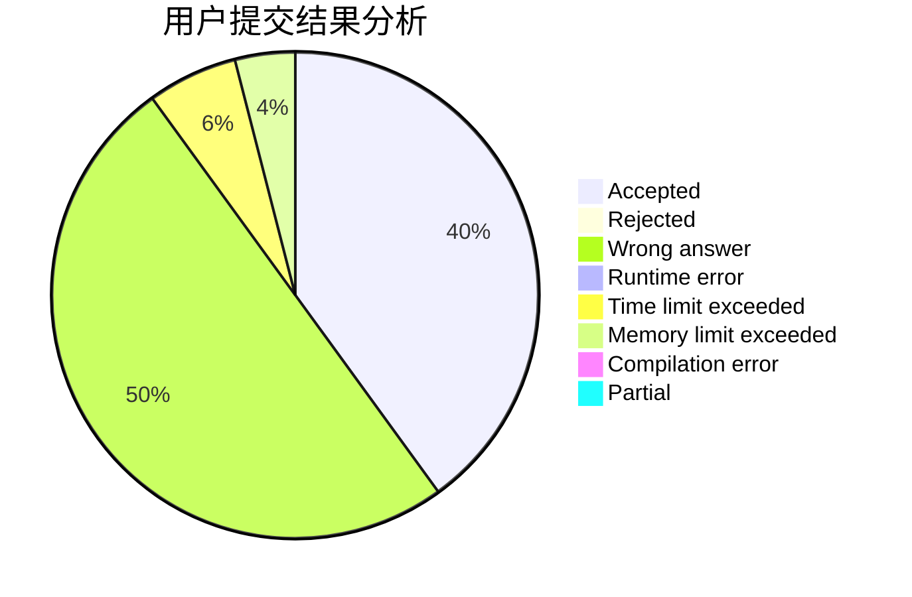
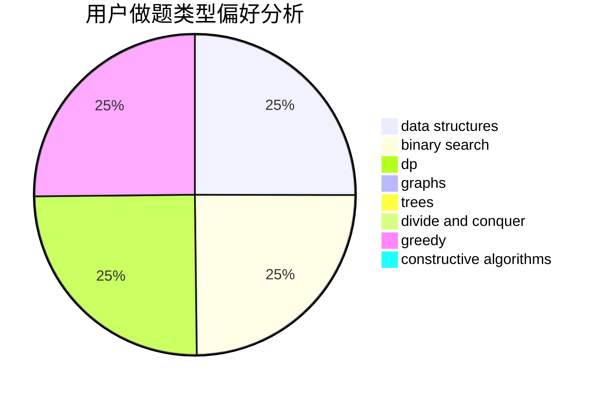
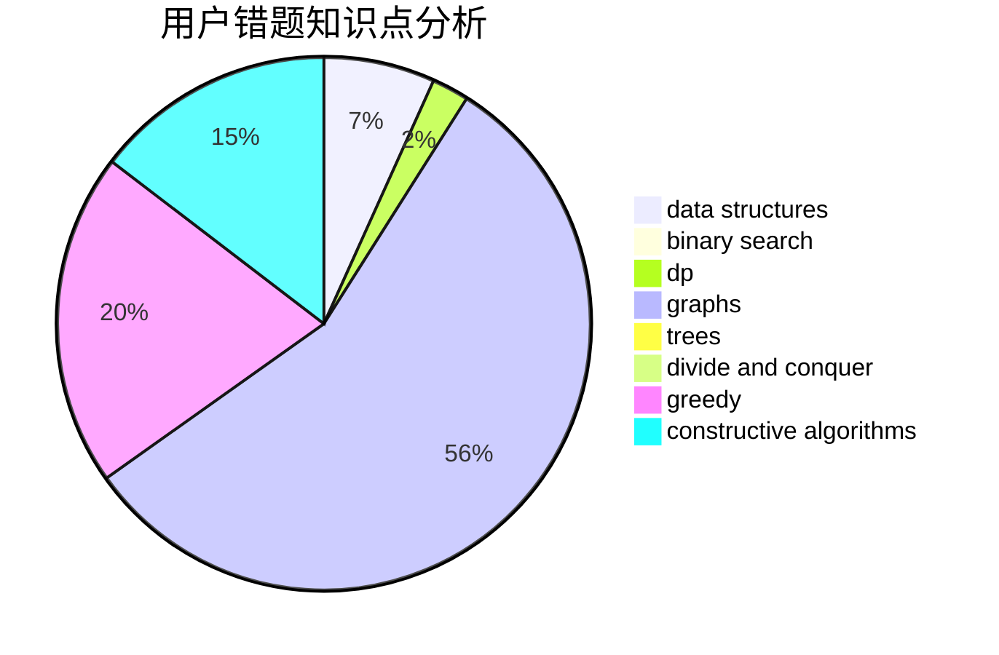

# Hearth

<!-- tabs:start -->

#### **用户提交结果分析**

#### **用户做题类型偏好分析**

#### **用户错题知识点分析**

<!-- tabs:end -->
# 推荐题目
[1081C](https://codeforces.com/contest/1081/problem/C)		combinatorics,
                        dp,
                        math		  
[865A](https://codeforces.com/contest/865/problem/A)		constructive algorithms		  
[689E](https://codeforces.com/contest/689/problem/E)		combinatorics,
                        data structures,
                        dp,
                        geometry,
                        implementation		  
[176D](https://codeforces.com/contest/176/problem/D)		dp		  
[516D](https://codeforces.com/contest/516/problem/D)		dfs and similar,
                        dp,
                        dsu,
                        trees,
                        two pointers		  
[115B](https://codeforces.com/contest/115/problem/B)		greedy,
                        sortings		  
[873F](https://codeforces.com/contest/873/problem/F)		dsu,
                        string suffix structures,
                        strings		  
[1491A](https://codeforces.com/contest/1491/problem/A)		brute force,
                        greedy,
                        implementation		  
[567F](https://codeforces.com/contest/567/problem/F)		dp		  
[1359D](https://codeforces.com/contest/1359/problem/D)		data structures,
                        dp,
                        implementation,
                        two pointers		  
