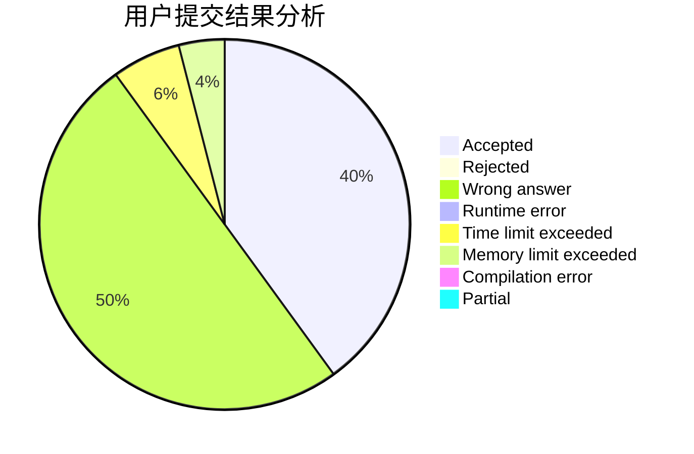
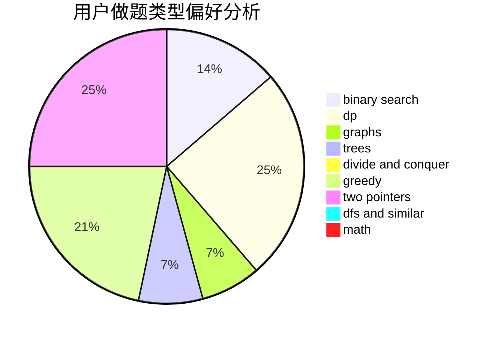

# Hearth

<!-- tabs:start -->

#### **用户提交结果分析**

#### **用户做题类型偏好分析**

<!-- tabs:end -->
# 推荐题目
[1081F](https://codeforces.com/contest/1081/problem/F)
[884D](https://codeforces.com/contest/884/problem/D)
[70E](https://codeforces.com/contest/70/problem/E)
[201C](https://codeforces.com/contest/201/problem/C)
[543D](https://codeforces.com/contest/543/problem/D)
[11631](https://codeforces.com/contest/1163/problem/1)
[894D](https://codeforces.com/contest/894/problem/D)
[1499G](https://codeforces.com/contest/1499/problem/G)
[587E](https://codeforces.com/contest/587/problem/E)
[1367C](https://codeforces.com/contest/1367/problem/C)
