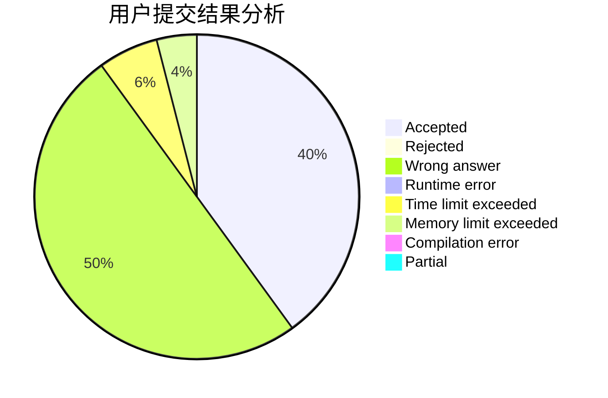
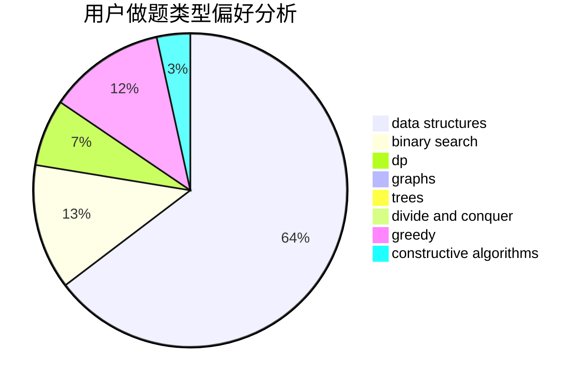
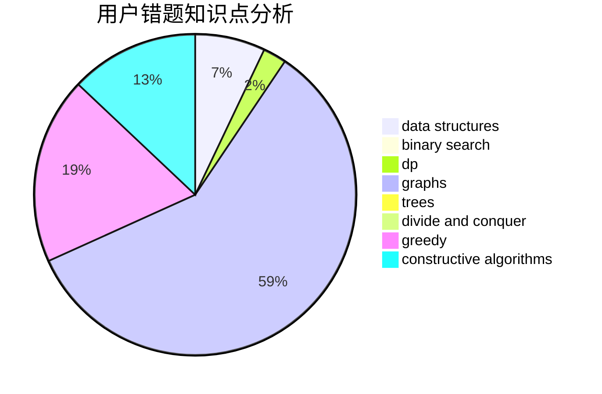

# Hearth

<!-- tabs:start -->

#### **用户提交结果分析**

#### **用户做题类型偏好分析**

#### **用户错题知识点分析**

<!-- tabs:end -->
# 推荐题目
[1081F](https://codeforces.com/contest/1081/problem/F)		constructive algorithms,
                        implementation,
                        interactive		  
[884D](https://codeforces.com/contest/884/problem/D)		data structures,
                        greedy		  
[70E](https://codeforces.com/contest/70/problem/E)		dp,
                        implementation,
                        trees		  
[201C](https://codeforces.com/contest/201/problem/C)		dp		  
[543D](https://codeforces.com/contest/543/problem/D)		dp,
                        trees		  
[11631](https://codeforces.com/contest/1163/problem/1)		dsu,graphs,sortings,trees		  
[894D](https://codeforces.com/contest/894/problem/D)		brute force,
                        data structures,
                        trees		  
[1499G](https://codeforces.com/contest/1499/problem/G)		data structures,
                        graphs,
                        interactive		  
[587E](https://codeforces.com/contest/587/problem/E)		data structures		  
[1367C](https://codeforces.com/contest/1367/problem/C)		constructive algorithms,
                        greedy,
                        math		  
