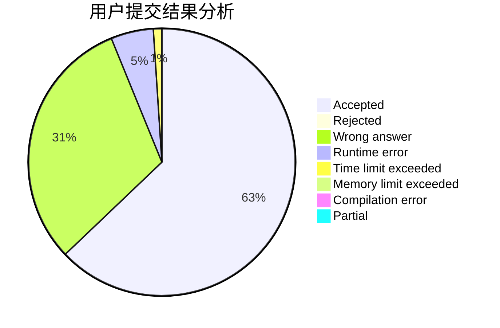
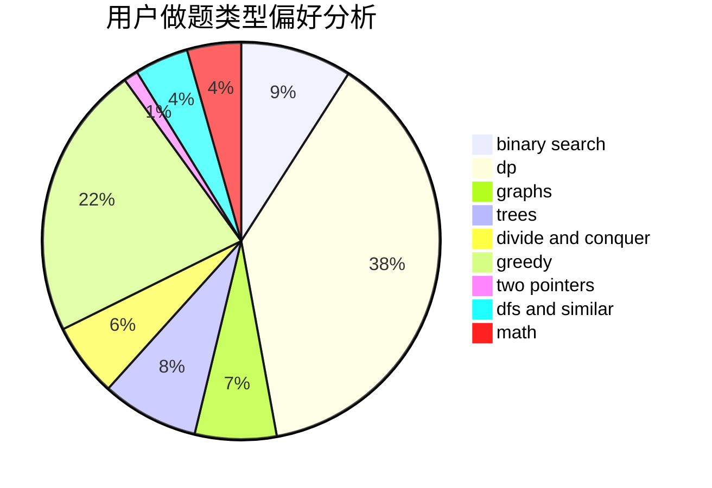

# Heilce

<!-- tabs:start -->

#### **用户提交结果分析**

#### **用户做题类型偏好分析**

<!-- tabs:end -->
# 推荐题目
[884A](https://codeforces.com/contest/884/problem/A)
[290C](https://codeforces.com/contest/290/problem/C)
[712C](https://codeforces.com/contest/712/problem/C)
[24E](https://codeforces.com/contest/24/problem/E)
[890B](https://codeforces.com/contest/890/problem/B)
[1228C](https://codeforces.com/contest/1228/problem/C)
[834B](https://codeforces.com/contest/834/problem/B)
[13782](https://codeforces.com/contest/1378/problem/2)
[1241B](https://codeforces.com/contest/1241/problem/B)
[12622](https://codeforces.com/contest/1262/problem/2)
