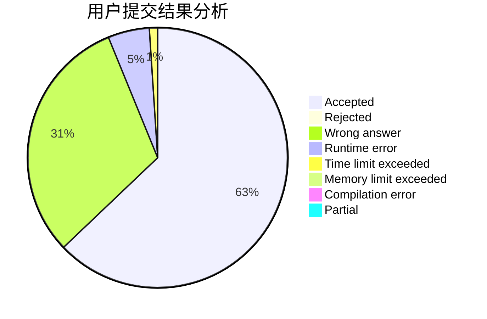
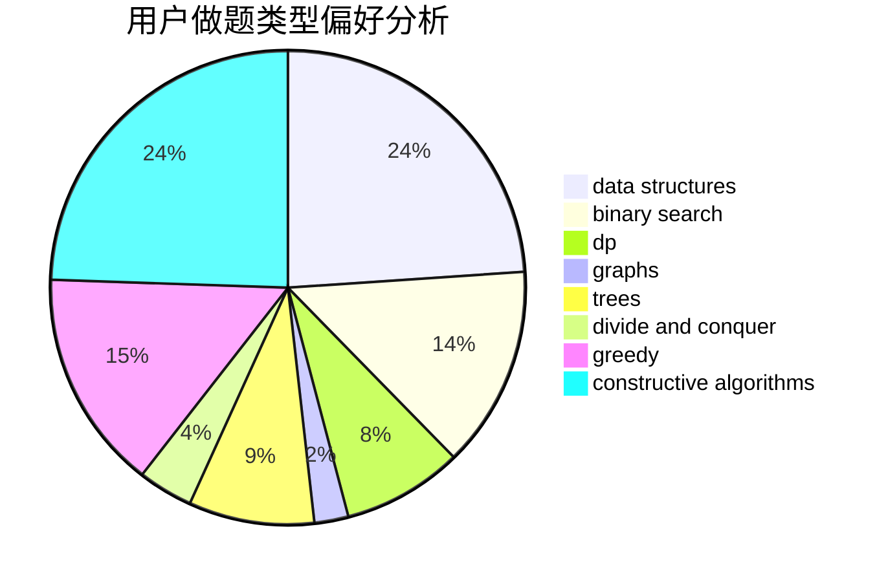
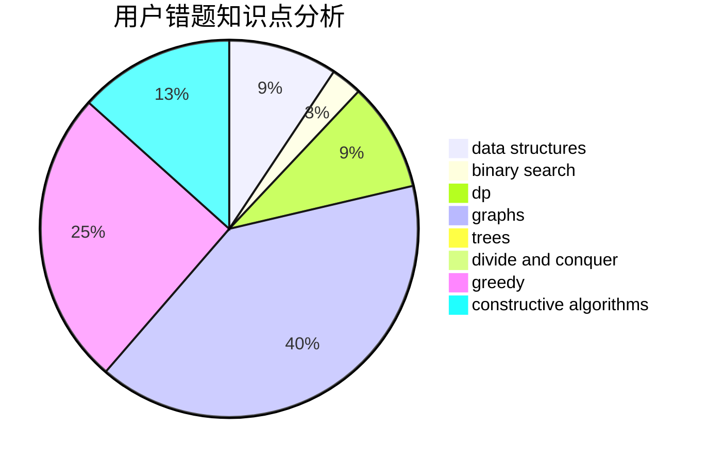

# Heilce

<!-- tabs:start -->

#### **用户提交结果分析**

#### **用户做题类型偏好分析**

#### **用户错题知识点分析**

<!-- tabs:end -->
# 推荐题目
[864D](https://codeforces.com/contest/864/problem/D)		greedy,
                        implementation,
                        math		  
[276C](https://codeforces.com/contest/276/problem/C)		data structures,
                        greedy,
                        implementation,
                        sortings		  
[696A](https://codeforces.com/contest/696/problem/A)		brute force,
                        data structures,
                        implementation,
                        trees		  
[22B](https://codeforces.com/contest/22/problem/B)		brute force,
                        dp		  
[870A](https://codeforces.com/contest/870/problem/A)		brute force,
                        implementation		  
[1220C](https://codeforces.com/contest/1220/problem/C)		games,
                        greedy,
                        strings		  
[815B](https://codeforces.com/contest/815/problem/B)		brute force,
                        combinatorics,
                        constructive algorithms,
                        math		  
[136D](https://codeforces.com/contest/136/problem/D)		dsu,graphs,sortings,trees		  
[1236E](https://codeforces.com/contest/1236/problem/E)		binary search,
                        data structures,
                        dp,
                        dsu		  
[1254E](https://codeforces.com/contest/1254/problem/E)		combinatorics,
                        dfs and similar,
                        dsu,
                        trees		  
