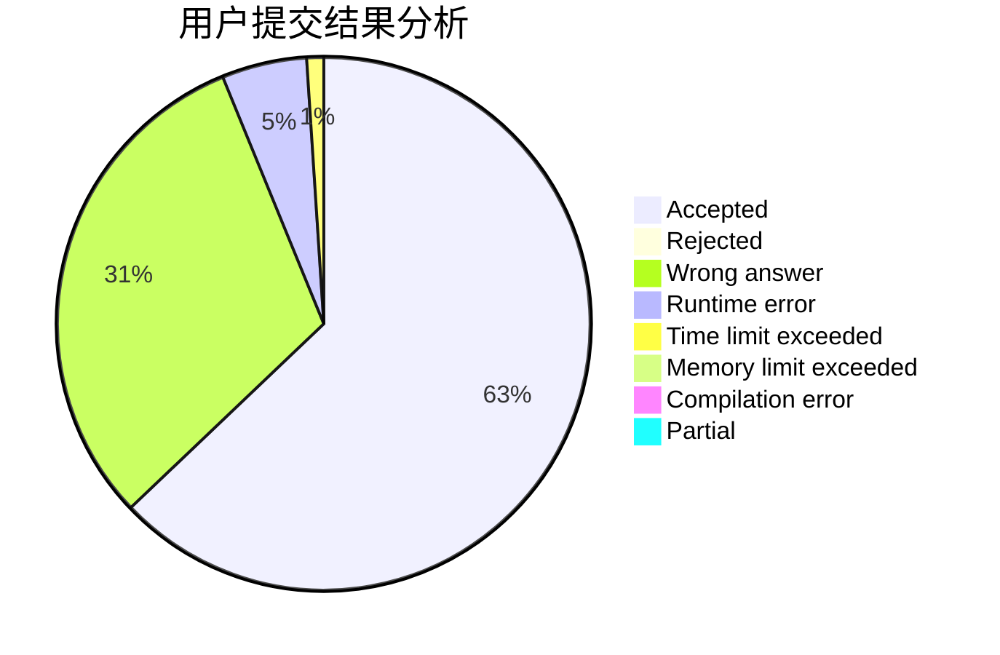
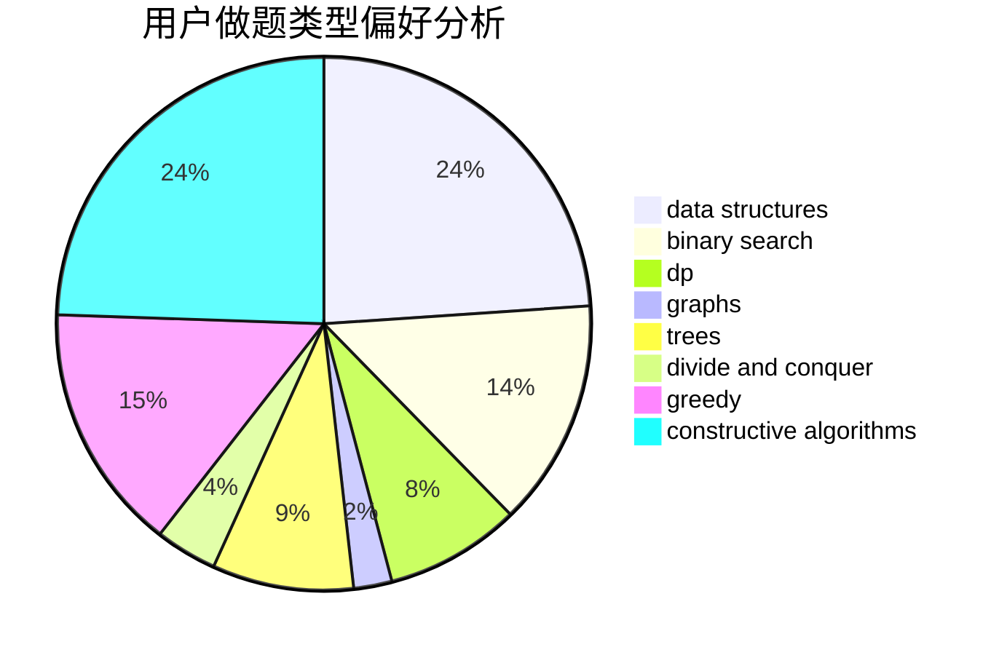
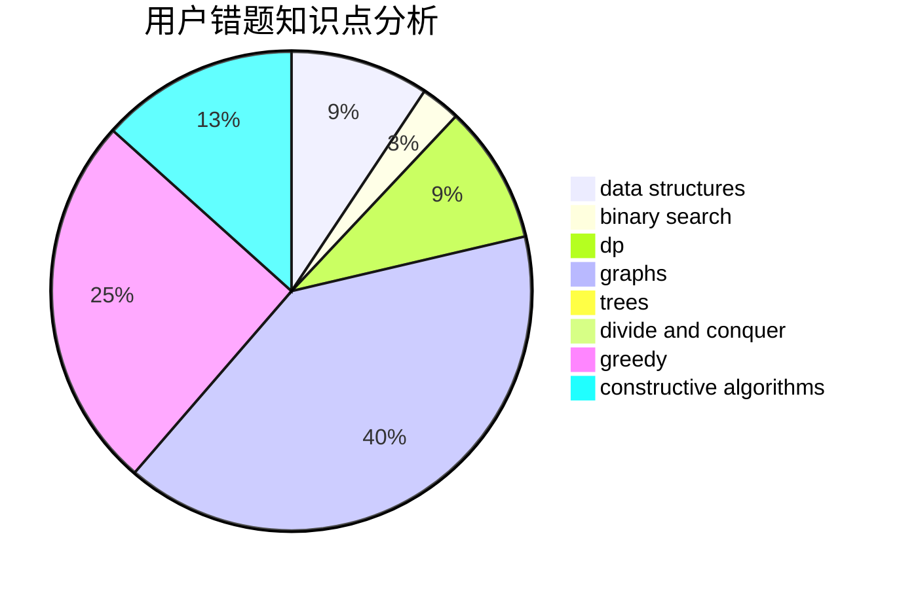

# Heilce
<!-- tabs:start -->
#### **用户提交结果分析**

#### **用户做题类型偏好分析**

#### **用户错题知识点分析**

<!-- tabs:end -->
# 推荐题目
[Bargaining Table](http://codeforces.com/problemset/problem/22/B)		brute force,
                        dp		  
[Little Girl and Maximum Sum](http://codeforces.com/problemset/problem/276/C)		data structures,
                        greedy,
                        implementation,
                        sortings		  
[Lorenzo Von Matterhorn](http://codeforces.com/problemset/problem/696/A)		brute force,
                        data structures,
                        implementation,
                        trees		  
[Substitutes in Number](http://codeforces.com/problemset/problem/464/C)		dp		  
[Karen and Test](http://codeforces.com/problemset/problem/815/B)		brute force,
                        combinatorics,
                        constructive algorithms,
                        math		  
[Cubes](http://codeforces.com/problemset/problem/243/D)		data structures,
                        dp,
                        geometry,
                        two pointers		  
[Search for Pretty Integers](http://codeforces.com/problemset/problem/870/A)		brute force,
                        implementation		  
[Special Permutations](http://codeforces.com/problemset/problem/1234/E)		math		  
[Text Volume](http://codeforces.com/problemset/problem/837/A)		implementation		  
[Substring Game in the Lesson](http://codeforces.com/problemset/problem/1220/C)		games,
                        greedy,
                        strings		  
<!-- tabs:start -->
#### **data structures**
[Bargaining Table](http://codeforces.com/problemset/problem/276/C)		data structures,
                        greedy,
                        implementation,
                        sortings		  
[Little Girl and Maximum Sum](http://codeforces.com/problemset/problem/696/A)		brute force,
                        data structures,
                        implementation,
                        trees		  
[Lorenzo Von Matterhorn](http://codeforces.com/problemset/problem/243/D)		data structures,
                        dp,
                        geometry,
                        two pointers		  
[Substitutes in Number](http://codeforces.com/problemset/problem/238/D)		data structures,
                        implementation		  
[Karen and Test](http://codeforces.com/problemset/problem/1236/E)		binary search,
                        data structures,
                        dp,
                        dsu		  
[Cubes](http://codeforces.com/problemset/problem/1129/C)		binary search,
                        data structures,
                        dp,
                        hashing,
                        sortings,
                        string suffix structures,
                        strings		  
[Search for Pretty Integers](http://codeforces.com/problemset/problem/877/E)		bitmasks,
                        data structures,
                        trees		  
[Special Permutations](http://codeforces.com/problemset/problem/741/E)		data structures,
                        string suffix structures		  
[Text Volume](http://codeforces.com/problemset/problem/1288/E)		data structures		  
[Substring Game in the Lesson](http://codeforces.com/problemset/problem/1009/F)		data structures,
                        dsu,
                        trees		  
#### **binary search**
[Bargaining Table](http://codeforces.com/problemset/problem/1236/E)		binary search,
                        data structures,
                        dp,
                        dsu		  
[Little Girl and Maximum Sum](http://codeforces.com/problemset/problem/1129/C)		binary search,
                        data structures,
                        dp,
                        hashing,
                        sortings,
                        string suffix structures,
                        strings		  
[Lorenzo Von Matterhorn](http://codeforces.com/problemset/problem/623/C)		binary search,
                        dp		  
[Substitutes in Number](http://codeforces.com/problemset/problem/1195/B)		binary search,
                        brute force,
                        math		  
[Karen and Test](https://codeforces.com/contest/1480/problem/C)		binary search,
                        interactive,
                        ternary search		  
[Cubes](http://codeforces.com/problemset/problem/1492/C)		binary search,
                        data structures,
                        dp,
                        greedy,
                        two pointers		  
[Search for Pretty Integers](http://codeforces.com/problemset/problem/1463/D)		binary search,
                        constructive algorithms,
                        greedy,
                        two pointers		  
[Special Permutations](http://codeforces.com/problemset/problem/1490/G)		binary search,
                        data structures,
                        math		  
[Text Volume](http://codeforces.com/problemset/problem/1479/D)		binary search,
                        bitmasks,
                        brute force,
                        data structures,
                        probabilities,
                        trees		  
[Substring Game in the Lesson](http://codeforces.com/problemset/problem/1436/E)		binary search,
                        data structures,
                        two pointers		  
#### **dp**
[Bargaining Table](http://codeforces.com/problemset/problem/22/B)		brute force,
                        dp		  
[Little Girl and Maximum Sum](http://codeforces.com/problemset/problem/464/C)		dp		  
[Lorenzo Von Matterhorn](http://codeforces.com/problemset/problem/243/D)		data structures,
                        dp,
                        geometry,
                        two pointers		  
[Substitutes in Number](http://codeforces.com/problemset/problem/513/E2)		dp		  
[Karen and Test](http://codeforces.com/problemset/problem/1236/E)		binary search,
                        data structures,
                        dp,
                        dsu		  
[Cubes](http://codeforces.com/problemset/problem/1129/C)		binary search,
                        data structures,
                        dp,
                        hashing,
                        sortings,
                        string suffix structures,
                        strings		  
[Search for Pretty Integers](http://codeforces.com/problemset/problem/906/C)		bitmasks,
                        brute force,
                        dp,
                        graphs		  
[Special Permutations](http://codeforces.com/problemset/problem/886/E)		combinatorics,
                        dp,
                        math		  
[Text Volume](http://codeforces.com/problemset/problem/1180/A)		dp,
                        implementation,
                        math		  
[Substring Game in the Lesson](http://codeforces.com/problemset/problem/479/E)		combinatorics,
                        dp		  
#### **graph**
[Bargaining Table](http://codeforces.com/problemset/problem/906/C)		bitmasks,
                        brute force,
                        dp,
                        graphs		  
[Little Girl and Maximum Sum](https://codeforces.com/contest/1013/problem/D)		constructive algorithms,
                        dfs and similar,
                        dsu,
                        graphs,
                        matrices		  
[Lorenzo Von Matterhorn](http://codeforces.com/problemset/problem/1389/G)		dfs and similar,
                        dp,
                        graphs,
                        trees		  
[Substitutes in Number](http://codeforces.com/problemset/problem/1494/F)		brute force,
                        constructive algorithms,
                        dfs and similar,
                        graphs,
                        implementation		  
[Karen and Test](http://codeforces.com/problemset/problem/1361/E)		dfs and similar,
                        graphs,
                        probabilities,
                        trees		  
[Cubes](http://codeforces.com/problemset/problem/1487/C)		brute force,
                        constructive algorithms,
                        dfs and similar,
                        graphs,
                        greedy,
                        implementation,
                        math		  
[Search for Pretty Integers](http://codeforces.com/problemset/problem/1437/C)		dp,
                        flows,
                        graph matchings,
                        greedy,
                        math,
                        sortings		  
[Special Permutations](http://codeforces.com/problemset/problem/1470/D)		constructive algorithms,
                        dfs and similar,
                        graph matchings,
                        graphs,
                        greedy		  
[Text Volume](http://codeforces.com/problemset/problem/1476/C)		dp,
                        graphs,
                        greedy		  
[Substring Game in the Lesson](http://codeforces.com/problemset/problem/1304/D)		constructive algorithms,
                        graphs,
                        greedy,
                        two pointers		  
#### **trees**
[Bargaining Table](http://codeforces.com/problemset/problem/696/A)		brute force,
                        data structures,
                        implementation,
                        trees		  
[Little Girl and Maximum Sum](http://codeforces.com/problemset/problem/877/E)		bitmasks,
                        data structures,
                        trees		  
[Lorenzo Von Matterhorn](http://codeforces.com/problemset/problem/1254/E)		combinatorics,
                        dfs and similar,
                        dsu,
                        trees		  
[Substitutes in Number](http://codeforces.com/problemset/problem/1389/G)		dfs and similar,
                        dp,
                        graphs,
                        trees		  
[Karen and Test](http://codeforces.com/problemset/problem/1361/E)		dfs and similar,
                        graphs,
                        probabilities,
                        trees		  
[Cubes](http://codeforces.com/problemset/problem/1009/F)		data structures,
                        dsu,
                        trees		  
[Search for Pretty Integers](http://codeforces.com/problemset/problem/1416/C)		bitmasks,
                        data structures,
                        divide and conquer,
                        dp,
                        greedy,
                        math,
                        sortings,
                        strings,
                        trees		  
[Special Permutations](http://codeforces.com/problemset/problem/1479/D)		binary search,
                        bitmasks,
                        brute force,
                        data structures,
                        probabilities,
                        trees		  
[Text Volume](http://codeforces.com/problemset/problem/1511/C)		brute force,
                        data structures,
                        implementation,
                        trees		  
[Substring Game in the Lesson](http://codeforces.com/problemset/problem/1499/F)		combinatorics,
                        dfs and similar,
                        dp,
                        trees		  
#### **divide and conquer**
[Bargaining Table](http://codeforces.com/problemset/problem/788/D)		constructive algorithms,
                        divide and conquer,
                        interactive		  
[Little Girl and Maximum Sum](http://codeforces.com/problemset/problem/1416/C)		bitmasks,
                        data structures,
                        divide and conquer,
                        dp,
                        greedy,
                        math,
                        sortings,
                        strings,
                        trees		  
[Lorenzo Von Matterhorn](http://codeforces.com/problemset/problem/1461/D)		binary search,
                        brute force,
                        data structures,
                        divide and conquer,
                        implementation,
                        sortings		  
[Substitutes in Number](http://codeforces.com/problemset/problem/1466/G)		combinatorics,
                        divide and conquer,
                        hashing,
                        math,
                        string suffix structures,
                        strings		  
[Karen and Test](http://codeforces.com/problemset/problem/1490/D)		dfs and similar,
                        divide and conquer,
                        implementation		  
[Cubes](https://codeforces.com/contest/1483/problem/C)		data structures,
                        divide and conquer,
                        dp		  
[Search for Pretty Integers](http://codeforces.com/problemset/problem/1491/E)		brute force,
                        dfs and similar,
                        divide and conquer,
                        number theory,
                        trees		  
[Special Permutations](http://codeforces.com/problemset/problem/1303/G)		data structures,
                        divide and conquer,
                        geometry,
                        trees		  
[Text Volume](http://codeforces.com/problemset/problem/1494/D)		constructive algorithms,
                        data structures,
                        dfs and similar,
                        divide and conquer,
                        dsu,
                        greedy,
                        sortings,
                        trees		  
[Substring Game in the Lesson](http://codeforces.com/problemset/problem/1482/E)		data structures,
                        divide and conquer,
                        dp		  
#### **greedy**
[Bargaining Table](http://codeforces.com/problemset/problem/276/C)		data structures,
                        greedy,
                        implementation,
                        sortings		  
[Little Girl and Maximum Sum](http://codeforces.com/problemset/problem/1220/C)		games,
                        greedy,
                        strings		  
[Lorenzo Von Matterhorn](http://codeforces.com/problemset/problem/864/D)		greedy,
                        implementation,
                        math		  
[Substitutes in Number](http://codeforces.com/problemset/problem/1416/C)		bitmasks,
                        data structures,
                        divide and conquer,
                        dp,
                        greedy,
                        math,
                        sortings,
                        strings,
                        trees		  
[Karen and Test](http://codeforces.com/problemset/problem/1492/C)		binary search,
                        data structures,
                        dp,
                        greedy,
                        two pointers		  
[Cubes](https://codeforces.com/contest/1496/problem/C)		geometry,
                        greedy,
                        math,
                        sortings		  
[Search for Pretty Integers](http://codeforces.com/problemset/problem/1493/A)		constructive algorithms,
                        greedy		  
[Special Permutations](http://codeforces.com/problemset/problem/1463/D)		binary search,
                        constructive algorithms,
                        greedy,
                        two pointers		  
[Text Volume](http://codeforces.com/problemset/problem/1462/C)		brute force,
                        greedy,
                        math		  
[Substring Game in the Lesson](http://codeforces.com/problemset/problem/1494/B)		bitmasks,
                        brute force,
                        greedy,
                        implementation		  
#### **constructive algorithms**
[Bargaining Table](http://codeforces.com/problemset/problem/815/B)		brute force,
                        combinatorics,
                        constructive algorithms,
                        math		  
[Little Girl and Maximum Sum](http://codeforces.com/problemset/problem/906/B)		brute force,
                        constructive algorithms,
                        math		  
[Lorenzo Von Matterhorn](https://codeforces.com/contest/1013/problem/D)		constructive algorithms,
                        dfs and similar,
                        dsu,
                        graphs,
                        matrices		  
[Substitutes in Number](http://codeforces.com/problemset/problem/1494/F)		brute force,
                        constructive algorithms,
                        dfs and similar,
                        graphs,
                        implementation		  
[Karen and Test](http://codeforces.com/problemset/problem/788/D)		constructive algorithms,
                        divide and conquer,
                        interactive		  
[Cubes](http://codeforces.com/problemset/problem/1450/C1)		constructive algorithms,
                        math		  
[Search for Pretty Integers](http://codeforces.com/problemset/problem/1493/A)		constructive algorithms,
                        greedy		  
[Special Permutations](http://codeforces.com/problemset/problem/1463/D)		binary search,
                        constructive algorithms,
                        greedy,
                        two pointers		  
[Text Volume](https://codeforces.com/contest/1456/problem/B)		bitmasks,
                        brute force,
                        constructive algorithms		  
[Substring Game in the Lesson](http://codeforces.com/problemset/problem/1492/D)		bitmasks,
                        constructive algorithms,
                        greedy,
                        math		  
#### **sortings**
[Bargaining Table](http://codeforces.com/problemset/problem/276/C)		data structures,
                        greedy,
                        implementation,
                        sortings		  
[Little Girl and Maximum Sum](http://codeforces.com/problemset/problem/1129/C)		binary search,
                        data structures,
                        dp,
                        hashing,
                        sortings,
                        string suffix structures,
                        strings		  
[Lorenzo Von Matterhorn](http://codeforces.com/problemset/problem/1416/C)		bitmasks,
                        data structures,
                        divide and conquer,
                        dp,
                        greedy,
                        math,
                        sortings,
                        strings,
                        trees		  
[Substitutes in Number](https://codeforces.com/contest/1496/problem/C)		geometry,
                        greedy,
                        math,
                        sortings		  
[Karen and Test](http://codeforces.com/problemset/problem/1495/A)		geometry,
                        greedy,
                        math,
                        sortings		  
[Cubes](http://codeforces.com/problemset/problem/1497/A)		brute force,
                        data structures,
                        greedy,
                        sortings		  
[Search for Pretty Integers](http://codeforces.com/problemset/problem/1427/A)		math,
                        sortings		  
[Special Permutations](http://codeforces.com/problemset/problem/1461/D)		binary search,
                        brute force,
                        data structures,
                        divide and conquer,
                        implementation,
                        sortings		  
[Text Volume](http://codeforces.com/problemset/problem/1437/C)		dp,
                        flows,
                        graph matchings,
                        greedy,
                        math,
                        sortings		  
[Substring Game in the Lesson](http://codeforces.com/problemset/problem/1473/A)		greedy,
                        implementation,
                        math,
                        sortings		  
<!-- tabs:end -->
