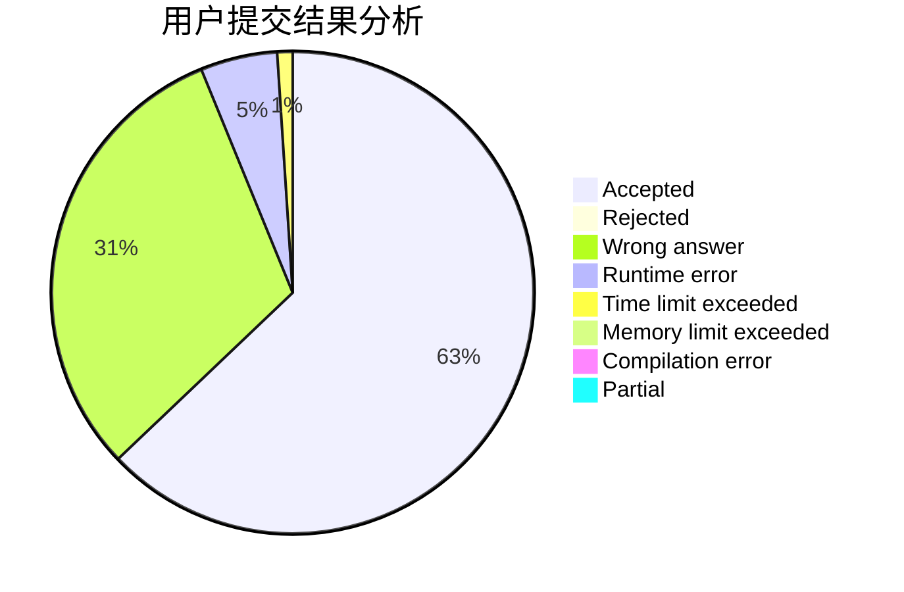
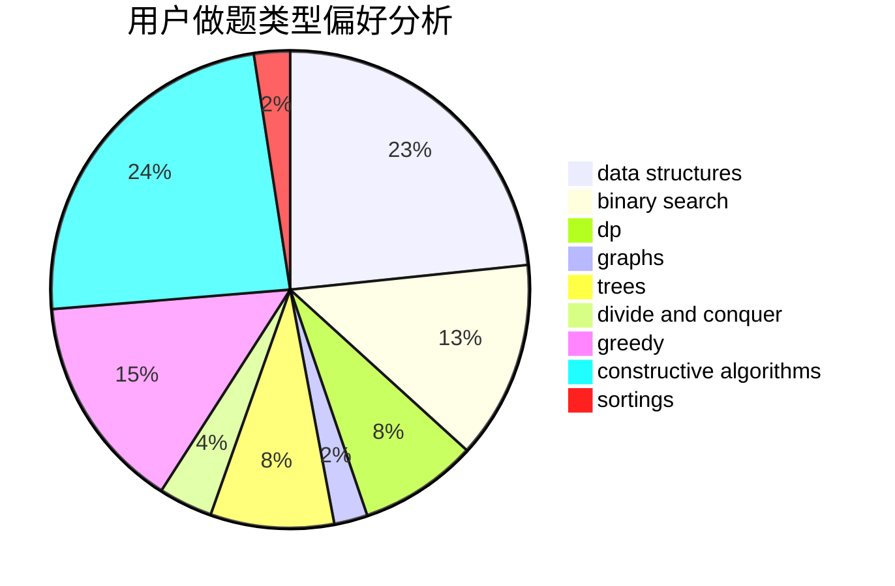
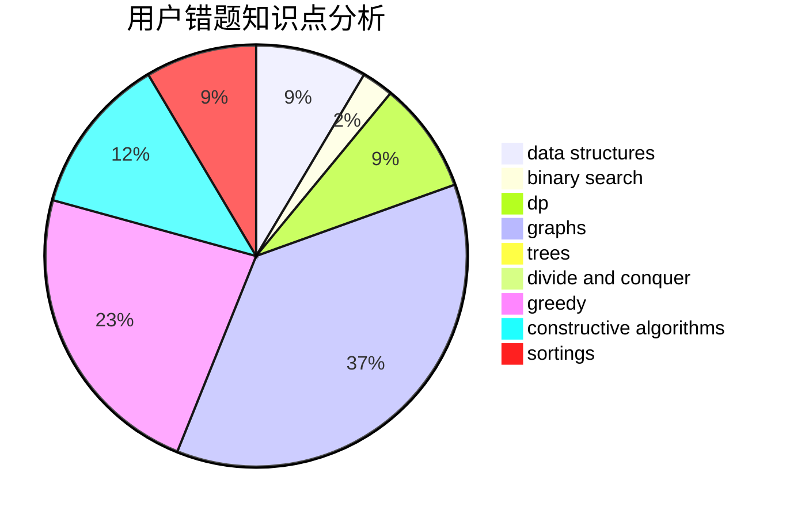

# Heilce
<!-- tabs:start -->
#### **用户提交结果分析**

#### **用户做题类型偏好分析**

#### **用户错题知识点分析**

<!-- tabs:end -->
# 推荐题目
[22B](http://codeforces.com/problemset/problem/22/B)		brute force,
                        dp		  
[276C](http://codeforces.com/problemset/problem/276/C)		data structures,
                        greedy,
                        implementation,
                        sortings		  
[696A](http://codeforces.com/problemset/problem/696/A)		brute force,
                        data structures,
                        implementation,
                        trees		  
[464C](http://codeforces.com/problemset/problem/464/C)		dp		  
[815B](http://codeforces.com/problemset/problem/815/B)		brute force,
                        combinatorics,
                        constructive algorithms,
                        math		  
[243D](http://codeforces.com/problemset/problem/243/D)		data structures,
                        dp,
                        geometry,
                        two pointers		  
[870A](http://codeforces.com/problemset/problem/870/A)		brute force,
                        implementation		  
[1234E](http://codeforces.com/problemset/problem/1234/E)		math		  
[837A](http://codeforces.com/problemset/problem/837/A)		implementation		  
[1220C](http://codeforces.com/problemset/problem/1220/C)		games,
                        greedy,
                        strings		  
<!-- tabs:start -->
#### **data structures**
[276C](http://codeforces.com/problemset/problem/276/C)		data structures,
                        greedy,
                        implementation,
                        sortings		  
[696A](http://codeforces.com/problemset/problem/696/A)		brute force,
                        data structures,
                        implementation,
                        trees		  
[243D](http://codeforces.com/problemset/problem/243/D)		data structures,
                        dp,
                        geometry,
                        two pointers		  
[238D](http://codeforces.com/problemset/problem/238/D)		data structures,
                        implementation		  
[1236E](http://codeforces.com/problemset/problem/1236/E)		binary search,
                        data structures,
                        dp,
                        dsu		  
[1129C](http://codeforces.com/problemset/problem/1129/C)		binary search,
                        data structures,
                        dp,
                        hashing,
                        sortings,
                        string suffix structures,
                        strings		  
[877E](http://codeforces.com/problemset/problem/877/E)		bitmasks,
                        data structures,
                        trees		  
[741E](http://codeforces.com/problemset/problem/741/E)		data structures,
                        string suffix structures		  
[1288E](http://codeforces.com/problemset/problem/1288/E)		data structures		  
[1009F](http://codeforces.com/problemset/problem/1009/F)		data structures,
                        dsu,
                        trees		  
#### **binary search**
[1236E](http://codeforces.com/problemset/problem/1236/E)		binary search,
                        data structures,
                        dp,
                        dsu		  
[1129C](http://codeforces.com/problemset/problem/1129/C)		binary search,
                        data structures,
                        dp,
                        hashing,
                        sortings,
                        string suffix structures,
                        strings		  
[623C](http://codeforces.com/problemset/problem/623/C)		binary search,
                        dp		  
[1195B](http://codeforces.com/problemset/problem/1195/B)		binary search,
                        brute force,
                        math		  
[1480C](https://codeforces.com/contest/1480/problem/C)		binary search,
                        interactive,
                        ternary search		  
[1492C](http://codeforces.com/problemset/problem/1492/C)		binary search,
                        data structures,
                        dp,
                        greedy,
                        two pointers		  
[1463D](http://codeforces.com/problemset/problem/1463/D)		binary search,
                        constructive algorithms,
                        greedy,
                        two pointers		  
[1490G](http://codeforces.com/problemset/problem/1490/G)		binary search,
                        data structures,
                        math		  
[1479D](http://codeforces.com/problemset/problem/1479/D)		binary search,
                        bitmasks,
                        brute force,
                        data structures,
                        probabilities,
                        trees		  
[1436E](http://codeforces.com/problemset/problem/1436/E)		binary search,
                        data structures,
                        two pointers		  
#### **dp**
[22B](http://codeforces.com/problemset/problem/22/B)		brute force,
                        dp		  
[464C](http://codeforces.com/problemset/problem/464/C)		dp		  
[243D](http://codeforces.com/problemset/problem/243/D)		data structures,
                        dp,
                        geometry,
                        two pointers		  
[513E2](http://codeforces.com/problemset/problem/513/E2)		dp		  
[1236E](http://codeforces.com/problemset/problem/1236/E)		binary search,
                        data structures,
                        dp,
                        dsu		  
[1129C](http://codeforces.com/problemset/problem/1129/C)		binary search,
                        data structures,
                        dp,
                        hashing,
                        sortings,
                        string suffix structures,
                        strings		  
[906C](http://codeforces.com/problemset/problem/906/C)		bitmasks,
                        brute force,
                        dp,
                        graphs		  
[886E](http://codeforces.com/problemset/problem/886/E)		combinatorics,
                        dp,
                        math		  
[1180A](http://codeforces.com/problemset/problem/1180/A)		dp,
                        implementation,
                        math		  
[479E](http://codeforces.com/problemset/problem/479/E)		combinatorics,
                        dp		  
#### **graph**
[906C](http://codeforces.com/problemset/problem/906/C)		bitmasks,
                        brute force,
                        dp,
                        graphs		  
[1013D](https://codeforces.com/contest/1013/problem/D)		constructive algorithms,
                        dfs and similar,
                        dsu,
                        graphs,
                        matrices		  
[1389G](http://codeforces.com/problemset/problem/1389/G)		dfs and similar,
                        dp,
                        graphs,
                        trees		  
[1494F](http://codeforces.com/problemset/problem/1494/F)		brute force,
                        constructive algorithms,
                        dfs and similar,
                        graphs,
                        implementation		  
[1361E](http://codeforces.com/problemset/problem/1361/E)		dfs and similar,
                        graphs,
                        probabilities,
                        trees		  
[1487C](http://codeforces.com/problemset/problem/1487/C)		brute force,
                        constructive algorithms,
                        dfs and similar,
                        graphs,
                        greedy,
                        implementation,
                        math		  
[1437C](http://codeforces.com/problemset/problem/1437/C)		dp,
                        flows,
                        graph matchings,
                        greedy,
                        math,
                        sortings		  
[1470D](http://codeforces.com/problemset/problem/1470/D)		constructive algorithms,
                        dfs and similar,
                        graph matchings,
                        graphs,
                        greedy		  
[1476C](http://codeforces.com/problemset/problem/1476/C)		dp,
                        graphs,
                        greedy		  
[1304D](http://codeforces.com/problemset/problem/1304/D)		constructive algorithms,
                        graphs,
                        greedy,
                        two pointers		  
#### **trees**
[696A](http://codeforces.com/problemset/problem/696/A)		brute force,
                        data structures,
                        implementation,
                        trees		  
[877E](http://codeforces.com/problemset/problem/877/E)		bitmasks,
                        data structures,
                        trees		  
[1254E](http://codeforces.com/problemset/problem/1254/E)		combinatorics,
                        dfs and similar,
                        dsu,
                        trees		  
[1389G](http://codeforces.com/problemset/problem/1389/G)		dfs and similar,
                        dp,
                        graphs,
                        trees		  
[1361E](http://codeforces.com/problemset/problem/1361/E)		dfs and similar,
                        graphs,
                        probabilities,
                        trees		  
[1009F](http://codeforces.com/problemset/problem/1009/F)		data structures,
                        dsu,
                        trees		  
[1416C](http://codeforces.com/problemset/problem/1416/C)		bitmasks,
                        data structures,
                        divide and conquer,
                        dp,
                        greedy,
                        math,
                        sortings,
                        strings,
                        trees		  
[1479D](http://codeforces.com/problemset/problem/1479/D)		binary search,
                        bitmasks,
                        brute force,
                        data structures,
                        probabilities,
                        trees		  
[1511C](http://codeforces.com/problemset/problem/1511/C)		brute force,
                        data structures,
                        implementation,
                        trees		  
[1499F](http://codeforces.com/problemset/problem/1499/F)		combinatorics,
                        dfs and similar,
                        dp,
                        trees		  
#### **divide and conquer**
[788D](http://codeforces.com/problemset/problem/788/D)		constructive algorithms,
                        divide and conquer,
                        interactive		  
[1416C](http://codeforces.com/problemset/problem/1416/C)		bitmasks,
                        data structures,
                        divide and conquer,
                        dp,
                        greedy,
                        math,
                        sortings,
                        strings,
                        trees		  
[1461D](http://codeforces.com/problemset/problem/1461/D)		binary search,
                        brute force,
                        data structures,
                        divide and conquer,
                        implementation,
                        sortings		  
[1466G](http://codeforces.com/problemset/problem/1466/G)		combinatorics,
                        divide and conquer,
                        hashing,
                        math,
                        string suffix structures,
                        strings		  
[1490D](http://codeforces.com/problemset/problem/1490/D)		dfs and similar,
                        divide and conquer,
                        implementation		  
[1483C](https://codeforces.com/contest/1483/problem/C)		data structures,
                        divide and conquer,
                        dp		  
[1491E](http://codeforces.com/problemset/problem/1491/E)		brute force,
                        dfs and similar,
                        divide and conquer,
                        number theory,
                        trees		  
[1303G](http://codeforces.com/problemset/problem/1303/G)		data structures,
                        divide and conquer,
                        geometry,
                        trees		  
[1494D](http://codeforces.com/problemset/problem/1494/D)		constructive algorithms,
                        data structures,
                        dfs and similar,
                        divide and conquer,
                        dsu,
                        greedy,
                        sortings,
                        trees		  
[1482E](http://codeforces.com/problemset/problem/1482/E)		data structures,
                        divide and conquer,
                        dp		  
#### **greedy**
[276C](http://codeforces.com/problemset/problem/276/C)		data structures,
                        greedy,
                        implementation,
                        sortings		  
[1220C](http://codeforces.com/problemset/problem/1220/C)		games,
                        greedy,
                        strings		  
[864D](http://codeforces.com/problemset/problem/864/D)		greedy,
                        implementation,
                        math		  
[1416C](http://codeforces.com/problemset/problem/1416/C)		bitmasks,
                        data structures,
                        divide and conquer,
                        dp,
                        greedy,
                        math,
                        sortings,
                        strings,
                        trees		  
[1492C](http://codeforces.com/problemset/problem/1492/C)		binary search,
                        data structures,
                        dp,
                        greedy,
                        two pointers		  
[1496C](https://codeforces.com/contest/1496/problem/C)		geometry,
                        greedy,
                        math,
                        sortings		  
[1493A](http://codeforces.com/problemset/problem/1493/A)		constructive algorithms,
                        greedy		  
[1463D](http://codeforces.com/problemset/problem/1463/D)		binary search,
                        constructive algorithms,
                        greedy,
                        two pointers		  
[1462C](http://codeforces.com/problemset/problem/1462/C)		brute force,
                        greedy,
                        math		  
[1494B](http://codeforces.com/problemset/problem/1494/B)		bitmasks,
                        brute force,
                        greedy,
                        implementation		  
#### **constructive algorithms**
[815B](http://codeforces.com/problemset/problem/815/B)		brute force,
                        combinatorics,
                        constructive algorithms,
                        math		  
[906B](http://codeforces.com/problemset/problem/906/B)		brute force,
                        constructive algorithms,
                        math		  
[1013D](https://codeforces.com/contest/1013/problem/D)		constructive algorithms,
                        dfs and similar,
                        dsu,
                        graphs,
                        matrices		  
[1494F](http://codeforces.com/problemset/problem/1494/F)		brute force,
                        constructive algorithms,
                        dfs and similar,
                        graphs,
                        implementation		  
[788D](http://codeforces.com/problemset/problem/788/D)		constructive algorithms,
                        divide and conquer,
                        interactive		  
[1450C1](http://codeforces.com/problemset/problem/1450/C1)		constructive algorithms,
                        math		  
[1493A](http://codeforces.com/problemset/problem/1493/A)		constructive algorithms,
                        greedy		  
[1463D](http://codeforces.com/problemset/problem/1463/D)		binary search,
                        constructive algorithms,
                        greedy,
                        two pointers		  
[1456B](https://codeforces.com/contest/1456/problem/B)		bitmasks,
                        brute force,
                        constructive algorithms		  
[1492D](http://codeforces.com/problemset/problem/1492/D)		bitmasks,
                        constructive algorithms,
                        greedy,
                        math		  
#### **sortings**
[276C](http://codeforces.com/problemset/problem/276/C)		data structures,
                        greedy,
                        implementation,
                        sortings		  
[1129C](http://codeforces.com/problemset/problem/1129/C)		binary search,
                        data structures,
                        dp,
                        hashing,
                        sortings,
                        string suffix structures,
                        strings		  
[1416C](http://codeforces.com/problemset/problem/1416/C)		bitmasks,
                        data structures,
                        divide and conquer,
                        dp,
                        greedy,
                        math,
                        sortings,
                        strings,
                        trees		  
[1496C](https://codeforces.com/contest/1496/problem/C)		geometry,
                        greedy,
                        math,
                        sortings		  
[1495A](http://codeforces.com/problemset/problem/1495/A)		geometry,
                        greedy,
                        math,
                        sortings		  
[1497A](http://codeforces.com/problemset/problem/1497/A)		brute force,
                        data structures,
                        greedy,
                        sortings		  
[1427A](http://codeforces.com/problemset/problem/1427/A)		math,
                        sortings		  
[1461D](http://codeforces.com/problemset/problem/1461/D)		binary search,
                        brute force,
                        data structures,
                        divide and conquer,
                        implementation,
                        sortings		  
[1437C](http://codeforces.com/problemset/problem/1437/C)		dp,
                        flows,
                        graph matchings,
                        greedy,
                        math,
                        sortings		  
[1473A](http://codeforces.com/problemset/problem/1473/A)		greedy,
                        implementation,
                        math,
                        sortings		  
<!-- tabs:end -->
