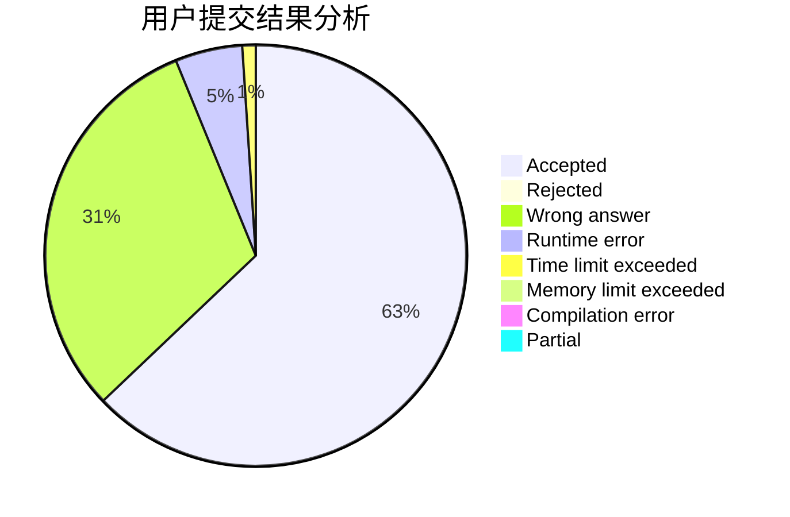
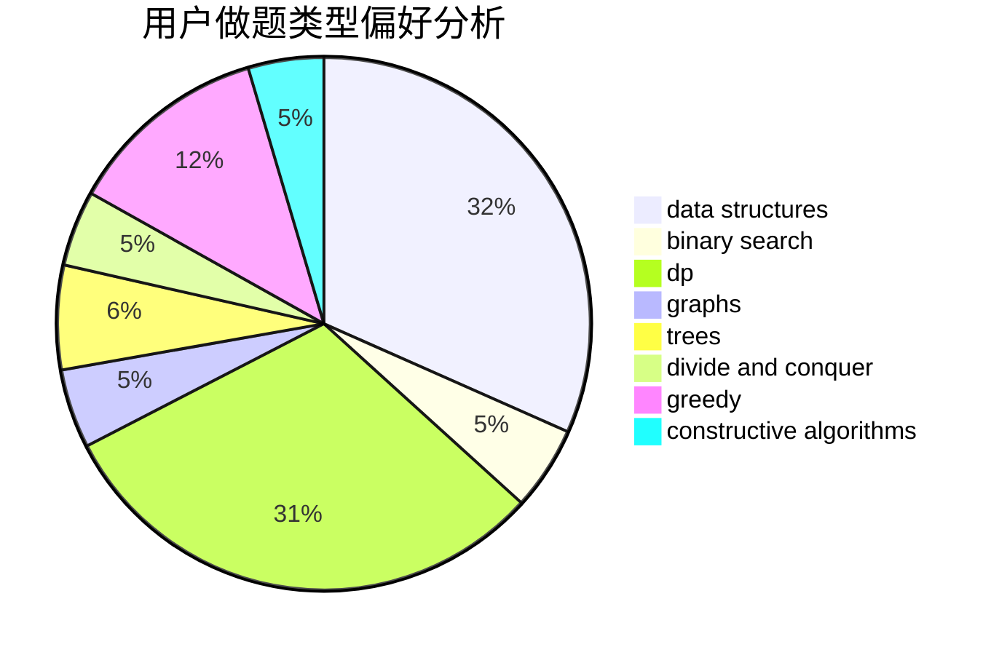

# Heilce

<!-- tabs:start -->

#### **用户提交结果分析**

#### **用户做题类型偏好分析**

#### **用户错题知识点分析**

<!-- tabs:end -->
# 推荐题目
[884A](https://codeforces.com/contest/884/problem/A)		implementation		  
[290C](https://codeforces.com/contest/290/problem/C)		*special problem,
                        graph matchings,
                        implementation,
                        trees		  
[712C](https://codeforces.com/contest/712/problem/C)		greedy,
                        math		  
[24E](https://codeforces.com/contest/24/problem/E)		binary search		  
[890B](https://codeforces.com/contest/890/problem/B)		dsu,graphs,sortings,trees		  
[1228C](https://codeforces.com/contest/1228/problem/C)		math,
                        number theory		  
[834B](https://codeforces.com/contest/834/problem/B)		data structures,
                        implementation		  
[13782](https://codeforces.com/contest/1378/problem/2)		dsu,graphs,sortings,trees		  
[1241B](https://codeforces.com/contest/1241/problem/B)		dsu,graphs,sortings,trees		  
[12622](https://codeforces.com/contest/1262/problem/2)		dsu,graphs,sortings,trees		  
