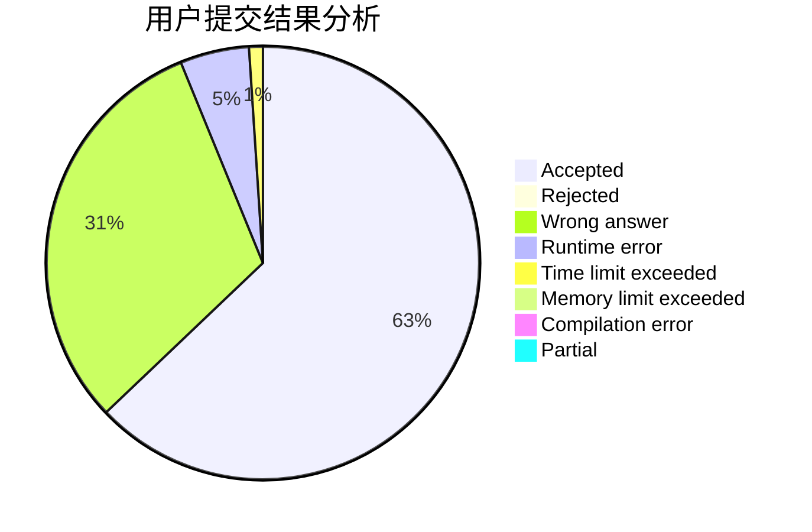
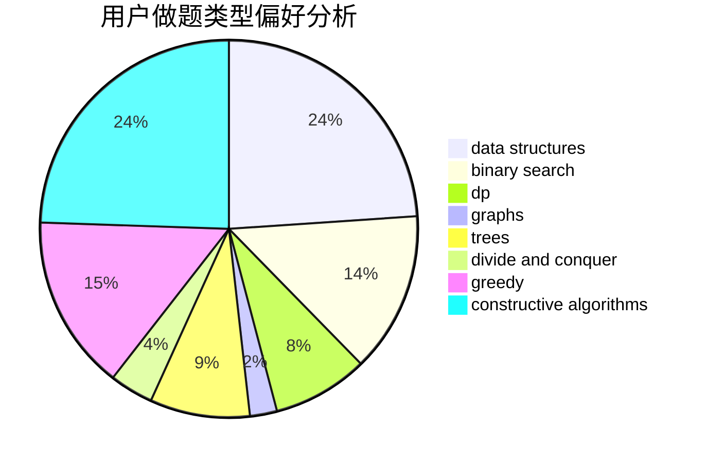
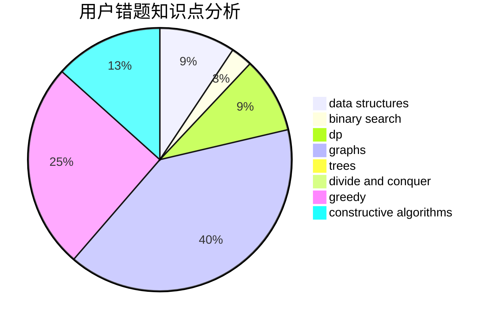

# Heilce
<!-- tabs:start -->
#### **用户提交结果分析**

#### **用户做题类型偏好分析**

#### **用户错题知识点分析**

<!-- tabs:end -->
# 推荐题目
[Bargaining Table](http://codeforces.com/problemset/problem/22/B)		brute force,
                        dp		  
[Little Girl and Maximum Sum](http://codeforces.com/problemset/problem/276/C)		data structures,
                        greedy,
                        implementation,
                        sortings		  
[Lorenzo Von Matterhorn](http://codeforces.com/problemset/problem/696/A)		brute force,
                        data structures,
                        implementation,
                        trees		  
[Substitutes in Number](http://codeforces.com/problemset/problem/464/C)		dp		  
[Karen and Test](http://codeforces.com/problemset/problem/815/B)		brute force,
                        combinatorics,
                        constructive algorithms,
                        math		  
[Cubes](http://codeforces.com/problemset/problem/243/D)		data structures,
                        dp,
                        geometry,
                        two pointers		  
[Search for Pretty Integers](http://codeforces.com/problemset/problem/870/A)		brute force,
                        implementation		  
[Special Permutations](http://codeforces.com/problemset/problem/1234/E)		math		  
[Text Volume](http://codeforces.com/problemset/problem/837/A)		implementation		  
[Substring Game in the Lesson](http://codeforces.com/problemset/problem/1220/C)		games,
                        greedy,
                        strings		  
<!-- tabs:start -->
#### **data structures**
[Little Girl and Maximum Sum](http://codeforces.com/problemset/problem/276/C)		data structures,
                        greedy,
                        implementation,
                        sortings		  
[Lorenzo Von Matterhorn](http://codeforces.com/problemset/problem/696/A)		brute force,
                        data structures,
                        implementation,
                        trees		  
[Cubes](http://codeforces.com/problemset/problem/243/D)		data structures,
                        dp,
                        geometry,
                        two pointers		  
[Tape Programming](http://codeforces.com/problemset/problem/238/D)		data structures,
                        implementation		  
[Alice and the Unfair Game](http://codeforces.com/problemset/problem/1236/E)		binary search,
                        data structures,
                        dp,
                        dsu		  
[Morse Code](http://codeforces.com/problemset/problem/1129/C)		binary search,
                        data structures,
                        dp,
                        hashing,
                        sortings,
                        string suffix structures,
                        strings		  
[Danil and a Part-time Job](http://codeforces.com/problemset/problem/877/E)		bitmasks,
                        data structures,
                        trees		  
[Arpa’s abnormal DNA and Mehrdad’s deep interest](http://codeforces.com/problemset/problem/741/E)		data structures,
                        string suffix structures		  
[Messenger Simulator](http://codeforces.com/problemset/problem/1288/E)		data structures		  
[Dominant Indices](http://codeforces.com/problemset/problem/1009/F)		data structures,
                        dsu,
                        trees		  
#### **binary search**
[Alice and the Unfair Game](http://codeforces.com/problemset/problem/1236/E)		binary search,
                        data structures,
                        dp,
                        dsu		  
[Morse Code](http://codeforces.com/problemset/problem/1129/C)		binary search,
                        data structures,
                        dp,
                        hashing,
                        sortings,
                        string suffix structures,
                        strings		  
[Electric Charges](http://codeforces.com/problemset/problem/623/C)		binary search,
                        dp		  
[Sport Mafia](http://codeforces.com/problemset/problem/1195/B)		binary search,
                        brute force,
                        math		  
[Searching Local Minimum](https://codeforces.com/contest/1480/problem/C)		binary search,
                        interactive,
                        ternary search		  
[Maximum width](http://codeforces.com/problemset/problem/1492/C)		binary search,
                        data structures,
                        dp,
                        greedy,
                        two pointers		  
[Pairs](http://codeforces.com/problemset/problem/1463/D)		binary search,
                        constructive algorithms,
                        greedy,
                        two pointers		  
[Old Floppy Drive](http://codeforces.com/problemset/problem/1490/G)		binary search,
                        data structures,
                        math		  
[Odd Mineral Resource](http://codeforces.com/problemset/problem/1479/D)		binary search,
                        bitmasks,
                        brute force,
                        data structures,
                        probabilities,
                        trees		  
[Complicated Computations](http://codeforces.com/problemset/problem/1436/E)		binary search,
                        data structures,
                        two pointers		  
#### **dp**
[Bargaining Table](http://codeforces.com/problemset/problem/22/B)		brute force,
                        dp		  
[Substitutes in Number](http://codeforces.com/problemset/problem/464/C)		dp		  
[Cubes](http://codeforces.com/problemset/problem/243/D)		data structures,
                        dp,
                        geometry,
                        two pointers		  
[Subarray Cuts](http://codeforces.com/problemset/problem/513/E2)		dp		  
[Alice and the Unfair Game](http://codeforces.com/problemset/problem/1236/E)		binary search,
                        data structures,
                        dp,
                        dsu		  
[Morse Code](http://codeforces.com/problemset/problem/1129/C)		binary search,
                        data structures,
                        dp,
                        hashing,
                        sortings,
                        string suffix structures,
                        strings		  
[Party](http://codeforces.com/problemset/problem/906/C)		bitmasks,
                        brute force,
                        dp,
                        graphs		  
[Maximum Element](http://codeforces.com/problemset/problem/886/E)		combinatorics,
                        dp,
                        math		  
[Alex and a Rhombus](http://codeforces.com/problemset/problem/1180/A)		dp,
                        implementation,
                        math		  
[Riding in a Lift](http://codeforces.com/problemset/problem/479/E)		combinatorics,
                        dp		  
#### **graph**
[Party](http://codeforces.com/problemset/problem/906/C)		bitmasks,
                        brute force,
                        dp,
                        graphs		  
[Chemical table](https://codeforces.com/contest/1013/problem/D)		constructive algorithms,
                        dfs and similar,
                        dsu,
                        graphs,
                        matrices		  
[Directing Edges](http://codeforces.com/problemset/problem/1389/G)		dfs and similar,
                        dp,
                        graphs,
                        trees		  
[Delete The Edges](http://codeforces.com/problemset/problem/1494/F)		brute force,
                        constructive algorithms,
                        dfs and similar,
                        graphs,
                        implementation		  
[James and the Chase](http://codeforces.com/problemset/problem/1361/E)		dfs and similar,
                        graphs,
                        probabilities,
                        trees		  
[Minimum Ties](http://codeforces.com/problemset/problem/1487/C)		brute force,
                        constructive algorithms,
                        dfs and similar,
                        graphs,
                        greedy,
                        implementation,
                        math		  
[Chef Monocarp](http://codeforces.com/problemset/problem/1437/C)		dp,
                        flows,
                        graph matchings,
                        greedy,
                        math,
                        sortings		  
[Strange Housing](http://codeforces.com/problemset/problem/1470/D)		constructive algorithms,
                        dfs and similar,
                        graph matchings,
                        graphs,
                        greedy		  
[Longest Simple Cycle](http://codeforces.com/problemset/problem/1476/C)		dp,
                        graphs,
                        greedy		  
[Shortest and Longest LIS](http://codeforces.com/problemset/problem/1304/D)		constructive algorithms,
                        graphs,
                        greedy,
                        two pointers		  
#### **trees**
[Lorenzo Von Matterhorn](http://codeforces.com/problemset/problem/696/A)		brute force,
                        data structures,
                        implementation,
                        trees		  
[Danil and a Part-time Job](http://codeforces.com/problemset/problem/877/E)		bitmasks,
                        data structures,
                        trees		  
[Send Tree to Charlie](http://codeforces.com/problemset/problem/1254/E)		combinatorics,
                        dfs and similar,
                        dsu,
                        trees		  
[Directing Edges](http://codeforces.com/problemset/problem/1389/G)		dfs and similar,
                        dp,
                        graphs,
                        trees		  
[James and the Chase](http://codeforces.com/problemset/problem/1361/E)		dfs and similar,
                        graphs,
                        probabilities,
                        trees		  
[Dominant Indices](http://codeforces.com/problemset/problem/1009/F)		data structures,
                        dsu,
                        trees		  
[XOR Inverse](http://codeforces.com/problemset/problem/1416/C)		bitmasks,
                        data structures,
                        divide and conquer,
                        dp,
                        greedy,
                        math,
                        sortings,
                        strings,
                        trees		  
[Odd Mineral Resource](http://codeforces.com/problemset/problem/1479/D)		binary search,
                        bitmasks,
                        brute force,
                        data structures,
                        probabilities,
                        trees		  
[Yet Another Card Deck](http://codeforces.com/problemset/problem/1511/C)		brute force,
                        data structures,
                        implementation,
                        trees		  
[Diameter Cuts](http://codeforces.com/problemset/problem/1499/F)		combinatorics,
                        dfs and similar,
                        dp,
                        trees		  
#### **divide and conquer**
[Finding lines](http://codeforces.com/problemset/problem/788/D)		constructive algorithms,
                        divide and conquer,
                        interactive		  
[XOR Inverse](http://codeforces.com/problemset/problem/1416/C)		bitmasks,
                        data structures,
                        divide and conquer,
                        dp,
                        greedy,
                        math,
                        sortings,
                        strings,
                        trees		  
[Divide and Summarize](http://codeforces.com/problemset/problem/1461/D)		binary search,
                        brute force,
                        data structures,
                        divide and conquer,
                        implementation,
                        sortings		  
[Song of the Sirens](http://codeforces.com/problemset/problem/1466/G)		combinatorics,
                        divide and conquer,
                        hashing,
                        math,
                        string suffix structures,
                        strings		  
[Permutation Transformation](http://codeforces.com/problemset/problem/1490/D)		dfs and similar,
                        divide and conquer,
                        implementation		  
[Skyline Photo](https://codeforces.com/contest/1483/problem/C)		data structures,
                        divide and conquer,
                        dp		  
[Fib-tree](http://codeforces.com/problemset/problem/1491/E)		brute force,
                        dfs and similar,
                        divide and conquer,
                        number theory,
                        trees		  
[Sum of Prefix Sums](http://codeforces.com/problemset/problem/1303/G)		data structures,
                        divide and conquer,
                        geometry,
                        trees		  
[Dogeforces](http://codeforces.com/problemset/problem/1494/D)		constructive algorithms,
                        data structures,
                        dfs and similar,
                        divide and conquer,
                        dsu,
                        greedy,
                        sortings,
                        trees		  
[Skyline Photo](http://codeforces.com/problemset/problem/1482/E)		data structures,
                        divide and conquer,
                        dp		  
#### **greedy**
[Little Girl and Maximum Sum](http://codeforces.com/problemset/problem/276/C)		data structures,
                        greedy,
                        implementation,
                        sortings		  
[Substring Game in the Lesson](http://codeforces.com/problemset/problem/1220/C)		games,
                        greedy,
                        strings		  
[Make a Permutation!](http://codeforces.com/problemset/problem/864/D)		greedy,
                        implementation,
                        math		  
[XOR Inverse](http://codeforces.com/problemset/problem/1416/C)		bitmasks,
                        data structures,
                        divide and conquer,
                        dp,
                        greedy,
                        math,
                        sortings,
                        strings,
                        trees		  
[Maximum width](http://codeforces.com/problemset/problem/1492/C)		binary search,
                        data structures,
                        dp,
                        greedy,
                        two pointers		  
[Diamond Miner](https://codeforces.com/contest/1496/problem/C)		geometry,
                        greedy,
                        math,
                        sortings		  
[Anti-knapsack](http://codeforces.com/problemset/problem/1493/A)		constructive algorithms,
                        greedy		  
[Pairs](http://codeforces.com/problemset/problem/1463/D)		binary search,
                        constructive algorithms,
                        greedy,
                        two pointers		  
[Unique Number](http://codeforces.com/problemset/problem/1462/C)		brute force,
                        greedy,
                        math		  
[Berland Crossword](http://codeforces.com/problemset/problem/1494/B)		bitmasks,
                        brute force,
                        greedy,
                        implementation		  
#### **constructive algorithms**
[Karen and Test](http://codeforces.com/problemset/problem/815/B)		brute force,
                        combinatorics,
                        constructive algorithms,
                        math		  
[Seating of Students](http://codeforces.com/problemset/problem/906/B)		brute force,
                        constructive algorithms,
                        math		  
[Chemical table](https://codeforces.com/contest/1013/problem/D)		constructive algorithms,
                        dfs and similar,
                        dsu,
                        graphs,
                        matrices		  
[Delete The Edges](http://codeforces.com/problemset/problem/1494/F)		brute force,
                        constructive algorithms,
                        dfs and similar,
                        graphs,
                        implementation		  
[Finding lines](http://codeforces.com/problemset/problem/788/D)		constructive algorithms,
                        divide and conquer,
                        interactive		  
[Errich-Tac-Toe (Easy Version)](http://codeforces.com/problemset/problem/1450/C1)		constructive algorithms,
                        math		  
[Anti-knapsack](http://codeforces.com/problemset/problem/1493/A)		constructive algorithms,
                        greedy		  
[Pairs](http://codeforces.com/problemset/problem/1463/D)		binary search,
                        constructive algorithms,
                        greedy,
                        two pointers		  
[XOR-gun](https://codeforces.com/contest/1456/problem/B)		bitmasks,
                        brute force,
                        constructive algorithms		  
[Genius's Gambit](http://codeforces.com/problemset/problem/1492/D)		bitmasks,
                        constructive algorithms,
                        greedy,
                        math		  
#### **sortings**
[Little Girl and Maximum Sum](http://codeforces.com/problemset/problem/276/C)		data structures,
                        greedy,
                        implementation,
                        sortings		  
[Morse Code](http://codeforces.com/problemset/problem/1129/C)		binary search,
                        data structures,
                        dp,
                        hashing,
                        sortings,
                        string suffix structures,
                        strings		  
[XOR Inverse](http://codeforces.com/problemset/problem/1416/C)		bitmasks,
                        data structures,
                        divide and conquer,
                        dp,
                        greedy,
                        math,
                        sortings,
                        strings,
                        trees		  
[Diamond Miner](https://codeforces.com/contest/1496/problem/C)		geometry,
                        greedy,
                        math,
                        sortings		  
[Diamond Miner](http://codeforces.com/problemset/problem/1495/A)		geometry,
                        greedy,
                        math,
                        sortings		  
[Meximization](http://codeforces.com/problemset/problem/1497/A)		brute force,
                        data structures,
                        greedy,
                        sortings		  
[Avoiding Zero](http://codeforces.com/problemset/problem/1427/A)		math,
                        sortings		  
[Divide and Summarize](http://codeforces.com/problemset/problem/1461/D)		binary search,
                        brute force,
                        data structures,
                        divide and conquer,
                        implementation,
                        sortings		  
[Chef Monocarp](http://codeforces.com/problemset/problem/1437/C)		dp,
                        flows,
                        graph matchings,
                        greedy,
                        math,
                        sortings		  
[Replacing Elements](http://codeforces.com/problemset/problem/1473/A)		greedy,
                        implementation,
                        math,
                        sortings		  
<!-- tabs:end -->
