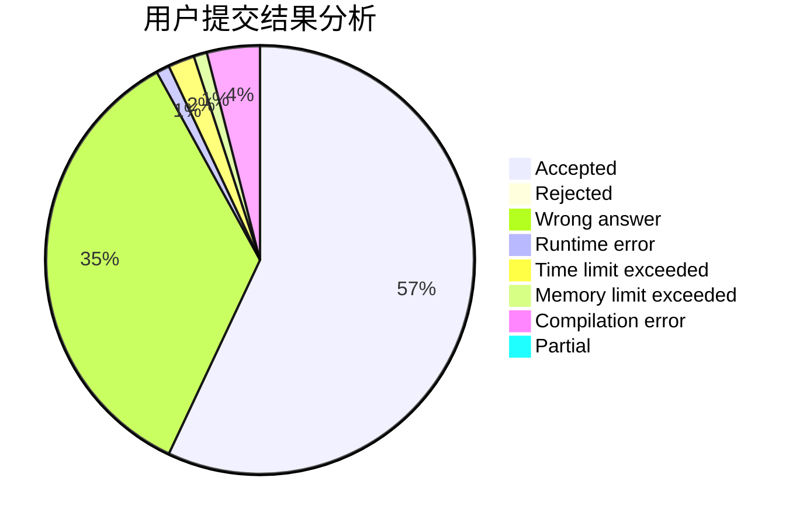
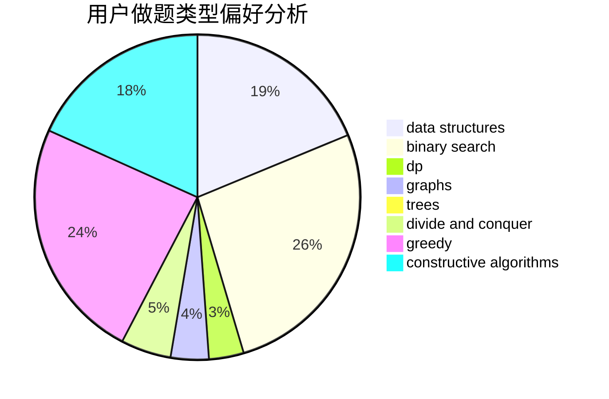
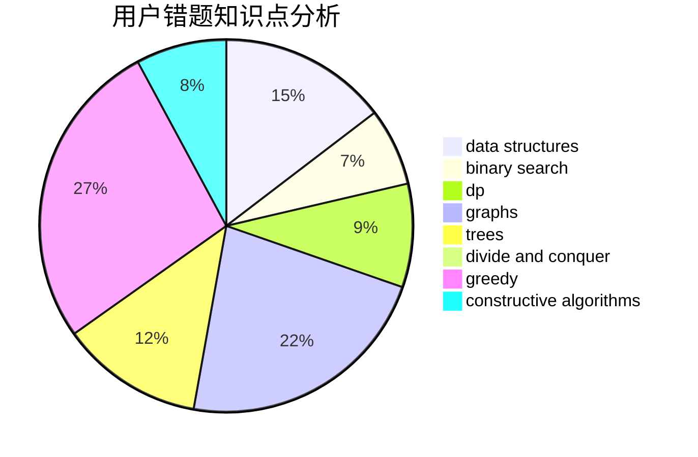

# Heisexingqitian
<!-- tabs:start -->
#### **用户提交结果分析**

#### **用户做题类型偏好分析**

#### **用户错题知识点分析**

<!-- tabs:end -->
# 推荐题目
[Continuous City](http://codeforces.com/problemset/problem/1479/C)		bitmasks,
                        constructive algorithms		  
[Tiles for Bathroom](http://codeforces.com/problemset/problem/1500/D)		data structures,
                        sortings,
                        two pointers		  
[Power Tree](http://codeforces.com/problemset/problem/1120/D)		dfs and similar,
                        dp,
                        dsu,
                        graphs,
                        greedy,
                        trees		  
[Wizards and Huge Prize](http://codeforces.com/problemset/problem/167/B)		dp,
                        math,
                        probabilities		  
[Weird journey](https://codeforces.com/contest/789/problem/D)		combinatorics,
                        constructive algorithms,
                        dfs and similar,
                        dsu,
                        graphs		  
[Zigzag](http://codeforces.com/problemset/problem/228/D)		data structures		  
[Numbers on the blackboard](http://codeforces.com/problemset/problem/878/E)		combinatorics,
                        dp		  
[Integer Game](http://codeforces.com/problemset/problem/1375/F)		constructive algorithms,
                        games,
                        interactive,
                        math		  
[Name](http://codeforces.com/problemset/problem/180/D)		greedy,
                        strings		  
[Dwarves, Hats and Extrasensory Abilities](https://codeforces.com/contest/1064/problem/E)		binary search,
                        constructive algorithms,
                        geometry,
                        interactive		  
<!-- tabs:start -->
#### **data structures**
[Continuous City](http://codeforces.com/problemset/problem/1500/D)		data structures,
                        sortings,
                        two pointers		  
[Tiles for Bathroom](http://codeforces.com/problemset/problem/228/D)		data structures		  
[Power Tree](http://codeforces.com/problemset/problem/802/O)		binary search,
                        data structures,
                        flows		  
[Wizards and Huge Prize](http://codeforces.com/problemset/problem/811/E)		data structures,
                        dsu,
                        graphs		  
[Weird journey](http://codeforces.com/problemset/problem/587/E)		data structures		  
[Zigzag](http://codeforces.com/problemset/problem/777/B)		data structures,
                        dp,
                        greedy,
                        sortings		  
[Numbers on the blackboard](http://codeforces.com/problemset/problem/1500/E)		binary search,
                        data structures		  
[Integer Game](http://codeforces.com/problemset/problem/1492/C)		binary search,
                        data structures,
                        dp,
                        greedy,
                        two pointers		  
[Name](http://codeforces.com/problemset/problem/1490/G)		binary search,
                        data structures,
                        math		  
[Dwarves, Hats and Extrasensory Abilities](http://codeforces.com/problemset/problem/1479/D)		binary search,
                        bitmasks,
                        brute force,
                        data structures,
                        probabilities,
                        trees		  
#### **binary search**
[Continuous City](https://codeforces.com/contest/1064/problem/E)		binary search,
                        constructive algorithms,
                        geometry,
                        interactive		  
[Tiles for Bathroom](http://codeforces.com/problemset/problem/802/O)		binary search,
                        data structures,
                        flows		  
[Power Tree](http://codeforces.com/problemset/problem/1279/F)		binary search,
                        dp		  
[Wizards and Huge Prize](http://codeforces.com/problemset/problem/1463/A)		binary search,
                        math		  
[Weird journey](http://codeforces.com/problemset/problem/1500/E)		binary search,
                        data structures		  
[Zigzag](http://codeforces.com/problemset/problem/1492/C)		binary search,
                        data structures,
                        dp,
                        greedy,
                        two pointers		  
[Numbers on the blackboard](http://codeforces.com/problemset/problem/1463/D)		binary search,
                        constructive algorithms,
                        greedy,
                        two pointers		  
[Integer Game](http://codeforces.com/problemset/problem/1490/G)		binary search,
                        data structures,
                        math		  
[Name](http://codeforces.com/problemset/problem/1479/D)		binary search,
                        bitmasks,
                        brute force,
                        data structures,
                        probabilities,
                        trees		  
[Dwarves, Hats and Extrasensory Abilities](http://codeforces.com/problemset/problem/1436/E)		binary search,
                        data structures,
                        two pointers		  
#### **dp**
[Continuous City](http://codeforces.com/problemset/problem/1120/D)		dfs and similar,
                        dp,
                        dsu,
                        graphs,
                        greedy,
                        trees		  
[Tiles for Bathroom](http://codeforces.com/problemset/problem/167/B)		dp,
                        math,
                        probabilities		  
[Power Tree](http://codeforces.com/problemset/problem/878/E)		combinatorics,
                        dp		  
[Wizards and Huge Prize](http://codeforces.com/problemset/problem/128/C)		combinatorics,
                        dp		  
[Weird journey](http://codeforces.com/problemset/problem/1383/C)		bitmasks,
                        dp,
                        graphs,
                        trees		  
[Zigzag](http://codeforces.com/problemset/problem/1279/F)		binary search,
                        dp		  
[Numbers on the blackboard](http://codeforces.com/problemset/problem/886/E)		combinatorics,
                        dp,
                        math		  
[Integer Game](http://codeforces.com/problemset/problem/1276/D)		dp,
                        trees		  
[Name](http://codeforces.com/problemset/problem/906/E)		dp,
                        string suffix structures,
                        strings		  
[Dwarves, Hats and Extrasensory Abilities](http://codeforces.com/problemset/problem/777/B)		data structures,
                        dp,
                        greedy,
                        sortings		  
#### **graph**
[Continuous City](http://codeforces.com/problemset/problem/1120/D)		dfs and similar,
                        dp,
                        dsu,
                        graphs,
                        greedy,
                        trees		  
[Tiles for Bathroom](https://codeforces.com/contest/789/problem/D)		combinatorics,
                        constructive algorithms,
                        dfs and similar,
                        dsu,
                        graphs		  
[Power Tree](http://codeforces.com/problemset/problem/1383/C)		bitmasks,
                        dp,
                        graphs,
                        trees		  
[Wizards and Huge Prize](http://codeforces.com/problemset/problem/118/E)		dfs and similar,
                        graphs		  
[Weird journey](https://codeforces.com/contest/782/problem/E)		constructive algorithms,
                        dfs and similar,
                        graphs		  
[Zigzag](http://codeforces.com/problemset/problem/811/E)		data structures,
                        dsu,
                        graphs		  
[Numbers on the blackboard](http://codeforces.com/problemset/problem/1487/C)		brute force,
                        constructive algorithms,
                        dfs and similar,
                        graphs,
                        greedy,
                        implementation,
                        math		  
[Integer Game](http://codeforces.com/problemset/problem/1437/C)		dp,
                        flows,
                        graph matchings,
                        greedy,
                        math,
                        sortings		  
[Name](http://codeforces.com/problemset/problem/1470/D)		constructive algorithms,
                        dfs and similar,
                        graph matchings,
                        graphs,
                        greedy		  
[Dwarves, Hats and Extrasensory Abilities](http://codeforces.com/problemset/problem/1476/C)		dp,
                        graphs,
                        greedy		  
#### **trees**
[Continuous City](http://codeforces.com/problemset/problem/1120/D)		dfs and similar,
                        dp,
                        dsu,
                        graphs,
                        greedy,
                        trees		  
[Tiles for Bathroom](http://codeforces.com/problemset/problem/1383/C)		bitmasks,
                        dp,
                        graphs,
                        trees		  
[Power Tree](http://codeforces.com/problemset/problem/1276/D)		dp,
                        trees		  
[Wizards and Huge Prize](http://codeforces.com/problemset/problem/1479/D)		binary search,
                        bitmasks,
                        brute force,
                        data structures,
                        probabilities,
                        trees		  
[Weird journey](http://codeforces.com/problemset/problem/1511/C)		brute force,
                        data structures,
                        implementation,
                        trees		  
[Zigzag](http://codeforces.com/problemset/problem/1499/F)		combinatorics,
                        dfs and similar,
                        dp,
                        trees		  
[Numbers on the blackboard](http://codeforces.com/problemset/problem/1491/E)		brute force,
                        dfs and similar,
                        divide and conquer,
                        number theory,
                        trees		  
[Integer Game](http://codeforces.com/problemset/problem/1466/D)		data structures,
                        greedy,
                        sortings,
                        trees		  
[Name](http://codeforces.com/problemset/problem/1495/D)		combinatorics,
                        dfs and similar,
                        graphs,
                        math,
                        shortest paths,
                        trees		  
[Dwarves, Hats and Extrasensory Abilities](http://codeforces.com/problemset/problem/1303/G)		data structures,
                        divide and conquer,
                        geometry,
                        trees		  
#### **divide and conquer**
[Continuous City](http://codeforces.com/problemset/problem/1461/D)		binary search,
                        brute force,
                        data structures,
                        divide and conquer,
                        implementation,
                        sortings		  
[Tiles for Bathroom](http://codeforces.com/problemset/problem/1466/G)		combinatorics,
                        divide and conquer,
                        hashing,
                        math,
                        string suffix structures,
                        strings		  
[Power Tree](http://codeforces.com/problemset/problem/1490/D)		dfs and similar,
                        divide and conquer,
                        implementation		  
[Wizards and Huge Prize](https://codeforces.com/contest/1483/problem/C)		data structures,
                        divide and conquer,
                        dp		  
[Weird journey](http://codeforces.com/problemset/problem/1491/E)		brute force,
                        dfs and similar,
                        divide and conquer,
                        number theory,
                        trees		  
[Zigzag](http://codeforces.com/problemset/problem/1303/G)		data structures,
                        divide and conquer,
                        geometry,
                        trees		  
[Numbers on the blackboard](http://codeforces.com/problemset/problem/1494/D)		constructive algorithms,
                        data structures,
                        dfs and similar,
                        divide and conquer,
                        dsu,
                        greedy,
                        sortings,
                        trees		  
[Integer Game](http://codeforces.com/problemset/problem/1482/E)		data structures,
                        divide and conquer,
                        dp		  
[Name](http://codeforces.com/problemset/problem/566/C)		dfs and similar,
                        divide and conquer,
                        trees		  
[Dwarves, Hats and Extrasensory Abilities](http://codeforces.com/problemset/problem/1428/F)		binary search,
                        data structures,
                        divide and conquer,
                        dp,
                        two pointers		  
#### **greedy**
[Continuous City](http://codeforces.com/problemset/problem/1120/D)		dfs and similar,
                        dp,
                        dsu,
                        graphs,
                        greedy,
                        trees		  
[Tiles for Bathroom](http://codeforces.com/problemset/problem/180/D)		greedy,
                        strings		  
[Power Tree](http://codeforces.com/problemset/problem/3/B)		greedy,
                        sortings		  
[Wizards and Huge Prize](http://codeforces.com/problemset/problem/379/C)		greedy,
                        sortings		  
[Weird journey](http://codeforces.com/problemset/problem/1305/E)		constructive algorithms,
                        greedy,
                        implementation,
                        math		  
[Zigzag](http://codeforces.com/problemset/problem/777/B)		data structures,
                        dp,
                        greedy,
                        sortings		  
[Numbers on the blackboard](http://codeforces.com/problemset/problem/1492/C)		binary search,
                        data structures,
                        dp,
                        greedy,
                        two pointers		  
[Integer Game](https://codeforces.com/contest/1496/problem/C)		geometry,
                        greedy,
                        math,
                        sortings		  
[Name](http://codeforces.com/problemset/problem/1493/A)		constructive algorithms,
                        greedy		  
[Dwarves, Hats and Extrasensory Abilities](http://codeforces.com/problemset/problem/1463/D)		binary search,
                        constructive algorithms,
                        greedy,
                        two pointers		  
#### **constructive algorithms**
[Continuous City](http://codeforces.com/problemset/problem/1479/C)		bitmasks,
                        constructive algorithms		  
[Tiles for Bathroom](https://codeforces.com/contest/789/problem/D)		combinatorics,
                        constructive algorithms,
                        dfs and similar,
                        dsu,
                        graphs		  
[Power Tree](http://codeforces.com/problemset/problem/1375/F)		constructive algorithms,
                        games,
                        interactive,
                        math		  
[Wizards and Huge Prize](https://codeforces.com/contest/1064/problem/E)		binary search,
                        constructive algorithms,
                        geometry,
                        interactive		  
[Weird journey](https://codeforces.com/contest/782/problem/E)		constructive algorithms,
                        dfs and similar,
                        graphs		  
[Zigzag](http://codeforces.com/problemset/problem/1305/E)		constructive algorithms,
                        greedy,
                        implementation,
                        math		  
[Numbers on the blackboard](http://codeforces.com/problemset/problem/1392/E)		bitmasks,
                        constructive algorithms,
                        interactive,
                        math		  
[Integer Game](http://codeforces.com/problemset/problem/1493/A)		constructive algorithms,
                        greedy		  
[Name](http://codeforces.com/problemset/problem/1463/D)		binary search,
                        constructive algorithms,
                        greedy,
                        two pointers		  
[Dwarves, Hats and Extrasensory Abilities](https://codeforces.com/contest/1456/problem/B)		bitmasks,
                        brute force,
                        constructive algorithms		  
#### **sortings**
[Continuous City](http://codeforces.com/problemset/problem/1500/D)		data structures,
                        sortings,
                        two pointers		  
[Tiles for Bathroom](http://codeforces.com/problemset/problem/3/B)		greedy,
                        sortings		  
[Power Tree](http://codeforces.com/problemset/problem/379/C)		greedy,
                        sortings		  
[Wizards and Huge Prize](http://codeforces.com/problemset/problem/777/B)		data structures,
                        dp,
                        greedy,
                        sortings		  
[Weird journey](https://codeforces.com/contest/1496/problem/C)		geometry,
                        greedy,
                        math,
                        sortings		  
[Zigzag](http://codeforces.com/problemset/problem/1495/A)		geometry,
                        greedy,
                        math,
                        sortings		  
[Numbers on the blackboard](http://codeforces.com/problemset/problem/1497/A)		brute force,
                        data structures,
                        greedy,
                        sortings		  
[Integer Game](http://codeforces.com/problemset/problem/1427/A)		math,
                        sortings		  
[Name](http://codeforces.com/problemset/problem/1461/D)		binary search,
                        brute force,
                        data structures,
                        divide and conquer,
                        implementation,
                        sortings		  
[Dwarves, Hats and Extrasensory Abilities](http://codeforces.com/problemset/problem/1437/C)		dp,
                        flows,
                        graph matchings,
                        greedy,
                        math,
                        sortings		  
<!-- tabs:end -->
