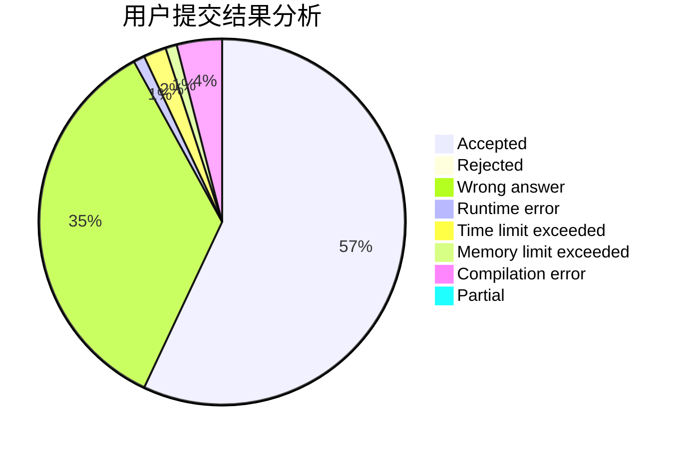
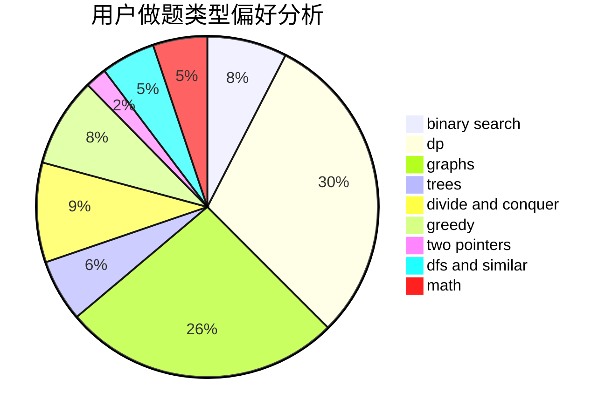

# Heisexingqitian

<!-- tabs:start -->

#### **用户提交结果分析**

#### **用户做题类型偏好分析**

<!-- tabs:end -->
# 推荐题目
[193C](https://codeforces.com/contest/193/problem/C)
[804F](https://codeforces.com/contest/804/problem/F)
[899D](https://codeforces.com/contest/899/problem/D)
[920F](https://codeforces.com/contest/920/problem/F)
[1065B](https://codeforces.com/contest/1065/problem/B)
[208A](https://codeforces.com/contest/208/problem/A)
[1384E](https://codeforces.com/contest/1384/problem/E)
[246D](https://codeforces.com/contest/246/problem/D)
[1307F](https://codeforces.com/contest/1307/problem/F)
[920C](https://codeforces.com/contest/920/problem/C)
