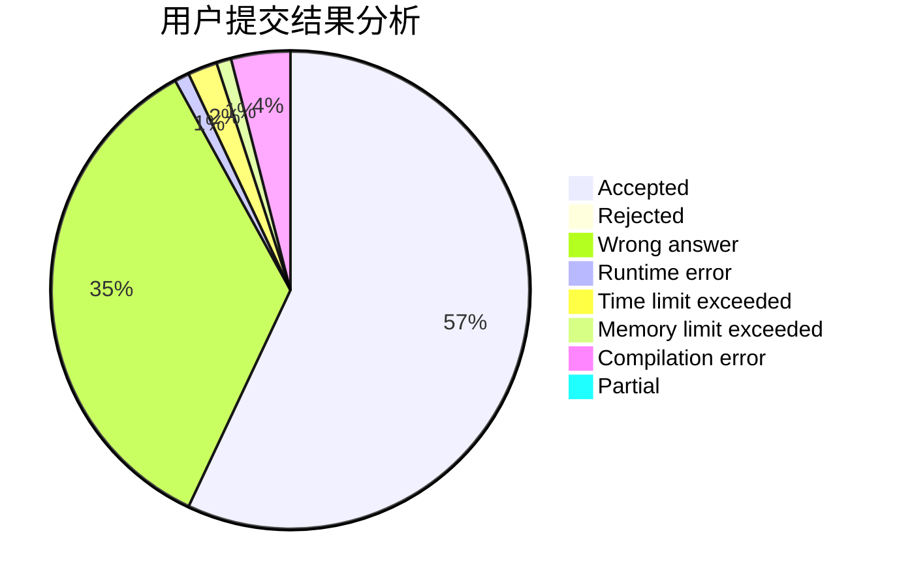
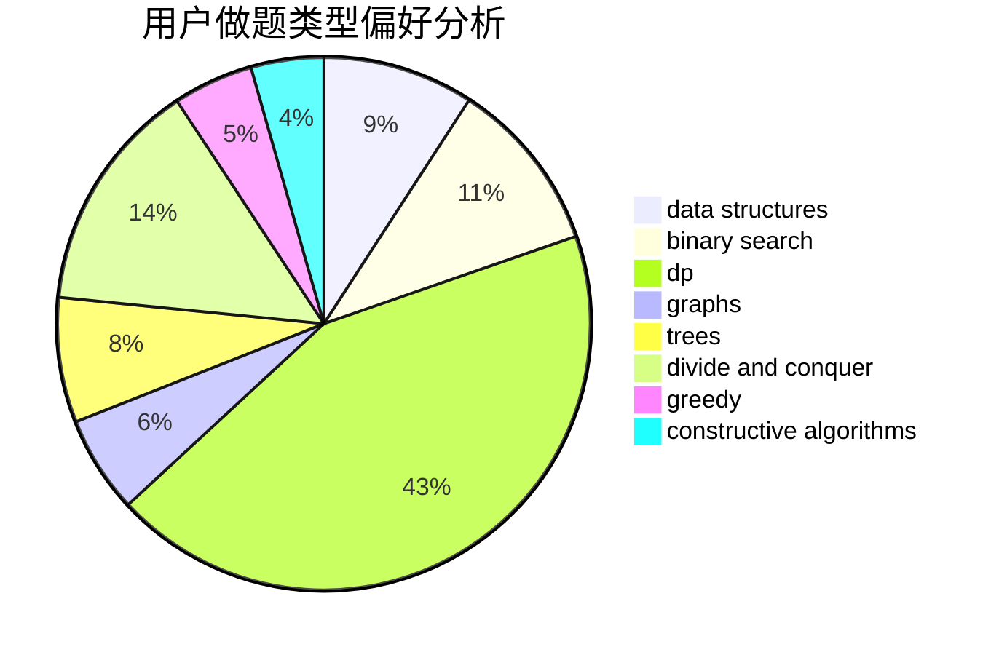

# Heisexingqitian

<!-- tabs:start -->

#### **用户提交结果分析**

#### **用户做题类型偏好分析**

#### **用户错题知识点分析**

<!-- tabs:end -->
# 推荐题目
[193C](https://codeforces.com/contest/193/problem/C)		constructive algorithms,
                        greedy,
                        math,
                        matrices		  
[804F](https://codeforces.com/contest/804/problem/F)		combinatorics,
                        dfs and similar,
                        dp,
                        graphs,
                        number theory		  
[899D](https://codeforces.com/contest/899/problem/D)		constructive algorithms,
                        math		  
[920F](https://codeforces.com/contest/920/problem/F)		brute force,
                        data structures,
                        dsu,
                        number theory		  
[1065B](https://codeforces.com/contest/1065/problem/B)		constructive algorithms,
                        graphs		  
[208A](https://codeforces.com/contest/208/problem/A)		strings		  
[1384E](https://codeforces.com/contest/1384/problem/E)		dsu,graphs,sortings,trees		  
[246D](https://codeforces.com/contest/246/problem/D)		brute force,
                        dfs and similar,
                        graphs		  
[1307F](https://codeforces.com/contest/1307/problem/F)		dfs and similar,
                        dsu,
                        trees		  
[920C](https://codeforces.com/contest/920/problem/C)		dfs and similar,
                        greedy,
                        math,
                        sortings,
                        two pointers		  
