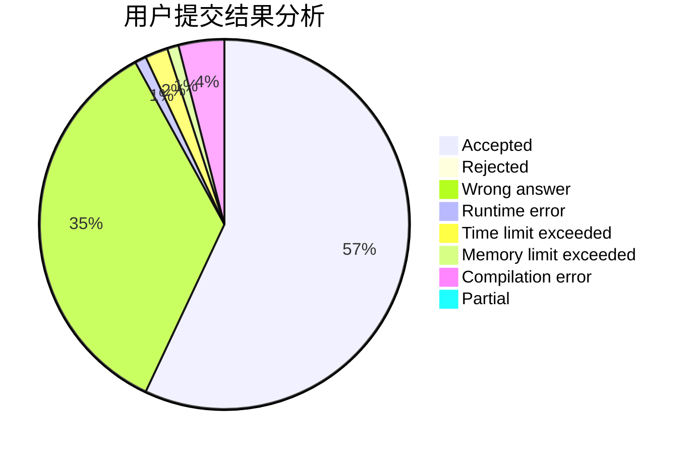
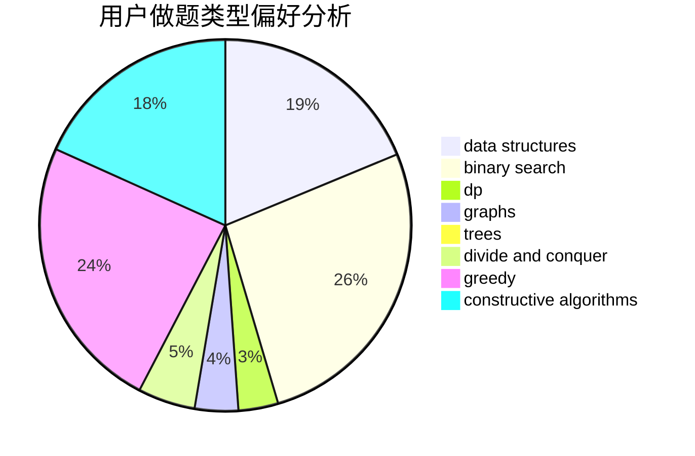
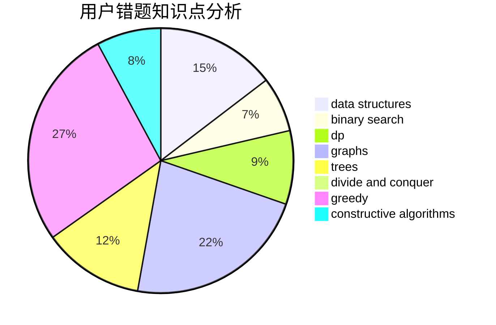

# Heisexingqitian

<!-- tabs:start -->

#### **用户提交结果分析**

#### **用户做题类型偏好分析**

#### **用户错题知识点分析**

<!-- tabs:end -->
# 推荐题目
[167B](https://codeforces.com/contest/167/problem/B)		dp,
                        math,
                        probabilities		  
[789D](https://codeforces.com/contest/789/problem/D)		dsu,graphs,sortings,trees		  
[878E](https://codeforces.com/contest/878/problem/E)		combinatorics,
                        dp		  
[907B](https://codeforces.com/contest/907/problem/B)		implementation		  
[1064E](https://codeforces.com/contest/1064/problem/E)		dsu,graphs,sortings,trees		  
[180D](https://codeforces.com/contest/180/problem/D)		greedy,
                        strings		  
[1375F](https://codeforces.com/contest/1375/problem/F)		constructive algorithms,
                        games,
                        interactive,
                        math		  
[228D](https://codeforces.com/contest/228/problem/D)		data structures		  
[1300A](https://codeforces.com/contest/1300/problem/A)		implementation,
                        math		  
[906E](https://codeforces.com/contest/906/problem/E)		dp,
                        string suffix structures,
                        strings		  
