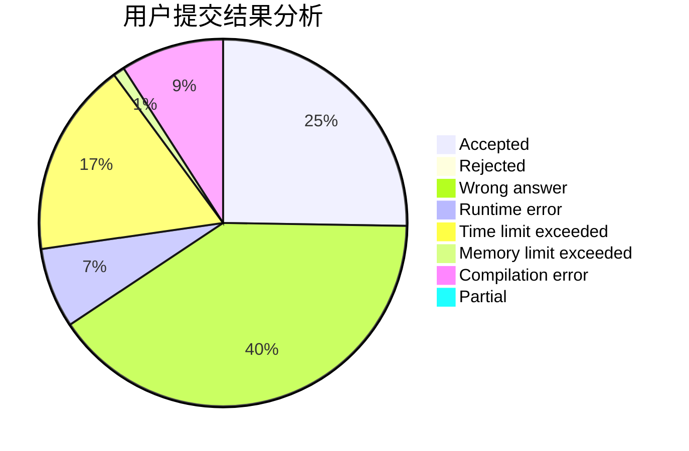
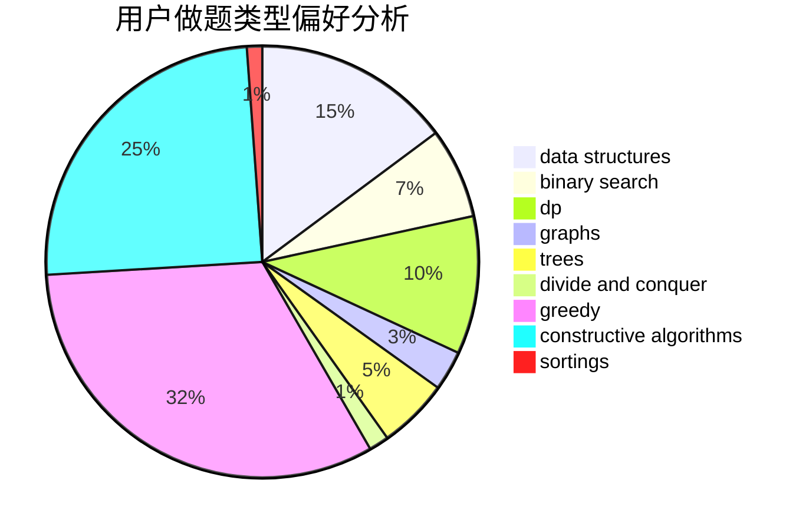
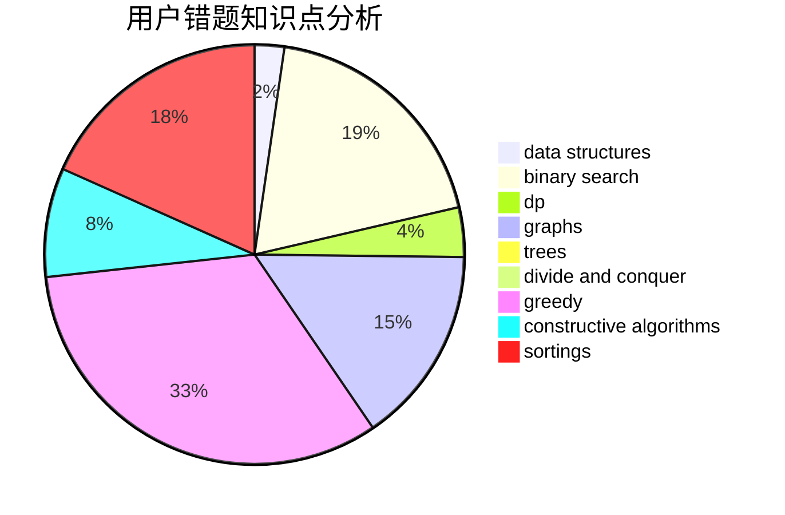

# 2354660845
<!-- tabs:start -->
#### **用户提交结果分析**

#### **用户做题类型偏好分析**

#### **用户错题知识点分析**

<!-- tabs:end -->
# 推荐题目
[1082C](http://codeforces.com/problemset/problem/1082/C)		greedy,
                        sortings		  
[1315C](http://codeforces.com/problemset/problem/1315/C)		greedy		  
[1313E](http://codeforces.com/problemset/problem/1313/E)		data structures,
                        hashing,
                        strings,
                        two pointers		  
[1314D](https://codeforces.com/contest/1314/problem/D)		dp,
                        graphs,
                        probabilities		  
[1315D](https://codeforces.com/contest/1315/problem/D)		data structures,
                        greedy,
                        sortings		  
[1178F1](http://codeforces.com/problemset/problem/1178/F1)		combinatorics,
                        dfs and similar,
                        dp		  
[1316D](http://codeforces.com/problemset/problem/1316/D)		constructive algorithms,
                        dfs and similar,
                        graphs,
                        implementation		  
[1315F](https://codeforces.com/contest/1315/problem/F)		binary search,
                        dp,
                        strings		  
[1252L](http://codeforces.com/problemset/problem/1252/L)		flows,
                        graphs		  
[1314C](https://codeforces.com/contest/1314/problem/C)		binary search,
                        dp,
                        strings		  
<!-- tabs:start -->
#### **data structures**
[1313E](http://codeforces.com/problemset/problem/1313/E)		data structures,
                        hashing,
                        strings,
                        two pointers		  
[1315D](https://codeforces.com/contest/1315/problem/D)		data structures,
                        greedy,
                        sortings		  
[1320A](http://codeforces.com/problemset/problem/1320/A)		data structures,
                        dp,
                        greedy,
                        math,
                        sortings		  
[1320E](http://codeforces.com/problemset/problem/1320/E)		data structures,
                        dfs and similar,
                        dp,
                        shortest paths,
                        trees		  
[1200A](http://codeforces.com/problemset/problem/1200/A)		brute force,
                        data structures,
                        implementation		  
[1320D](http://codeforces.com/problemset/problem/1320/D)		data structures,
                        hashing,
                        strings		  
[1314A](https://codeforces.com/contest/1314/problem/A)		data structures,
                        greedy,
                        sortings		  
[1320C](http://codeforces.com/problemset/problem/1320/C)		brute force,
                        data structures,
                        sortings		  
[1313C1](http://codeforces.com/problemset/problem/1313/C1)		brute force,
                        data structures,
                        dp,
                        greedy		  
[1314E](https://codeforces.com/contest/1314/problem/E)		binary search,
                        data structures,
                        dp,
                        greedy		  
#### **binary search**
[1315F](https://codeforces.com/contest/1315/problem/F)		binary search,
                        dp,
                        strings		  
[1314C](https://codeforces.com/contest/1314/problem/C)		binary search,
                        dp,
                        strings		  
[1315B](http://codeforces.com/problemset/problem/1315/B)		binary search,
                        dp,
                        greedy,
                        strings		  
[1314E](https://codeforces.com/contest/1314/problem/E)		binary search,
                        data structures,
                        dp,
                        greedy		  
[1301C](http://codeforces.com/problemset/problem/1301/C)		binary search,
                        combinatorics,
                        greedy,
                        math,
                        strings		  
[1158A](http://codeforces.com/problemset/problem/1158/A)		binary search,
                        constructive algorithms,
                        greedy,
                        implementation,
                        math,
                        sortings,
                        two pointers		  
[1492C](http://codeforces.com/problemset/problem/1492/C)		binary search,
                        data structures,
                        dp,
                        greedy,
                        two pointers		  
[1463D](http://codeforces.com/problemset/problem/1463/D)		binary search,
                        constructive algorithms,
                        greedy,
                        two pointers		  
[1490G](http://codeforces.com/problemset/problem/1490/G)		binary search,
                        data structures,
                        math		  
[1479D](http://codeforces.com/problemset/problem/1479/D)		binary search,
                        bitmasks,
                        brute force,
                        data structures,
                        probabilities,
                        trees		  
#### **dp**
[1314D](https://codeforces.com/contest/1314/problem/D)		dp,
                        graphs,
                        probabilities		  
[1178F1](http://codeforces.com/problemset/problem/1178/F1)		combinatorics,
                        dfs and similar,
                        dp		  
[1315F](https://codeforces.com/contest/1315/problem/F)		binary search,
                        dp,
                        strings		  
[1314C](https://codeforces.com/contest/1314/problem/C)		binary search,
                        dp,
                        strings		  
[1320A](http://codeforces.com/problemset/problem/1320/A)		data structures,
                        dp,
                        greedy,
                        math,
                        sortings		  
[1314B](https://codeforces.com/contest/1314/problem/B)		dp,
                        implementation		  
[1315B](http://codeforces.com/problemset/problem/1315/B)		binary search,
                        dp,
                        greedy,
                        strings		  
[1320E](http://codeforces.com/problemset/problem/1320/E)		data structures,
                        dfs and similar,
                        dp,
                        shortest paths,
                        trees		  
[1028G](http://codeforces.com/problemset/problem/1028/G)		dp,
                        interactive		  
[1313D](http://codeforces.com/problemset/problem/1313/D)		bitmasks,
                        dp,
                        implementation		  
#### **graph**
[1314D](https://codeforces.com/contest/1314/problem/D)		dp,
                        graphs,
                        probabilities		  
[1316D](http://codeforces.com/problemset/problem/1316/D)		constructive algorithms,
                        dfs and similar,
                        graphs,
                        implementation		  
[1252L](http://codeforces.com/problemset/problem/1252/L)		flows,
                        graphs		  
[131D](http://codeforces.com/problemset/problem/131/D)		dfs and similar,
                        graphs		  
[1320B](http://codeforces.com/problemset/problem/1320/B)		dfs and similar,
                        graphs,
                        shortest paths		  
[1487C](http://codeforces.com/problemset/problem/1487/C)		brute force,
                        constructive algorithms,
                        dfs and similar,
                        graphs,
                        greedy,
                        implementation,
                        math		  
[1437C](http://codeforces.com/problemset/problem/1437/C)		dp,
                        flows,
                        graph matchings,
                        greedy,
                        math,
                        sortings		  
[1470D](http://codeforces.com/problemset/problem/1470/D)		constructive algorithms,
                        dfs and similar,
                        graph matchings,
                        graphs,
                        greedy		  
[1476C](http://codeforces.com/problemset/problem/1476/C)		dp,
                        graphs,
                        greedy		  
[1304D](http://codeforces.com/problemset/problem/1304/D)		constructive algorithms,
                        graphs,
                        greedy,
                        two pointers		  
#### **trees**
[1320E](http://codeforces.com/problemset/problem/1320/E)		data structures,
                        dfs and similar,
                        dp,
                        shortest paths,
                        trees		  
[1479D](http://codeforces.com/problemset/problem/1479/D)		binary search,
                        bitmasks,
                        brute force,
                        data structures,
                        probabilities,
                        trees		  
[1511C](http://codeforces.com/problemset/problem/1511/C)		brute force,
                        data structures,
                        implementation,
                        trees		  
[1499F](http://codeforces.com/problemset/problem/1499/F)		combinatorics,
                        dfs and similar,
                        dp,
                        trees		  
[1491E](http://codeforces.com/problemset/problem/1491/E)		brute force,
                        dfs and similar,
                        divide and conquer,
                        number theory,
                        trees		  
[1466D](http://codeforces.com/problemset/problem/1466/D)		data structures,
                        greedy,
                        sortings,
                        trees		  
[1495D](http://codeforces.com/problemset/problem/1495/D)		combinatorics,
                        dfs and similar,
                        graphs,
                        math,
                        shortest paths,
                        trees		  
[1303G](http://codeforces.com/problemset/problem/1303/G)		data structures,
                        divide and conquer,
                        geometry,
                        trees		  
[1454E](http://codeforces.com/problemset/problem/1454/E)		combinatorics,
                        dfs and similar,
                        graphs,
                        trees		  
[1494D](http://codeforces.com/problemset/problem/1494/D)		constructive algorithms,
                        data structures,
                        dfs and similar,
                        divide and conquer,
                        dsu,
                        greedy,
                        sortings,
                        trees		  
#### **divide and conquer**
[1316F](http://codeforces.com/problemset/problem/1316/F)		data structures,
                        divide and conquer,
                        probabilities		  
[1461D](http://codeforces.com/problemset/problem/1461/D)		binary search,
                        brute force,
                        data structures,
                        divide and conquer,
                        implementation,
                        sortings		  
[1466G](http://codeforces.com/problemset/problem/1466/G)		combinatorics,
                        divide and conquer,
                        hashing,
                        math,
                        string suffix structures,
                        strings		  
[1490D](http://codeforces.com/problemset/problem/1490/D)		dfs and similar,
                        divide and conquer,
                        implementation		  
[1483C](https://codeforces.com/contest/1483/problem/C)		data structures,
                        divide and conquer,
                        dp		  
[1491E](http://codeforces.com/problemset/problem/1491/E)		brute force,
                        dfs and similar,
                        divide and conquer,
                        number theory,
                        trees		  
[1303G](http://codeforces.com/problemset/problem/1303/G)		data structures,
                        divide and conquer,
                        geometry,
                        trees		  
[1494D](http://codeforces.com/problemset/problem/1494/D)		constructive algorithms,
                        data structures,
                        dfs and similar,
                        divide and conquer,
                        dsu,
                        greedy,
                        sortings,
                        trees		  
[1482E](http://codeforces.com/problemset/problem/1482/E)		data structures,
                        divide and conquer,
                        dp		  
[566C](http://codeforces.com/problemset/problem/566/C)		dfs and similar,
                        divide and conquer,
                        trees		  
#### **greedy**
[1082C](http://codeforces.com/problemset/problem/1082/C)		greedy,
                        sortings		  
[1315C](http://codeforces.com/problemset/problem/1315/C)		greedy		  
[1315D](https://codeforces.com/contest/1315/problem/D)		data structures,
                        greedy,
                        sortings		  
[1118D1](http://codeforces.com/problemset/problem/1118/D1)		brute force,
                        greedy		  
[1313B](http://codeforces.com/problemset/problem/1313/B)		constructive algorithms,
                        greedy,
                        implementation,
                        math		  
[1320A](http://codeforces.com/problemset/problem/1320/A)		data structures,
                        dp,
                        greedy,
                        math,
                        sortings		  
[1315B](http://codeforces.com/problemset/problem/1315/B)		binary search,
                        dp,
                        greedy,
                        strings		  
[1017C](http://codeforces.com/problemset/problem/1017/C)		constructive algorithms,
                        greedy		  
[1313A](http://codeforces.com/problemset/problem/1313/A)		brute force,
                        greedy,
                        implementation		  
[1314A](https://codeforces.com/contest/1314/problem/A)		data structures,
                        greedy,
                        sortings		  
#### **constructive algorithms**
[1316D](http://codeforces.com/problemset/problem/1316/D)		constructive algorithms,
                        dfs and similar,
                        graphs,
                        implementation		  
[1313B](http://codeforces.com/problemset/problem/1313/B)		constructive algorithms,
                        greedy,
                        implementation,
                        math		  
[1012D](http://codeforces.com/problemset/problem/1012/D)		constructive algorithms,
                        strings		  
[1316C](http://codeforces.com/problemset/problem/1316/C)		constructive algorithms,
                        math,
                        ternary search		  
[1017C](http://codeforces.com/problemset/problem/1017/C)		constructive algorithms,
                        greedy		  
[1316B](http://codeforces.com/problemset/problem/1316/B)		brute force,
                        constructive algorithms,
                        implementation,
                        sortings,
                        strings		  
[1158A](http://codeforces.com/problemset/problem/1158/A)		binary search,
                        constructive algorithms,
                        greedy,
                        implementation,
                        math,
                        sortings,
                        two pointers		  
[1493A](http://codeforces.com/problemset/problem/1493/A)		constructive algorithms,
                        greedy		  
[1463D](http://codeforces.com/problemset/problem/1463/D)		binary search,
                        constructive algorithms,
                        greedy,
                        two pointers		  
[1456B](https://codeforces.com/contest/1456/problem/B)		bitmasks,
                        brute force,
                        constructive algorithms		  
#### **sortings**
[1082C](http://codeforces.com/problemset/problem/1082/C)		greedy,
                        sortings		  
[1315D](https://codeforces.com/contest/1315/problem/D)		data structures,
                        greedy,
                        sortings		  
[1320A](http://codeforces.com/problemset/problem/1320/A)		data structures,
                        dp,
                        greedy,
                        math,
                        sortings		  
[1314A](https://codeforces.com/contest/1314/problem/A)		data structures,
                        greedy,
                        sortings		  
[1320C](http://codeforces.com/problemset/problem/1320/C)		brute force,
                        data structures,
                        sortings		  
[1316B](http://codeforces.com/problemset/problem/1316/B)		brute force,
                        constructive algorithms,
                        implementation,
                        sortings,
                        strings		  
[1316E](http://codeforces.com/problemset/problem/1316/E)		bitmasks,
                        dp,
                        greedy,
                        sortings		  
[1158A](http://codeforces.com/problemset/problem/1158/A)		binary search,
                        constructive algorithms,
                        greedy,
                        implementation,
                        math,
                        sortings,
                        two pointers		  
[1496C](https://codeforces.com/contest/1496/problem/C)		geometry,
                        greedy,
                        math,
                        sortings		  
[1495A](http://codeforces.com/problemset/problem/1495/A)		geometry,
                        greedy,
                        math,
                        sortings		  
<!-- tabs:end -->
