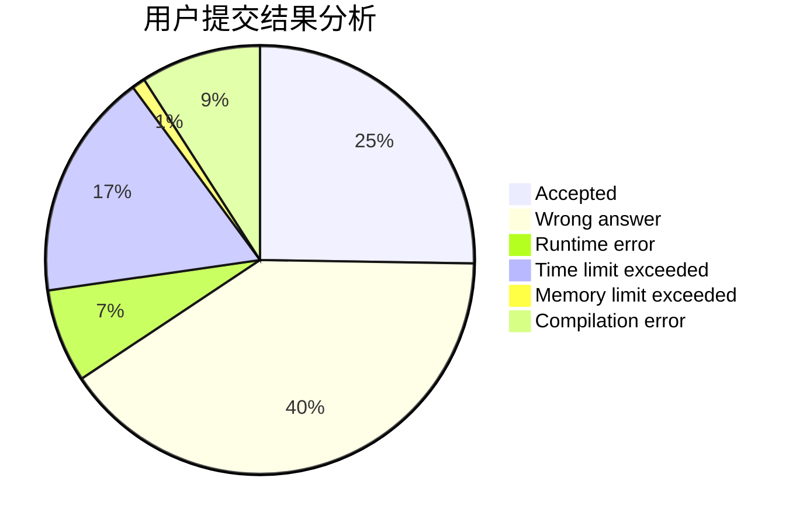
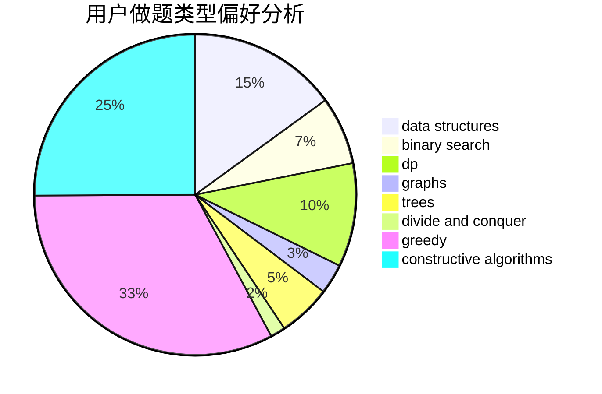
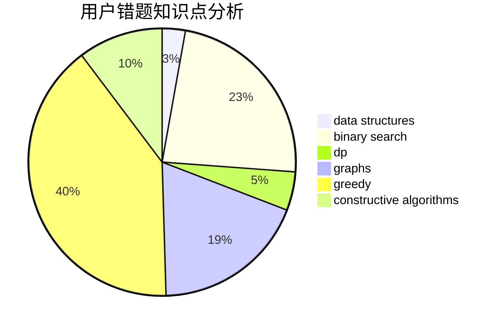

# 2354660845
<!-- tabs:start -->
#### **用户提交结果分析**

#### **用户做题类型偏好分析**

#### **用户错题知识点分析**

<!-- tabs:end -->
# 推荐题目
[Multi-Subject Competition](http://codeforces.com/problemset/problem/1082/C)		greedy,
                        sortings		  
[Restoring Permutation](http://codeforces.com/problemset/problem/1315/C)		greedy		  
[Concatenation with intersection](http://codeforces.com/problemset/problem/1313/E)		data structures,
                        hashing,
                        strings,
                        two pointers		  
[Tourism](https://codeforces.com/contest/1314/problem/D)		dp,
                        graphs,
                        probabilities		  
[Recommendations](https://codeforces.com/contest/1315/problem/D)		data structures,
                        greedy,
                        sortings		  
[Short Colorful Strip](http://codeforces.com/problemset/problem/1178/F1)		combinatorics,
                        dfs and similar,
                        dp		  
[Nash Matrix](http://codeforces.com/problemset/problem/1316/D)		constructive algorithms,
                        dfs and similar,
                        graphs,
                        implementation		  
[Au Pont Rouge](https://codeforces.com/contest/1315/problem/F)		binary search,
                        dp,
                        strings		  
[Road Construction](http://codeforces.com/problemset/problem/1252/L)		flows,
                        graphs		  
<!-- tabs:start -->
#### **data structures**
[Concatenation with intersection](http://codeforces.com/problemset/problem/1313/E)		data structures,
                        hashing,
                        strings,
                        two pointers		  
[Recommendations](https://codeforces.com/contest/1315/problem/D)		data structures,
                        greedy,
                        sortings		  
[Journey Planning](http://codeforces.com/problemset/problem/1320/A)		data structures,
                        dp,
                        greedy,
                        math,
                        sortings		  
[Treeland and Viruses](http://codeforces.com/problemset/problem/1320/E)		data structures,
                        dfs and similar,
                        dp,
                        shortest paths,
                        trees		  
[Hotelier](http://codeforces.com/problemset/problem/1200/A)		brute force,
                        data structures,
                        implementation		  
[Reachable Strings](http://codeforces.com/problemset/problem/1320/D)		data structures,
                        hashing,
                        strings		  
[World of Darkraft: Battle for Azathoth](http://codeforces.com/problemset/problem/1320/C)		brute force,
                        data structures,
                        sortings		  
[Skyscrapers (easy version)](http://codeforces.com/problemset/problem/1313/C1)		brute force,
                        data structures,
                        dp,
                        greedy		  
[Strange Function](https://codeforces.com/contest/1314/problem/E)		binary search,
                        data structures,
                        dp,
                        greedy		  
[Skyscrapers (hard version)](http://codeforces.com/problemset/problem/1313/C2)		data structures,
                        dp,
                        greedy		  
#### **binary search**
[Au Pont Rouge](https://codeforces.com/contest/1315/problem/F)		binary search,
                        dp,
                        strings		  
[Homecoming](http://codeforces.com/problemset/problem/1315/B)		binary search,
                        dp,
                        greedy,
                        strings		  
[Strange Function](https://codeforces.com/contest/1314/problem/E)		binary search,
                        data structures,
                        dp,
                        greedy		  
[Ayoub's function](http://codeforces.com/problemset/problem/1301/C)		binary search,
                        combinatorics,
                        greedy,
                        math,
                        strings		  
[The Party and Sweets](http://codeforces.com/problemset/problem/1158/A)		binary search,
                        constructive algorithms,
                        greedy,
                        implementation,
                        math,
                        sortings,
                        two pointers		  
[Maximum width](http://codeforces.com/problemset/problem/1492/C)		binary search,
                        data structures,
                        dp,
                        greedy,
                        two pointers		  
[Pairs](http://codeforces.com/problemset/problem/1463/D)		binary search,
                        constructive algorithms,
                        greedy,
                        two pointers		  
[Old Floppy Drive](http://codeforces.com/problemset/problem/1490/G)		binary search,
                        data structures,
                        math		  
[Odd Mineral Resource](http://codeforces.com/problemset/problem/1479/D)		binary search,
                        bitmasks,
                        brute force,
                        data structures,
                        probabilities,
                        trees		  
[Complicated Computations](http://codeforces.com/problemset/problem/1436/E)		binary search,
                        data structures,
                        two pointers		  
#### **dp**
[Tourism](https://codeforces.com/contest/1314/problem/D)		dp,
                        graphs,
                        probabilities		  
[Short Colorful Strip](http://codeforces.com/problemset/problem/1178/F1)		combinatorics,
                        dfs and similar,
                        dp		  
[Au Pont Rouge](https://codeforces.com/contest/1315/problem/F)		binary search,
                        dp,
                        strings		  
[Journey Planning](http://codeforces.com/problemset/problem/1320/A)		data structures,
                        dp,
                        greedy,
                        math,
                        sortings		  
[Double Elimination](https://codeforces.com/contest/1314/problem/B)		dp,
                        implementation		  
[Homecoming](http://codeforces.com/problemset/problem/1315/B)		binary search,
                        dp,
                        greedy,
                        strings		  
[Treeland and Viruses](http://codeforces.com/problemset/problem/1320/E)		data structures,
                        dfs and similar,
                        dp,
                        shortest paths,
                        trees		  
[Guess the number](http://codeforces.com/problemset/problem/1028/G)		dp,
                        interactive		  
[Happy New Year](http://codeforces.com/problemset/problem/1313/D)		bitmasks,
                        dp,
                        implementation		  
[Vasya and Good Sequences](https://codeforces.com/contest/1053/problem/B)		bitmasks,
                        dp		  
#### **graph**
[Tourism](https://codeforces.com/contest/1314/problem/D)		dp,
                        graphs,
                        probabilities		  
[Nash Matrix](http://codeforces.com/problemset/problem/1316/D)		constructive algorithms,
                        dfs and similar,
                        graphs,
                        implementation		  
[Road Construction](http://codeforces.com/problemset/problem/1252/L)		flows,
                        graphs		  
[Subway](http://codeforces.com/problemset/problem/131/D)		dfs and similar,
                        graphs		  
[Navigation System](http://codeforces.com/problemset/problem/1320/B)		dfs and similar,
                        graphs,
                        shortest paths		  
[Minimum Ties](http://codeforces.com/problemset/problem/1487/C)		brute force,
                        constructive algorithms,
                        dfs and similar,
                        graphs,
                        greedy,
                        implementation,
                        math		  
[Chef Monocarp](http://codeforces.com/problemset/problem/1437/C)		dp,
                        flows,
                        graph matchings,
                        greedy,
                        math,
                        sortings		  
[Strange Housing](http://codeforces.com/problemset/problem/1470/D)		constructive algorithms,
                        dfs and similar,
                        graph matchings,
                        graphs,
                        greedy		  
[Longest Simple Cycle](http://codeforces.com/problemset/problem/1476/C)		dp,
                        graphs,
                        greedy		  
[Shortest and Longest LIS](http://codeforces.com/problemset/problem/1304/D)		constructive algorithms,
                        graphs,
                        greedy,
                        two pointers		  
#### **trees**
[Treeland and Viruses](http://codeforces.com/problemset/problem/1320/E)		data structures,
                        dfs and similar,
                        dp,
                        shortest paths,
                        trees		  
[Odd Mineral Resource](http://codeforces.com/problemset/problem/1479/D)		binary search,
                        bitmasks,
                        brute force,
                        data structures,
                        probabilities,
                        trees		  
[Yet Another Card Deck](http://codeforces.com/problemset/problem/1511/C)		brute force,
                        data structures,
                        implementation,
                        trees		  
[Diameter Cuts](http://codeforces.com/problemset/problem/1499/F)		combinatorics,
                        dfs and similar,
                        dp,
                        trees		  
[Fib-tree](http://codeforces.com/problemset/problem/1491/E)		brute force,
                        dfs and similar,
                        divide and conquer,
                        number theory,
                        trees		  
[13th Labour of Heracles](http://codeforces.com/problemset/problem/1466/D)		data structures,
                        greedy,
                        sortings,
                        trees		  
[BFS Trees](http://codeforces.com/problemset/problem/1495/D)		combinatorics,
                        dfs and similar,
                        graphs,
                        math,
                        shortest paths,
                        trees		  
[Sum of Prefix Sums](http://codeforces.com/problemset/problem/1303/G)		data structures,
                        divide and conquer,
                        geometry,
                        trees		  
[Number of Simple Paths](http://codeforces.com/problemset/problem/1454/E)		combinatorics,
                        dfs and similar,
                        graphs,
                        trees		  
[Dogeforces](http://codeforces.com/problemset/problem/1494/D)		constructive algorithms,
                        data structures,
                        dfs and similar,
                        divide and conquer,
                        dsu,
                        greedy,
                        sortings,
                        trees		  
#### **divide and conquer**
[Battalion Strength](http://codeforces.com/problemset/problem/1316/F)		data structures,
                        divide and conquer,
                        probabilities		  
[Divide and Summarize](http://codeforces.com/problemset/problem/1461/D)		binary search,
                        brute force,
                        data structures,
                        divide and conquer,
                        implementation,
                        sortings		  
[Song of the Sirens](http://codeforces.com/problemset/problem/1466/G)		combinatorics,
                        divide and conquer,
                        hashing,
                        math,
                        string suffix structures,
                        strings		  
[Permutation Transformation](http://codeforces.com/problemset/problem/1490/D)		dfs and similar,
                        divide and conquer,
                        implementation		  
[Skyline Photo](https://codeforces.com/contest/1483/problem/C)		data structures,
                        divide and conquer,
                        dp		  
[Fib-tree](http://codeforces.com/problemset/problem/1491/E)		brute force,
                        dfs and similar,
                        divide and conquer,
                        number theory,
                        trees		  
[Sum of Prefix Sums](http://codeforces.com/problemset/problem/1303/G)		data structures,
                        divide and conquer,
                        geometry,
                        trees		  
[Dogeforces](http://codeforces.com/problemset/problem/1494/D)		constructive algorithms,
                        data structures,
                        dfs and similar,
                        divide and conquer,
                        dsu,
                        greedy,
                        sortings,
                        trees		  
[Logistical Questions](http://codeforces.com/problemset/problem/566/C)		dfs and similar,
                        divide and conquer,
                        trees		  
[Fruit Sequences](http://codeforces.com/problemset/problem/1428/F)		binary search,
                        data structures,
                        divide and conquer,
                        dp,
                        two pointers		  
#### **greedy**
[Multi-Subject Competition](http://codeforces.com/problemset/problem/1082/C)		greedy,
                        sortings		  
[Restoring Permutation](http://codeforces.com/problemset/problem/1315/C)		greedy		  
[Recommendations](https://codeforces.com/contest/1315/problem/D)		data structures,
                        greedy,
                        sortings		  
[Coffee and Coursework (Easy version)](http://codeforces.com/problemset/problem/1118/D1)		brute force,
                        greedy		  
[Different Rules](http://codeforces.com/problemset/problem/1313/B)		constructive algorithms,
                        greedy,
                        implementation,
                        math		  
[Journey Planning](http://codeforces.com/problemset/problem/1320/A)		data structures,
                        dp,
                        greedy,
                        math,
                        sortings		  
[Homecoming](http://codeforces.com/problemset/problem/1315/B)		binary search,
                        dp,
                        greedy,
                        strings		  
[The Phone Number](http://codeforces.com/problemset/problem/1017/C)		constructive algorithms,
                        greedy		  
[Fast Food Restaurant](http://codeforces.com/problemset/problem/1313/A)		brute force,
                        greedy,
                        implementation		  
[Skyscrapers (easy version)](http://codeforces.com/problemset/problem/1313/C1)		brute force,
                        data structures,
                        dp,
                        greedy		  
#### **constructive algorithms**
[Nash Matrix](http://codeforces.com/problemset/problem/1316/D)		constructive algorithms,
                        dfs and similar,
                        graphs,
                        implementation		  
[Different Rules](http://codeforces.com/problemset/problem/1313/B)		constructive algorithms,
                        greedy,
                        implementation,
                        math		  
[AB-Strings](http://codeforces.com/problemset/problem/1012/D)		constructive algorithms,
                        strings		  
[Primitive Primes](http://codeforces.com/problemset/problem/1316/C)		constructive algorithms,
                        math,
                        ternary search		  
[The Phone Number](http://codeforces.com/problemset/problem/1017/C)		constructive algorithms,
                        greedy		  
[String Modification](http://codeforces.com/problemset/problem/1316/B)		brute force,
                        constructive algorithms,
                        implementation,
                        sortings,
                        strings		  
[The Party and Sweets](http://codeforces.com/problemset/problem/1158/A)		binary search,
                        constructive algorithms,
                        greedy,
                        implementation,
                        math,
                        sortings,
                        two pointers		  
[Anti-knapsack](http://codeforces.com/problemset/problem/1493/A)		constructive algorithms,
                        greedy		  
[Pairs](http://codeforces.com/problemset/problem/1463/D)		binary search,
                        constructive algorithms,
                        greedy,
                        two pointers		  
[XOR-gun](https://codeforces.com/contest/1456/problem/B)		bitmasks,
                        brute force,
                        constructive algorithms		  
#### **sortings**
[Multi-Subject Competition](http://codeforces.com/problemset/problem/1082/C)		greedy,
                        sortings		  
[Recommendations](https://codeforces.com/contest/1315/problem/D)		data structures,
                        greedy,
                        sortings		  
[Journey Planning](http://codeforces.com/problemset/problem/1320/A)		data structures,
                        dp,
                        greedy,
                        math,
                        sortings		  
[World of Darkraft: Battle for Azathoth](http://codeforces.com/problemset/problem/1320/C)		brute force,
                        data structures,
                        sortings		  
[String Modification](http://codeforces.com/problemset/problem/1316/B)		brute force,
                        constructive algorithms,
                        implementation,
                        sortings,
                        strings		  
[Team Building](http://codeforces.com/problemset/problem/1316/E)		bitmasks,
                        dp,
                        greedy,
                        sortings		  
[The Party and Sweets](http://codeforces.com/problemset/problem/1158/A)		binary search,
                        constructive algorithms,
                        greedy,
                        implementation,
                        math,
                        sortings,
                        two pointers		  
[Diamond Miner](https://codeforces.com/contest/1496/problem/C)		geometry,
                        greedy,
                        math,
                        sortings		  
[Meximization](http://codeforces.com/problemset/problem/1497/A)		brute force,
                        data structures,
                        greedy,
                        sortings		  
[Avoiding Zero](http://codeforces.com/problemset/problem/1427/A)		math,
                        sortings		  
<!-- tabs:end -->
