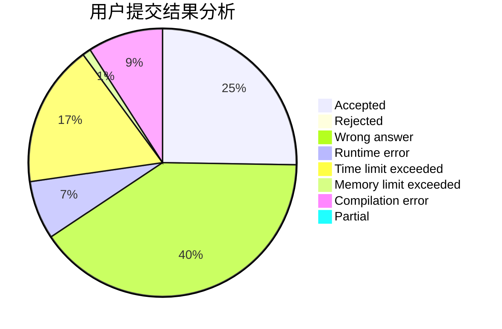
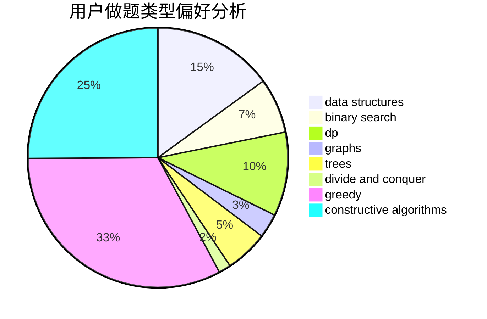
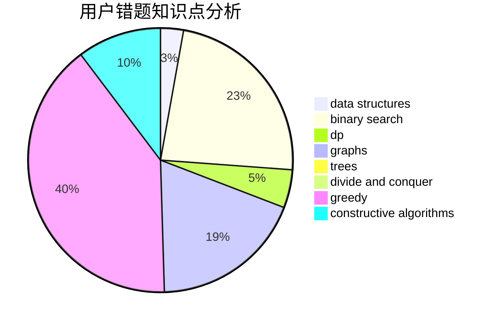

# 2354660845
<!-- tabs:start -->
#### **用户提交结果分析**

#### **用户做题类型偏好分析**

#### **用户错题知识点分析**

<!-- tabs:end -->
# 推荐题目
[Multi-Subject Competition](http://codeforces.com/problemset/problem/1082/C)		greedy,
                        sortings		  
[Restoring Permutation](http://codeforces.com/problemset/problem/1315/C)		greedy		  
[Concatenation with intersection](http://codeforces.com/problemset/problem/1313/E)		data structures,
                        hashing,
                        strings,
                        two pointers		  
[Tourism](https://codeforces.com/contest/1314/problem/D)		dp,
                        graphs,
                        probabilities		  
[Recommendations](https://codeforces.com/contest/1315/problem/D)		data structures,
                        greedy,
                        sortings		  
[Short Colorful Strip](http://codeforces.com/problemset/problem/1178/F1)		combinatorics,
                        dfs and similar,
                        dp		  
[Nash Matrix](http://codeforces.com/problemset/problem/1316/D)		constructive algorithms,
                        dfs and similar,
                        graphs,
                        implementation		  
[Au Pont Rouge](https://codeforces.com/contest/1315/problem/F)		binary search,
                        dp,
                        strings		  
[Road Construction](http://codeforces.com/problemset/problem/1252/L)		flows,
                        graphs		  
[Au Pont Rouge](https://codeforces.com/contest/1314/problem/C)		binary search,
                        dp,
                        strings		  
<!-- tabs:start -->
#### **data structures**
[Multi-Subject Competition](http://codeforces.com/problemset/problem/1313/E)		data structures,
                        hashing,
                        strings,
                        two pointers		  
[Restoring Permutation](https://codeforces.com/contest/1315/problem/D)		data structures,
                        greedy,
                        sortings		  
[Concatenation with intersection](http://codeforces.com/problemset/problem/1320/A)		data structures,
                        dp,
                        greedy,
                        math,
                        sortings		  
[Tourism](http://codeforces.com/problemset/problem/1320/E)		data structures,
                        dfs and similar,
                        dp,
                        shortest paths,
                        trees		  
[Recommendations](http://codeforces.com/problemset/problem/1200/A)		brute force,
                        data structures,
                        implementation		  
[Short Colorful Strip](http://codeforces.com/problemset/problem/1320/D)		data structures,
                        hashing,
                        strings		  
[Nash Matrix](https://codeforces.com/contest/1314/problem/A)		data structures,
                        greedy,
                        sortings		  
[Au Pont Rouge](http://codeforces.com/problemset/problem/1320/C)		brute force,
                        data structures,
                        sortings		  
[Road Construction](http://codeforces.com/problemset/problem/1313/C1)		brute force,
                        data structures,
                        dp,
                        greedy		  
[Au Pont Rouge](https://codeforces.com/contest/1314/problem/E)		binary search,
                        data structures,
                        dp,
                        greedy		  
#### **binary search**
[Multi-Subject Competition](https://codeforces.com/contest/1315/problem/F)		binary search,
                        dp,
                        strings		  
[Restoring Permutation](https://codeforces.com/contest/1314/problem/C)		binary search,
                        dp,
                        strings		  
[Concatenation with intersection](http://codeforces.com/problemset/problem/1315/B)		binary search,
                        dp,
                        greedy,
                        strings		  
[Tourism](https://codeforces.com/contest/1314/problem/E)		binary search,
                        data structures,
                        dp,
                        greedy		  
[Recommendations](http://codeforces.com/problemset/problem/1301/C)		binary search,
                        combinatorics,
                        greedy,
                        math,
                        strings		  
[Short Colorful Strip](http://codeforces.com/problemset/problem/1158/A)		binary search,
                        constructive algorithms,
                        greedy,
                        implementation,
                        math,
                        sortings,
                        two pointers		  
[Nash Matrix](http://codeforces.com/problemset/problem/1492/C)		binary search,
                        data structures,
                        dp,
                        greedy,
                        two pointers		  
[Au Pont Rouge](http://codeforces.com/problemset/problem/1463/D)		binary search,
                        constructive algorithms,
                        greedy,
                        two pointers		  
[Road Construction](http://codeforces.com/problemset/problem/1490/G)		binary search,
                        data structures,
                        math		  
[Au Pont Rouge](http://codeforces.com/problemset/problem/1479/D)		binary search,
                        bitmasks,
                        brute force,
                        data structures,
                        probabilities,
                        trees		  
#### **dp**
[Multi-Subject Competition](https://codeforces.com/contest/1314/problem/D)		dp,
                        graphs,
                        probabilities		  
[Restoring Permutation](http://codeforces.com/problemset/problem/1178/F1)		combinatorics,
                        dfs and similar,
                        dp		  
[Concatenation with intersection](https://codeforces.com/contest/1315/problem/F)		binary search,
                        dp,
                        strings		  
[Tourism](https://codeforces.com/contest/1314/problem/C)		binary search,
                        dp,
                        strings		  
[Recommendations](http://codeforces.com/problemset/problem/1320/A)		data structures,
                        dp,
                        greedy,
                        math,
                        sortings		  
[Short Colorful Strip](https://codeforces.com/contest/1314/problem/B)		dp,
                        implementation		  
[Nash Matrix](http://codeforces.com/problemset/problem/1315/B)		binary search,
                        dp,
                        greedy,
                        strings		  
[Au Pont Rouge](http://codeforces.com/problemset/problem/1320/E)		data structures,
                        dfs and similar,
                        dp,
                        shortest paths,
                        trees		  
[Road Construction](http://codeforces.com/problemset/problem/1028/G)		dp,
                        interactive		  
[Au Pont Rouge](http://codeforces.com/problemset/problem/1313/D)		bitmasks,
                        dp,
                        implementation		  
#### **graph**
[Multi-Subject Competition](https://codeforces.com/contest/1314/problem/D)		dp,
                        graphs,
                        probabilities		  
[Restoring Permutation](http://codeforces.com/problemset/problem/1316/D)		constructive algorithms,
                        dfs and similar,
                        graphs,
                        implementation		  
[Concatenation with intersection](http://codeforces.com/problemset/problem/1252/L)		flows,
                        graphs		  
[Tourism](http://codeforces.com/problemset/problem/131/D)		dfs and similar,
                        graphs		  
[Recommendations](http://codeforces.com/problemset/problem/1320/B)		dfs and similar,
                        graphs,
                        shortest paths		  
[Short Colorful Strip](http://codeforces.com/problemset/problem/1487/C)		brute force,
                        constructive algorithms,
                        dfs and similar,
                        graphs,
                        greedy,
                        implementation,
                        math		  
[Nash Matrix](http://codeforces.com/problemset/problem/1437/C)		dp,
                        flows,
                        graph matchings,
                        greedy,
                        math,
                        sortings		  
[Au Pont Rouge](http://codeforces.com/problemset/problem/1470/D)		constructive algorithms,
                        dfs and similar,
                        graph matchings,
                        graphs,
                        greedy		  
[Road Construction](http://codeforces.com/problemset/problem/1476/C)		dp,
                        graphs,
                        greedy		  
[Au Pont Rouge](http://codeforces.com/problemset/problem/1304/D)		constructive algorithms,
                        graphs,
                        greedy,
                        two pointers		  
#### **trees**
[Multi-Subject Competition](http://codeforces.com/problemset/problem/1320/E)		data structures,
                        dfs and similar,
                        dp,
                        shortest paths,
                        trees		  
[Restoring Permutation](http://codeforces.com/problemset/problem/1479/D)		binary search,
                        bitmasks,
                        brute force,
                        data structures,
                        probabilities,
                        trees		  
[Concatenation with intersection](http://codeforces.com/problemset/problem/1511/C)		brute force,
                        data structures,
                        implementation,
                        trees		  
[Tourism](http://codeforces.com/problemset/problem/1499/F)		combinatorics,
                        dfs and similar,
                        dp,
                        trees		  
[Recommendations](http://codeforces.com/problemset/problem/1491/E)		brute force,
                        dfs and similar,
                        divide and conquer,
                        number theory,
                        trees		  
[Short Colorful Strip](http://codeforces.com/problemset/problem/1466/D)		data structures,
                        greedy,
                        sortings,
                        trees		  
[Nash Matrix](http://codeforces.com/problemset/problem/1495/D)		combinatorics,
                        dfs and similar,
                        graphs,
                        math,
                        shortest paths,
                        trees		  
[Au Pont Rouge](http://codeforces.com/problemset/problem/1303/G)		data structures,
                        divide and conquer,
                        geometry,
                        trees		  
[Road Construction](http://codeforces.com/problemset/problem/1454/E)		combinatorics,
                        dfs and similar,
                        graphs,
                        trees		  
[Au Pont Rouge](http://codeforces.com/problemset/problem/1494/D)		constructive algorithms,
                        data structures,
                        dfs and similar,
                        divide and conquer,
                        dsu,
                        greedy,
                        sortings,
                        trees		  
#### **divide and conquer**
[Multi-Subject Competition](http://codeforces.com/problemset/problem/1316/F)		data structures,
                        divide and conquer,
                        probabilities		  
[Restoring Permutation](http://codeforces.com/problemset/problem/1461/D)		binary search,
                        brute force,
                        data structures,
                        divide and conquer,
                        implementation,
                        sortings		  
[Concatenation with intersection](http://codeforces.com/problemset/problem/1466/G)		combinatorics,
                        divide and conquer,
                        hashing,
                        math,
                        string suffix structures,
                        strings		  
[Tourism](http://codeforces.com/problemset/problem/1490/D)		dfs and similar,
                        divide and conquer,
                        implementation		  
[Recommendations](https://codeforces.com/contest/1483/problem/C)		data structures,
                        divide and conquer,
                        dp		  
[Short Colorful Strip](http://codeforces.com/problemset/problem/1491/E)		brute force,
                        dfs and similar,
                        divide and conquer,
                        number theory,
                        trees		  
[Nash Matrix](http://codeforces.com/problemset/problem/1303/G)		data structures,
                        divide and conquer,
                        geometry,
                        trees		  
[Au Pont Rouge](http://codeforces.com/problemset/problem/1494/D)		constructive algorithms,
                        data structures,
                        dfs and similar,
                        divide and conquer,
                        dsu,
                        greedy,
                        sortings,
                        trees		  
[Road Construction](http://codeforces.com/problemset/problem/1482/E)		data structures,
                        divide and conquer,
                        dp		  
[Au Pont Rouge](http://codeforces.com/problemset/problem/566/C)		dfs and similar,
                        divide and conquer,
                        trees		  
#### **greedy**
[Multi-Subject Competition](http://codeforces.com/problemset/problem/1082/C)		greedy,
                        sortings		  
[Restoring Permutation](http://codeforces.com/problemset/problem/1315/C)		greedy		  
[Concatenation with intersection](https://codeforces.com/contest/1315/problem/D)		data structures,
                        greedy,
                        sortings		  
[Tourism](http://codeforces.com/problemset/problem/1118/D1)		brute force,
                        greedy		  
[Recommendations](http://codeforces.com/problemset/problem/1313/B)		constructive algorithms,
                        greedy,
                        implementation,
                        math		  
[Short Colorful Strip](http://codeforces.com/problemset/problem/1320/A)		data structures,
                        dp,
                        greedy,
                        math,
                        sortings		  
[Nash Matrix](http://codeforces.com/problemset/problem/1315/B)		binary search,
                        dp,
                        greedy,
                        strings		  
[Au Pont Rouge](http://codeforces.com/problemset/problem/1017/C)		constructive algorithms,
                        greedy		  
[Road Construction](http://codeforces.com/problemset/problem/1313/A)		brute force,
                        greedy,
                        implementation		  
[Au Pont Rouge](https://codeforces.com/contest/1314/problem/A)		data structures,
                        greedy,
                        sortings		  
#### **constructive algorithms**
[Multi-Subject Competition](http://codeforces.com/problemset/problem/1316/D)		constructive algorithms,
                        dfs and similar,
                        graphs,
                        implementation		  
[Restoring Permutation](http://codeforces.com/problemset/problem/1313/B)		constructive algorithms,
                        greedy,
                        implementation,
                        math		  
[Concatenation with intersection](http://codeforces.com/problemset/problem/1012/D)		constructive algorithms,
                        strings		  
[Tourism](http://codeforces.com/problemset/problem/1316/C)		constructive algorithms,
                        math,
                        ternary search		  
[Recommendations](http://codeforces.com/problemset/problem/1017/C)		constructive algorithms,
                        greedy		  
[Short Colorful Strip](http://codeforces.com/problemset/problem/1316/B)		brute force,
                        constructive algorithms,
                        implementation,
                        sortings,
                        strings		  
[Nash Matrix](http://codeforces.com/problemset/problem/1158/A)		binary search,
                        constructive algorithms,
                        greedy,
                        implementation,
                        math,
                        sortings,
                        two pointers		  
[Au Pont Rouge](http://codeforces.com/problemset/problem/1493/A)		constructive algorithms,
                        greedy		  
[Road Construction](http://codeforces.com/problemset/problem/1463/D)		binary search,
                        constructive algorithms,
                        greedy,
                        two pointers		  
[Au Pont Rouge](https://codeforces.com/contest/1456/problem/B)		bitmasks,
                        brute force,
                        constructive algorithms		  
#### **sortings**
[Multi-Subject Competition](http://codeforces.com/problemset/problem/1082/C)		greedy,
                        sortings		  
[Restoring Permutation](https://codeforces.com/contest/1315/problem/D)		data structures,
                        greedy,
                        sortings		  
[Concatenation with intersection](http://codeforces.com/problemset/problem/1320/A)		data structures,
                        dp,
                        greedy,
                        math,
                        sortings		  
[Tourism](https://codeforces.com/contest/1314/problem/A)		data structures,
                        greedy,
                        sortings		  
[Recommendations](http://codeforces.com/problemset/problem/1320/C)		brute force,
                        data structures,
                        sortings		  
[Short Colorful Strip](http://codeforces.com/problemset/problem/1316/B)		brute force,
                        constructive algorithms,
                        implementation,
                        sortings,
                        strings		  
[Nash Matrix](http://codeforces.com/problemset/problem/1316/E)		bitmasks,
                        dp,
                        greedy,
                        sortings		  
[Au Pont Rouge](http://codeforces.com/problemset/problem/1158/A)		binary search,
                        constructive algorithms,
                        greedy,
                        implementation,
                        math,
                        sortings,
                        two pointers		  
[Road Construction](https://codeforces.com/contest/1496/problem/C)		geometry,
                        greedy,
                        math,
                        sortings		  
[Au Pont Rouge](http://codeforces.com/problemset/problem/1495/A)		geometry,
                        greedy,
                        math,
                        sortings		  
<!-- tabs:end -->
