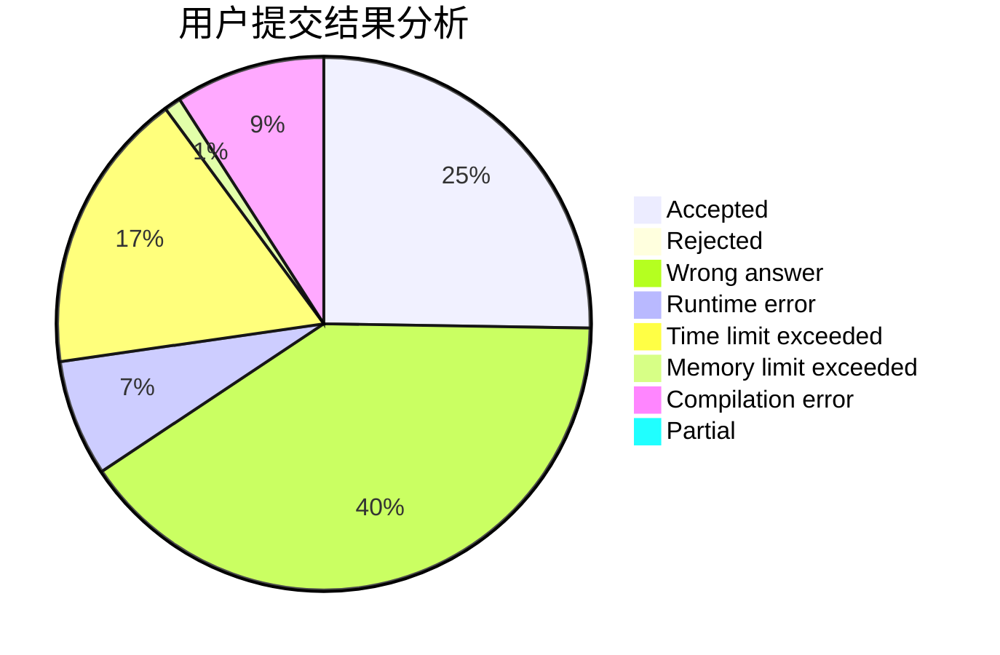
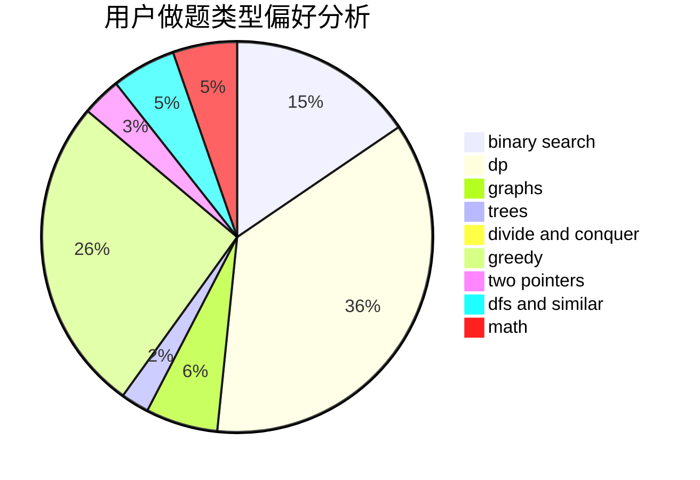

# 2354660845

<!-- tabs:start -->

#### **用户提交结果分析**

#### **用户做题类型偏好分析**

<!-- tabs:end -->
# 推荐题目
[1325A](https://codeforces.com/contest/1325/problem/A)
[1325B](https://codeforces.com/contest/1325/problem/B)
[1082F](https://codeforces.com/contest/1082/problem/F)
[1322E](https://codeforces.com/contest/1322/problem/E)
[1322F](https://codeforces.com/contest/1322/problem/F)
[1327A](https://codeforces.com/contest/1327/problem/A)
[1240E](https://codeforces.com/contest/1240/problem/E)
[1017F](https://codeforces.com/contest/1017/problem/F)
[1120A](https://codeforces.com/contest/1120/problem/A)
[1324C](https://codeforces.com/contest/1324/problem/C)
