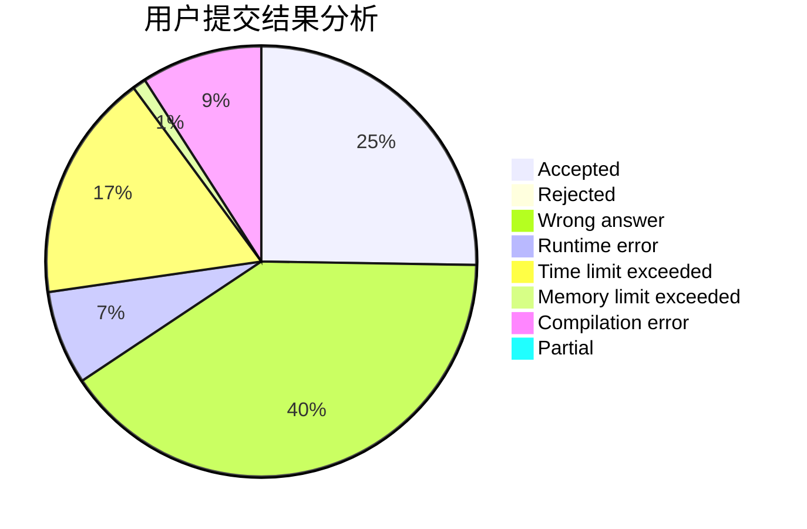
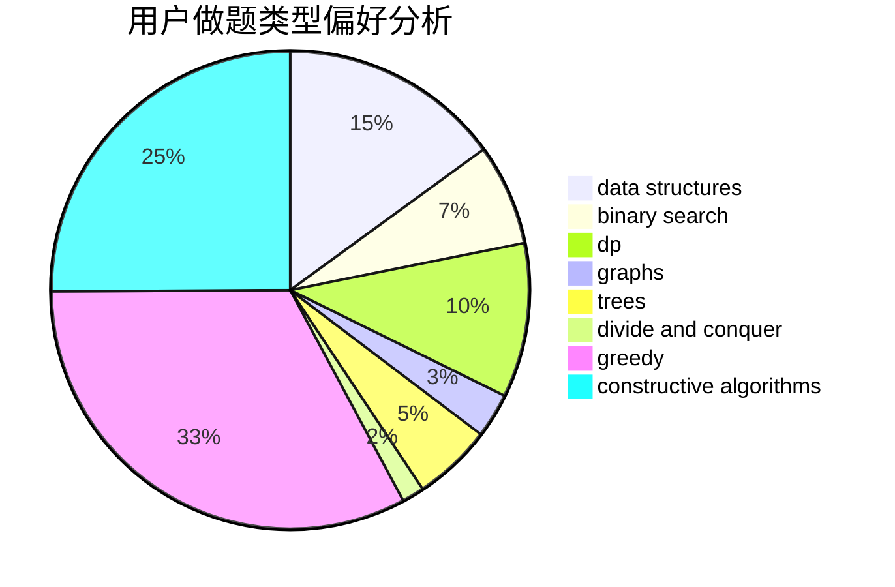
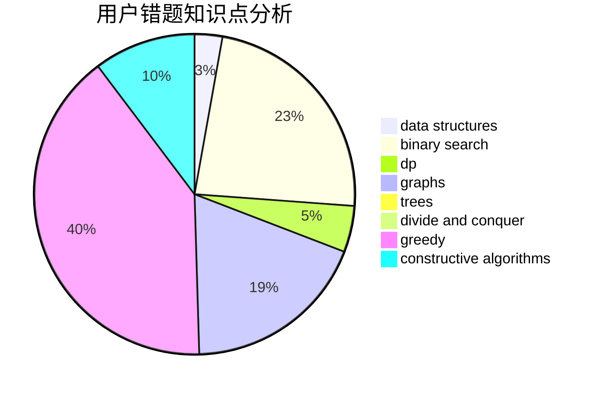

# 2354660845

<!-- tabs:start -->

#### **用户提交结果分析**

#### **用户做题类型偏好分析**

#### **用户错题知识点分析**

<!-- tabs:end -->
# 推荐题目
[1315B](https://codeforces.com/contest/1315/problem/B)		binary search,
                        dp,
                        greedy,
                        strings		  
[1315C](https://codeforces.com/contest/1315/problem/C)		greedy		  
[1082C](https://codeforces.com/contest/1082/problem/C)		greedy,
                        sortings		  
[1313B](https://codeforces.com/contest/1313/problem/B)		constructive algorithms,
                        greedy,
                        implementation,
                        math		  
[1313C1](https://codeforces.com/contest/1313C/problem/1)		brute force,
                        data structures,
                        dp,
                        greedy		  
[1320A](https://codeforces.com/contest/1320/problem/A)		data structures,
                        dp,
                        greedy,
                        math,
                        sortings		  
[1236B](https://codeforces.com/contest/1236/problem/B)		combinatorics,
                        math		  
[1017C](https://codeforces.com/contest/1017/problem/C)		constructive algorithms,
                        greedy		  
[1118D1](https://codeforces.com/contest/1118D/problem/1)		brute force,
                        greedy		  
[1314D](https://codeforces.com/contest/1314/problem/D)		dsu,graphs,sortings,trees		  
