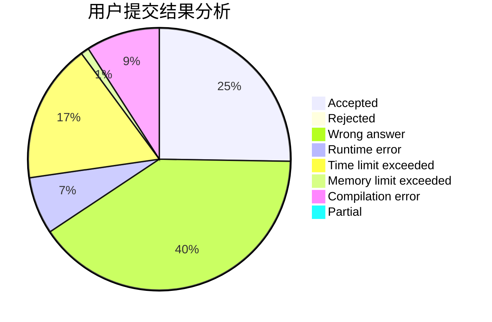
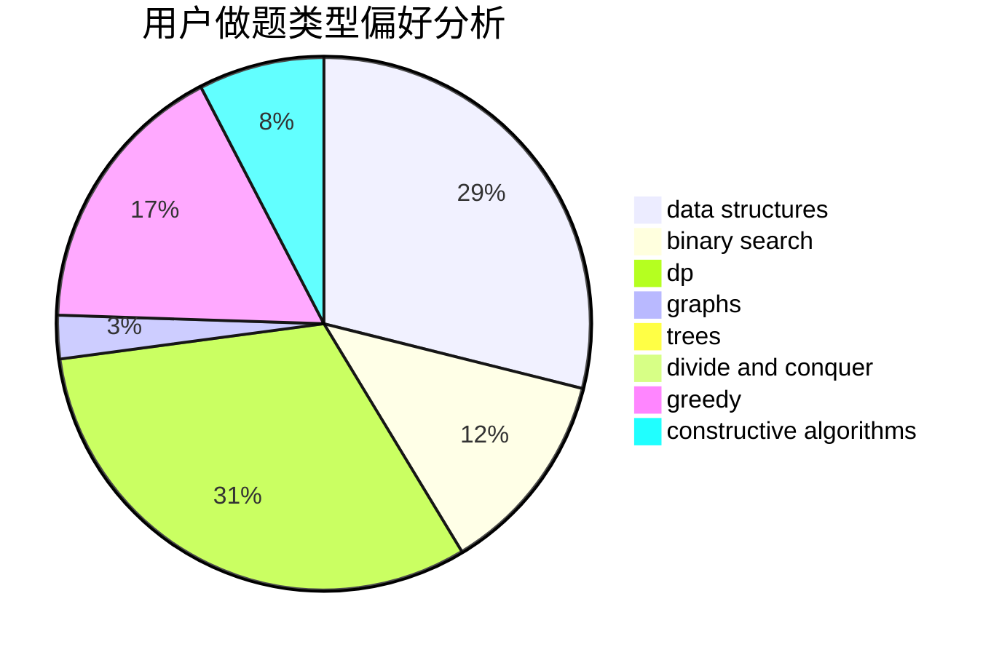
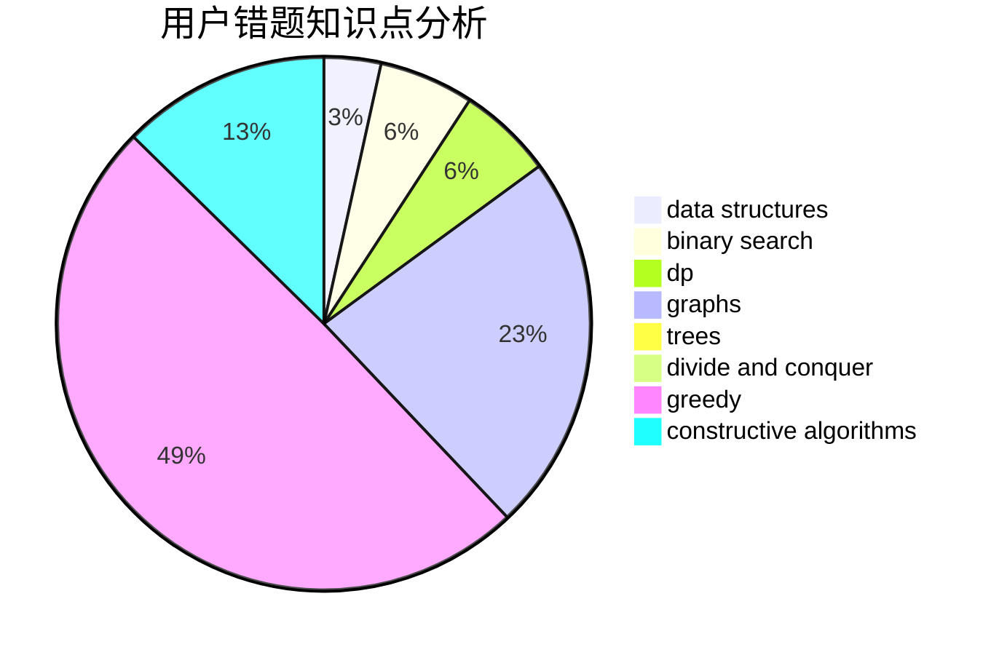

# 2354660845

<!-- tabs:start -->

#### **用户提交结果分析**

#### **用户做题类型偏好分析**

#### **用户错题知识点分析**

<!-- tabs:end -->
# 推荐题目
[1325A](https://codeforces.com/contest/1325/problem/A)		constructive algorithms,
                        greedy,
                        number theory		  
[1325B](https://codeforces.com/contest/1325/problem/B)		greedy,
                        implementation		  
[1082F](https://codeforces.com/contest/1082/problem/F)		dp,
                        strings,
                        trees		  
[1322E](https://codeforces.com/contest/1322/problem/E)		data structures		  
[1322F](https://codeforces.com/contest/1322/problem/F)		dp,
                        trees		  
[1327A](https://codeforces.com/contest/1327/problem/A)		math		  
[1240E](https://codeforces.com/contest/1240/problem/E)		dsu,graphs,sortings,trees		  
[1017F](https://codeforces.com/contest/1017/problem/F)		brute force,
                        math		  
[1120A](https://codeforces.com/contest/1120/problem/A)		greedy,
                        implementation,
                        two pointers		  
[1324C](https://codeforces.com/contest/1324/problem/C)		binary search,
                        data structures,
                        dfs and similar,
                        greedy,
                        implementation		  
