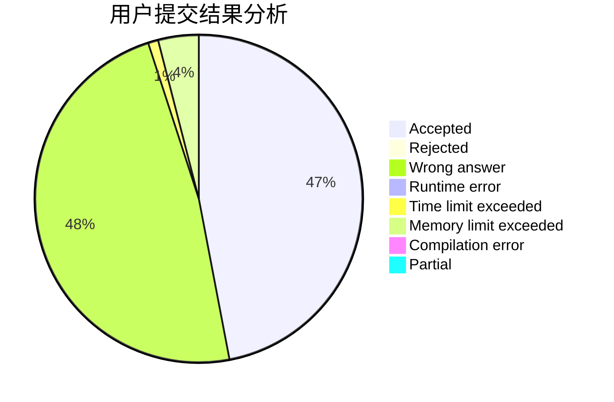
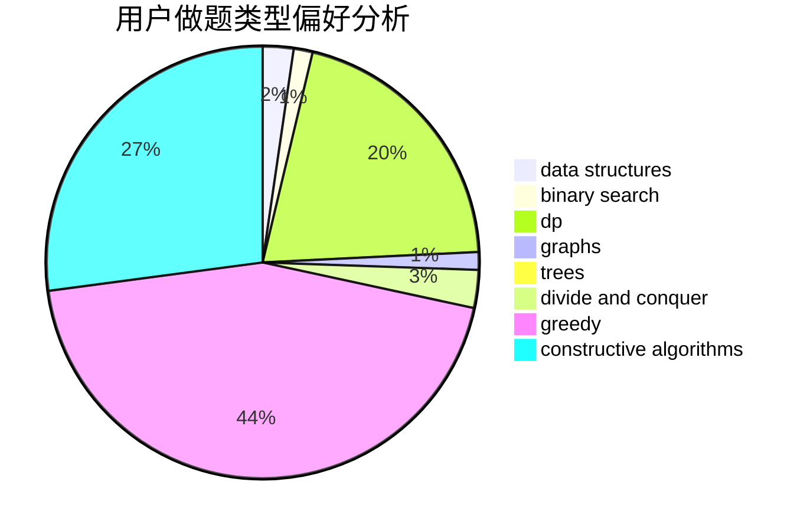

# Hello_BABY_OvO

<!-- tabs:start -->

#### **用户提交结果分析**

#### **用户做题类型偏好分析**

#### **用户错题知识点分析**

<!-- tabs:end -->
# 推荐题目
[1470D](https://codeforces.com/contest/1470/problem/D)		constructive algorithms,
                        dfs and similar,
                        graph matchings,
                        graphs,
                        greedy		  
[1267B](https://codeforces.com/contest/1267/problem/B)		nan		  
[610C](https://codeforces.com/contest/610/problem/C)		constructive algorithms		  
[54A](https://codeforces.com/contest/54/problem/A)		implementation		  
[1437C](https://codeforces.com/contest/1437/problem/C)		dp,
                        flows,
                        graph matchings,
                        greedy,
                        math,
                        sortings		  
[1344A](https://codeforces.com/contest/1344/problem/A)		math,
                        number theory,
                        sortings		  
[1009B](https://codeforces.com/contest/1009/problem/B)		greedy,
                        implementation		  
[434B](https://codeforces.com/contest/434/problem/B)		dsu,graphs,sortings,trees		  
[527E](https://codeforces.com/contest/527/problem/E)		dfs and similar,
                        graphs		  
[1019D](https://codeforces.com/contest/1019/problem/D)		binary search,
                        geometry,
                        sortings		  
