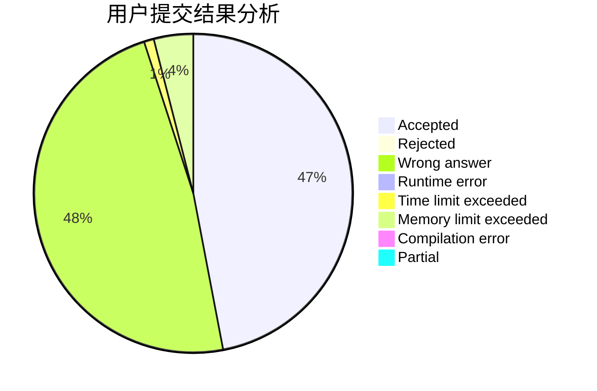
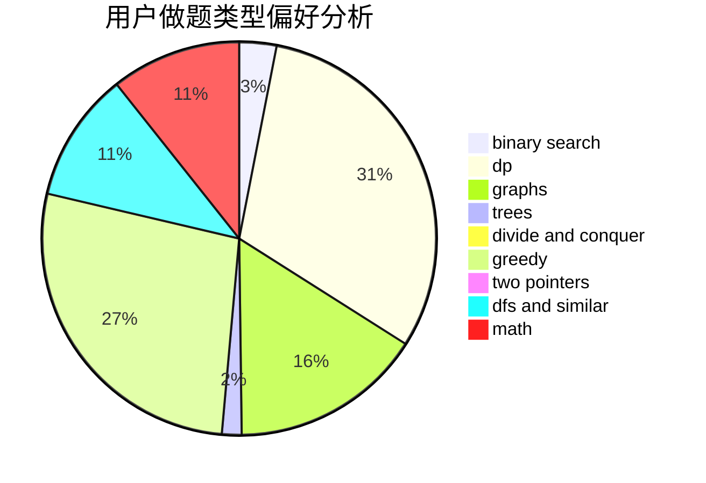

# Hello_BABY_OvO

<!-- tabs:start -->

#### **用户提交结果分析**

#### **用户做题类型偏好分析**

<!-- tabs:end -->
# 推荐题目
[14791](https://codeforces.com/contest/1479/problem/1)
[1272E](https://codeforces.com/contest/1272/problem/E)
[629E](https://codeforces.com/contest/629/problem/E)
[575A](https://codeforces.com/contest/575/problem/A)
[14472](https://codeforces.com/contest/1447/problem/2)
[1350E](https://codeforces.com/contest/1350/problem/E)
[1009E](https://codeforces.com/contest/1009/problem/E)
[455A](https://codeforces.com/contest/455/problem/A)
[551E](https://codeforces.com/contest/551/problem/E)
[101D](https://codeforces.com/contest/101/problem/D)
