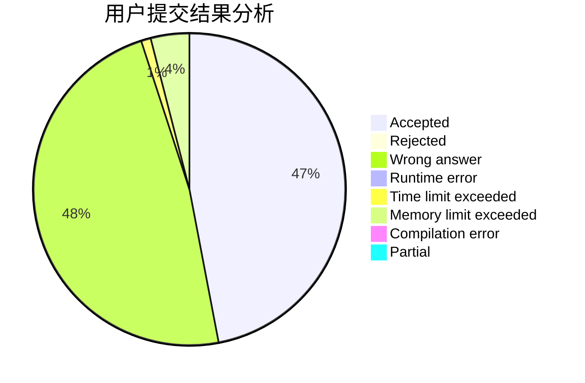
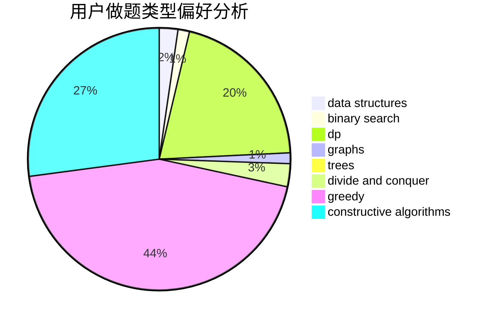

# Hello_BABY_OvO
<!-- tabs:start -->
#### **用户提交结果分析**

#### **用户做题类型偏好分析**

#### **用户错题知识点分析**

<!-- tabs:end -->
# 推荐题目
[Chef Monocarp](http://codeforces.com/problemset/problem/1437/C)		dp,
                        flows,
                        graph matchings,
                        greedy,
                        math,
                        sortings		  
[Hilbert's Hotel](http://codeforces.com/problemset/problem/1344/A)		math,
                        number theory,
                        sortings		  
[Max Mex](http://codeforces.com/problemset/problem/1083/C)		data structures,
                        trees		  
[Strange Housing](http://codeforces.com/problemset/problem/1470/D)		constructive algorithms,
                        dfs and similar,
                        graph matchings,
                        graphs,
                        greedy		  
[Presents](http://codeforces.com/problemset/problem/54/A)		implementation		  
[Build From Suffixes](http://codeforces.com/problemset/problem/1488/H)		*special problem,
                        combinatorics,
                        data structures		  
[Harmony Analysis](http://codeforces.com/problemset/problem/610/C)		constructive algorithms		  
[Nanami's Digital Board](https://codeforces.com/contest/434/problem/B)		dsu,
                        implementation		  
[Distinguish Y, XZ, -Y and -XZ](http://codeforces.com/problemset/problem/1357/A7)		nan		  
[Magic Gems](http://codeforces.com/problemset/problem/1117/D)		dp,
                        math,
                        matrices		  
<!-- tabs:start -->
#### **data structures**
[Max Mex](http://codeforces.com/problemset/problem/1083/C)		data structures,
                        trees		  
[Build From Suffixes](http://codeforces.com/problemset/problem/1488/H)		*special problem,
                        combinatorics,
                        data structures		  
[Minimal string](http://codeforces.com/problemset/problem/797/C)		data structures,
                        greedy,
                        strings		  
[Network Coverage](http://codeforces.com/problemset/problem/1373/F)		binary search,
                        constructive algorithms,
                        data structures,
                        greedy		  
[Hot is Cold](http://codeforces.com/problemset/problem/1146/E)		bitmasks,
                        data structures,
                        divide and conquer,
                        implementation		  
[Iahub and Xors](http://codeforces.com/problemset/problem/341/D)		data structures		  
[Interesting Array](http://codeforces.com/problemset/problem/482/B)		constructive algorithms,
                        data structures,
                        trees		  
[NEKO's Maze Game](http://codeforces.com/problemset/problem/1292/A)		data structures,
                        dsu,
                        implementation		  
[Maximum width](http://codeforces.com/problemset/problem/1492/C)		binary search,
                        data structures,
                        dp,
                        greedy,
                        two pointers		  
[Old Floppy Drive](http://codeforces.com/problemset/problem/1490/G)		binary search,
                        data structures,
                        math		  
#### **binary search**
[Network Coverage](http://codeforces.com/problemset/problem/1373/F)		binary search,
                        constructive algorithms,
                        data structures,
                        greedy		  
[Large Triangle](http://codeforces.com/problemset/problem/1019/D)		binary search,
                        geometry,
                        sortings		  
[k-Multiple Free Set](http://codeforces.com/problemset/problem/274/A)		binary search,
                        greedy,
                        sortings		  
[Simple Polygon Embedding](http://codeforces.com/problemset/problem/1354/C1)		binary search,
                        geometry,
                        math,
                        ternary search		  
[Binary Search](http://codeforces.com/problemset/problem/1436/C)		binary search,
                        combinatorics		  
[Maximum width](http://codeforces.com/problemset/problem/1492/C)		binary search,
                        data structures,
                        dp,
                        greedy,
                        two pointers		  
[Pairs](http://codeforces.com/problemset/problem/1463/D)		binary search,
                        constructive algorithms,
                        greedy,
                        two pointers		  
[Old Floppy Drive](http://codeforces.com/problemset/problem/1490/G)		binary search,
                        data structures,
                        math		  
[Odd Mineral Resource](http://codeforces.com/problemset/problem/1479/D)		binary search,
                        bitmasks,
                        brute force,
                        data structures,
                        probabilities,
                        trees		  
[Complicated Computations](http://codeforces.com/problemset/problem/1436/E)		binary search,
                        data structures,
                        two pointers		  
#### **dp**
[Chef Monocarp](http://codeforces.com/problemset/problem/1437/C)		dp,
                        flows,
                        graph matchings,
                        greedy,
                        math,
                        sortings		  
[Magic Gems](http://codeforces.com/problemset/problem/1117/D)		dp,
                        math,
                        matrices		  
[Future Failure](http://codeforces.com/problemset/problem/838/C)		dp,
                        games		  
[Product Oriented Recurrence](http://codeforces.com/problemset/problem/1182/E)		dp,
                        math,
                        matrices,
                        number theory		  
[Realistic Gameplay](http://codeforces.com/problemset/problem/1430/F)		dp,
                        greedy		  
[New Year and the Permutation Concatenation](http://codeforces.com/problemset/problem/1091/D)		combinatorics,
                        dp,
                        math		  
[Long Path](http://codeforces.com/problemset/problem/407/B)		dp,
                        implementation		  
[Looking for Order](http://codeforces.com/problemset/problem/8/C)		bitmasks,
                        dp		  
[Connecting Vertices](http://codeforces.com/problemset/problem/888/F)		dp,
                        graphs		  
[Bears and Juice](http://codeforces.com/problemset/problem/643/F)		dp,
                        math,
                        meet-in-the-middle		  
#### **graph**
[Chef Monocarp](http://codeforces.com/problemset/problem/1437/C)		dp,
                        flows,
                        graph matchings,
                        greedy,
                        math,
                        sortings		  
[Strange Housing](http://codeforces.com/problemset/problem/1470/D)		constructive algorithms,
                        dfs and similar,
                        graph matchings,
                        graphs,
                        greedy		  
[Data Center Drama](http://codeforces.com/problemset/problem/527/E)		dfs and similar,
                        graphs		  
[Relatively Prime Graph](http://codeforces.com/problemset/problem/1009/D)		brute force,
                        constructive algorithms,
                        graphs,
                        greedy,
                        math		  
[Bakery](http://codeforces.com/problemset/problem/707/B)		graphs		  
[Connecting Vertices](http://codeforces.com/problemset/problem/888/F)		dp,
                        graphs		  
[Ant Man](http://codeforces.com/problemset/problem/704/B)		dp,
                        graphs,
                        greedy		  
[Trails and Glades](http://codeforces.com/problemset/problem/209/C)		constructive algorithms,
                        dsu,
                        graphs,
                        greedy		  
[Minimum Ties](http://codeforces.com/problemset/problem/1487/C)		brute force,
                        constructive algorithms,
                        dfs and similar,
                        graphs,
                        greedy,
                        implementation,
                        math		  
[Chef Monocarp](http://codeforces.com/problemset/problem/1437/C)		dp,
                        flows,
                        graph matchings,
                        greedy,
                        math,
                        sortings		  
#### **trees**
[Max Mex](http://codeforces.com/problemset/problem/1083/C)		data structures,
                        trees		  
[Interesting Array](http://codeforces.com/problemset/problem/482/B)		constructive algorithms,
                        data structures,
                        trees		  
[Odd Mineral Resource](http://codeforces.com/problemset/problem/1479/D)		binary search,
                        bitmasks,
                        brute force,
                        data structures,
                        probabilities,
                        trees		  
[Yet Another Card Deck](http://codeforces.com/problemset/problem/1511/C)		brute force,
                        data structures,
                        implementation,
                        trees		  
[Diameter Cuts](http://codeforces.com/problemset/problem/1499/F)		combinatorics,
                        dfs and similar,
                        dp,
                        trees		  
[Fib-tree](http://codeforces.com/problemset/problem/1491/E)		brute force,
                        dfs and similar,
                        divide and conquer,
                        number theory,
                        trees		  
[13th Labour of Heracles](http://codeforces.com/problemset/problem/1466/D)		data structures,
                        greedy,
                        sortings,
                        trees		  
[BFS Trees](http://codeforces.com/problemset/problem/1495/D)		combinatorics,
                        dfs and similar,
                        graphs,
                        math,
                        shortest paths,
                        trees		  
[Sum of Prefix Sums](http://codeforces.com/problemset/problem/1303/G)		data structures,
                        divide and conquer,
                        geometry,
                        trees		  
[Number of Simple Paths](http://codeforces.com/problemset/problem/1454/E)		combinatorics,
                        dfs and similar,
                        graphs,
                        trees		  
#### **divide and conquer**
[Hot is Cold](http://codeforces.com/problemset/problem/1146/E)		bitmasks,
                        data structures,
                        divide and conquer,
                        implementation		  
[Xor-Set](http://codeforces.com/problemset/problem/1261/F)		bitmasks,
                        divide and conquer,
                        math		  
[Divide and Summarize](http://codeforces.com/problemset/problem/1461/D)		binary search,
                        brute force,
                        data structures,
                        divide and conquer,
                        implementation,
                        sortings		  
[Song of the Sirens](http://codeforces.com/problemset/problem/1466/G)		combinatorics,
                        divide and conquer,
                        hashing,
                        math,
                        string suffix structures,
                        strings		  
[Permutation Transformation](http://codeforces.com/problemset/problem/1490/D)		dfs and similar,
                        divide and conquer,
                        implementation		  
[Skyline Photo](https://codeforces.com/contest/1483/problem/C)		data structures,
                        divide and conquer,
                        dp		  
[Fib-tree](http://codeforces.com/problemset/problem/1491/E)		brute force,
                        dfs and similar,
                        divide and conquer,
                        number theory,
                        trees		  
[Sum of Prefix Sums](http://codeforces.com/problemset/problem/1303/G)		data structures,
                        divide and conquer,
                        geometry,
                        trees		  
[Dogeforces](http://codeforces.com/problemset/problem/1494/D)		constructive algorithms,
                        data structures,
                        dfs and similar,
                        divide and conquer,
                        dsu,
                        greedy,
                        sortings,
                        trees		  
[Skyline Photo](http://codeforces.com/problemset/problem/1482/E)		data structures,
                        divide and conquer,
                        dp		  
#### **greedy**
[Chef Monocarp](http://codeforces.com/problemset/problem/1437/C)		dp,
                        flows,
                        graph matchings,
                        greedy,
                        math,
                        sortings		  
[Strange Housing](http://codeforces.com/problemset/problem/1470/D)		constructive algorithms,
                        dfs and similar,
                        graph matchings,
                        graphs,
                        greedy		  
[Painting Eggs](http://codeforces.com/problemset/problem/282/B)		greedy,
                        math		  
[Minimal string](http://codeforces.com/problemset/problem/797/C)		data structures,
                        greedy,
                        strings		  
[Network Coverage](http://codeforces.com/problemset/problem/1373/F)		binary search,
                        constructive algorithms,
                        data structures,
                        greedy		  
[Minimum Ternary String](http://codeforces.com/problemset/problem/1009/B)		greedy,
                        implementation		  
[Mister B and Boring Game](https://codeforces.com/contest/820/problem/C)		games,
                        greedy		  
[Relatively Prime Graph](http://codeforces.com/problemset/problem/1009/D)		brute force,
                        constructive algorithms,
                        graphs,
                        greedy,
                        math		  
[Maximum Number](http://codeforces.com/problemset/problem/774/C)		*special problem,
                        constructive algorithms,
                        greedy,
                        implementation		  
[k-Multiple Free Set](http://codeforces.com/problemset/problem/274/A)		binary search,
                        greedy,
                        sortings		  
#### **constructive algorithms**
[Strange Housing](http://codeforces.com/problemset/problem/1470/D)		constructive algorithms,
                        dfs and similar,
                        graph matchings,
                        graphs,
                        greedy		  
[Harmony Analysis](http://codeforces.com/problemset/problem/610/C)		constructive algorithms		  
[Domino](http://codeforces.com/problemset/problem/85/A)		constructive algorithms,
                        implementation		  
[Network Coverage](http://codeforces.com/problemset/problem/1373/F)		binary search,
                        constructive algorithms,
                        data structures,
                        greedy		  
[Relatively Prime Graph](http://codeforces.com/problemset/problem/1009/D)		brute force,
                        constructive algorithms,
                        graphs,
                        greedy,
                        math		  
[Maximum Number](http://codeforces.com/problemset/problem/774/C)		*special problem,
                        constructive algorithms,
                        greedy,
                        implementation		  
[Seating of Students](https://codeforces.com/contest/907/problem/D)		brute force,
                        constructive algorithms,
                        math		  
[Yaroslav and Algorithm](http://codeforces.com/problemset/problem/301/C)		constructive algorithms		  
[Flow Optimality](http://codeforces.com/problemset/problem/457/E)		constructive algorithms,
                        flows,
                        math		  
[Interesting Array](http://codeforces.com/problemset/problem/482/B)		constructive algorithms,
                        data structures,
                        trees		  
#### **sortings**
[Chef Monocarp](http://codeforces.com/problemset/problem/1437/C)		dp,
                        flows,
                        graph matchings,
                        greedy,
                        math,
                        sortings		  
[Hilbert's Hotel](http://codeforces.com/problemset/problem/1344/A)		math,
                        number theory,
                        sortings		  
[Large Triangle](http://codeforces.com/problemset/problem/1019/D)		binary search,
                        geometry,
                        sortings		  
[k-Multiple Free Set](http://codeforces.com/problemset/problem/274/A)		binary search,
                        greedy,
                        sortings		  
[Equalizing by Division (hard version)](http://codeforces.com/problemset/problem/1213/D2)		brute force,
                        math,
                        sortings		  
[Diamond Miner](https://codeforces.com/contest/1496/problem/C)		geometry,
                        greedy,
                        math,
                        sortings		  
[Diamond Miner](http://codeforces.com/problemset/problem/1495/A)		geometry,
                        greedy,
                        math,
                        sortings		  
[Meximization](http://codeforces.com/problemset/problem/1497/A)		brute force,
                        data structures,
                        greedy,
                        sortings		  
[Avoiding Zero](http://codeforces.com/problemset/problem/1427/A)		math,
                        sortings		  
[Divide and Summarize](http://codeforces.com/problemset/problem/1461/D)		binary search,
                        brute force,
                        data structures,
                        divide and conquer,
                        implementation,
                        sortings		  
<!-- tabs:end -->
