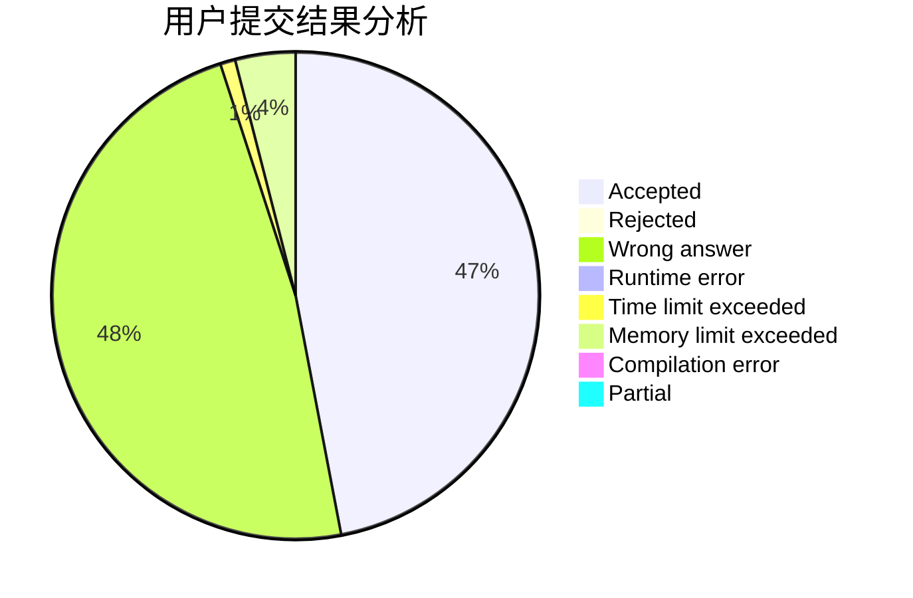
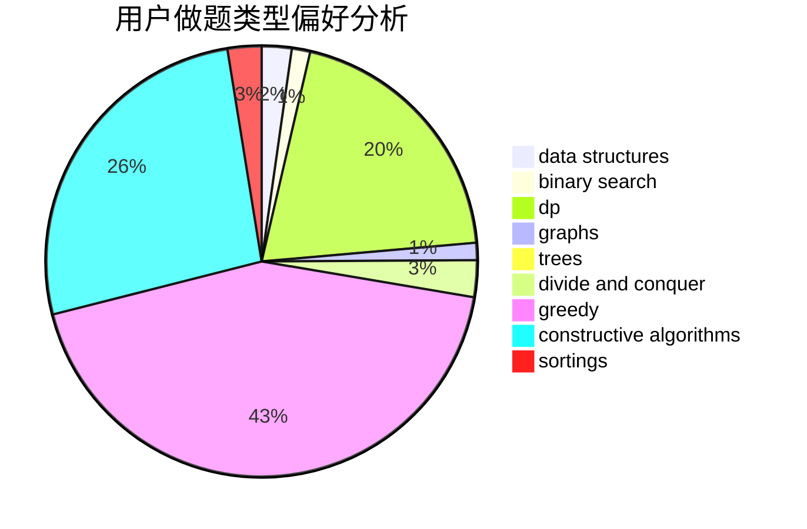

# Hello_BABY_OvO
<!-- tabs:start -->
#### **用户提交结果分析**

#### **用户做题类型偏好分析**

#### **用户错题知识点分析**

<!-- tabs:end -->
# 推荐题目
[1437C](http://codeforces.com/problemset/problem/1437/C)		dp,
                        flows,
                        graph matchings,
                        greedy,
                        math,
                        sortings		  
[1344A](http://codeforces.com/problemset/problem/1344/A)		math,
                        number theory,
                        sortings		  
[1083C](http://codeforces.com/problemset/problem/1083/C)		data structures,
                        trees		  
[1470D](http://codeforces.com/problemset/problem/1470/D)		constructive algorithms,
                        dfs and similar,
                        graph matchings,
                        graphs,
                        greedy		  
[54A](http://codeforces.com/problemset/problem/54/A)		implementation		  
[1488H](http://codeforces.com/problemset/problem/1488/H)		*special problem,
                        combinatorics,
                        data structures		  
[610C](http://codeforces.com/problemset/problem/610/C)		constructive algorithms		  
[434B](https://codeforces.com/contest/434/problem/B)		dsu,
                        implementation		  
[1357A7](http://codeforces.com/problemset/problem/1357/A7)		nan		  
[1117D](http://codeforces.com/problemset/problem/1117/D)		dp,
                        math,
                        matrices		  
<!-- tabs:start -->
#### **data structures**
[1083C](http://codeforces.com/problemset/problem/1083/C)		data structures,
                        trees		  
[1488H](http://codeforces.com/problemset/problem/1488/H)		*special problem,
                        combinatorics,
                        data structures		  
[797C](http://codeforces.com/problemset/problem/797/C)		data structures,
                        greedy,
                        strings		  
[1373F](http://codeforces.com/problemset/problem/1373/F)		binary search,
                        constructive algorithms,
                        data structures,
                        greedy		  
[1146E](http://codeforces.com/problemset/problem/1146/E)		bitmasks,
                        data structures,
                        divide and conquer,
                        implementation		  
[341D](http://codeforces.com/problemset/problem/341/D)		data structures		  
[482B](http://codeforces.com/problemset/problem/482/B)		constructive algorithms,
                        data structures,
                        trees		  
[1292A](http://codeforces.com/problemset/problem/1292/A)		data structures,
                        dsu,
                        implementation		  
[1492C](http://codeforces.com/problemset/problem/1492/C)		binary search,
                        data structures,
                        dp,
                        greedy,
                        two pointers		  
[1490G](http://codeforces.com/problemset/problem/1490/G)		binary search,
                        data structures,
                        math		  
#### **binary search**
[1373F](http://codeforces.com/problemset/problem/1373/F)		binary search,
                        constructive algorithms,
                        data structures,
                        greedy		  
[1019D](http://codeforces.com/problemset/problem/1019/D)		binary search,
                        geometry,
                        sortings		  
[274A](http://codeforces.com/problemset/problem/274/A)		binary search,
                        greedy,
                        sortings		  
[1354C1](http://codeforces.com/problemset/problem/1354/C1)		binary search,
                        geometry,
                        math,
                        ternary search		  
[1436C](http://codeforces.com/problemset/problem/1436/C)		binary search,
                        combinatorics		  
[1492C](http://codeforces.com/problemset/problem/1492/C)		binary search,
                        data structures,
                        dp,
                        greedy,
                        two pointers		  
[1463D](http://codeforces.com/problemset/problem/1463/D)		binary search,
                        constructive algorithms,
                        greedy,
                        two pointers		  
[1490G](http://codeforces.com/problemset/problem/1490/G)		binary search,
                        data structures,
                        math		  
[1479D](http://codeforces.com/problemset/problem/1479/D)		binary search,
                        bitmasks,
                        brute force,
                        data structures,
                        probabilities,
                        trees		  
[1436E](http://codeforces.com/problemset/problem/1436/E)		binary search,
                        data structures,
                        two pointers		  
#### **dp**
[1437C](http://codeforces.com/problemset/problem/1437/C)		dp,
                        flows,
                        graph matchings,
                        greedy,
                        math,
                        sortings		  
[1117D](http://codeforces.com/problemset/problem/1117/D)		dp,
                        math,
                        matrices		  
[838C](http://codeforces.com/problemset/problem/838/C)		dp,
                        games		  
[1182E](http://codeforces.com/problemset/problem/1182/E)		dp,
                        math,
                        matrices,
                        number theory		  
[1430F](http://codeforces.com/problemset/problem/1430/F)		dp,
                        greedy		  
[1091D](http://codeforces.com/problemset/problem/1091/D)		combinatorics,
                        dp,
                        math		  
[407B](http://codeforces.com/problemset/problem/407/B)		dp,
                        implementation		  
[8C](http://codeforces.com/problemset/problem/8/C)		bitmasks,
                        dp		  
[888F](http://codeforces.com/problemset/problem/888/F)		dp,
                        graphs		  
[643F](http://codeforces.com/problemset/problem/643/F)		dp,
                        math,
                        meet-in-the-middle		  
#### **graph**
[1437C](http://codeforces.com/problemset/problem/1437/C)		dp,
                        flows,
                        graph matchings,
                        greedy,
                        math,
                        sortings		  
[1470D](http://codeforces.com/problemset/problem/1470/D)		constructive algorithms,
                        dfs and similar,
                        graph matchings,
                        graphs,
                        greedy		  
[527E](http://codeforces.com/problemset/problem/527/E)		dfs and similar,
                        graphs		  
[1009D](http://codeforces.com/problemset/problem/1009/D)		brute force,
                        constructive algorithms,
                        graphs,
                        greedy,
                        math		  
[707B](http://codeforces.com/problemset/problem/707/B)		graphs		  
[888F](http://codeforces.com/problemset/problem/888/F)		dp,
                        graphs		  
[704B](http://codeforces.com/problemset/problem/704/B)		dp,
                        graphs,
                        greedy		  
[209C](http://codeforces.com/problemset/problem/209/C)		constructive algorithms,
                        dsu,
                        graphs,
                        greedy		  
[1487C](http://codeforces.com/problemset/problem/1487/C)		brute force,
                        constructive algorithms,
                        dfs and similar,
                        graphs,
                        greedy,
                        implementation,
                        math		  
[1437C](http://codeforces.com/problemset/problem/1437/C)		dp,
                        flows,
                        graph matchings,
                        greedy,
                        math,
                        sortings		  
#### **trees**
[1083C](http://codeforces.com/problemset/problem/1083/C)		data structures,
                        trees		  
[482B](http://codeforces.com/problemset/problem/482/B)		constructive algorithms,
                        data structures,
                        trees		  
[1479D](http://codeforces.com/problemset/problem/1479/D)		binary search,
                        bitmasks,
                        brute force,
                        data structures,
                        probabilities,
                        trees		  
[1511C](http://codeforces.com/problemset/problem/1511/C)		brute force,
                        data structures,
                        implementation,
                        trees		  
[1499F](http://codeforces.com/problemset/problem/1499/F)		combinatorics,
                        dfs and similar,
                        dp,
                        trees		  
[1491E](http://codeforces.com/problemset/problem/1491/E)		brute force,
                        dfs and similar,
                        divide and conquer,
                        number theory,
                        trees		  
[1466D](http://codeforces.com/problemset/problem/1466/D)		data structures,
                        greedy,
                        sortings,
                        trees		  
[1495D](http://codeforces.com/problemset/problem/1495/D)		combinatorics,
                        dfs and similar,
                        graphs,
                        math,
                        shortest paths,
                        trees		  
[1303G](http://codeforces.com/problemset/problem/1303/G)		data structures,
                        divide and conquer,
                        geometry,
                        trees		  
[1454E](http://codeforces.com/problemset/problem/1454/E)		combinatorics,
                        dfs and similar,
                        graphs,
                        trees		  
#### **divide and conquer**
[1146E](http://codeforces.com/problemset/problem/1146/E)		bitmasks,
                        data structures,
                        divide and conquer,
                        implementation		  
[1261F](http://codeforces.com/problemset/problem/1261/F)		bitmasks,
                        divide and conquer,
                        math		  
[1461D](http://codeforces.com/problemset/problem/1461/D)		binary search,
                        brute force,
                        data structures,
                        divide and conquer,
                        implementation,
                        sortings		  
[1466G](http://codeforces.com/problemset/problem/1466/G)		combinatorics,
                        divide and conquer,
                        hashing,
                        math,
                        string suffix structures,
                        strings		  
[1490D](http://codeforces.com/problemset/problem/1490/D)		dfs and similar,
                        divide and conquer,
                        implementation		  
[1483C](https://codeforces.com/contest/1483/problem/C)		data structures,
                        divide and conquer,
                        dp		  
[1491E](http://codeforces.com/problemset/problem/1491/E)		brute force,
                        dfs and similar,
                        divide and conquer,
                        number theory,
                        trees		  
[1303G](http://codeforces.com/problemset/problem/1303/G)		data structures,
                        divide and conquer,
                        geometry,
                        trees		  
[1494D](http://codeforces.com/problemset/problem/1494/D)		constructive algorithms,
                        data structures,
                        dfs and similar,
                        divide and conquer,
                        dsu,
                        greedy,
                        sortings,
                        trees		  
[1482E](http://codeforces.com/problemset/problem/1482/E)		data structures,
                        divide and conquer,
                        dp		  
#### **greedy**
[1437C](http://codeforces.com/problemset/problem/1437/C)		dp,
                        flows,
                        graph matchings,
                        greedy,
                        math,
                        sortings		  
[1470D](http://codeforces.com/problemset/problem/1470/D)		constructive algorithms,
                        dfs and similar,
                        graph matchings,
                        graphs,
                        greedy		  
[282B](http://codeforces.com/problemset/problem/282/B)		greedy,
                        math		  
[797C](http://codeforces.com/problemset/problem/797/C)		data structures,
                        greedy,
                        strings		  
[1373F](http://codeforces.com/problemset/problem/1373/F)		binary search,
                        constructive algorithms,
                        data structures,
                        greedy		  
[1009B](http://codeforces.com/problemset/problem/1009/B)		greedy,
                        implementation		  
[820C](https://codeforces.com/contest/820/problem/C)		games,
                        greedy		  
[1009D](http://codeforces.com/problemset/problem/1009/D)		brute force,
                        constructive algorithms,
                        graphs,
                        greedy,
                        math		  
[774C](http://codeforces.com/problemset/problem/774/C)		*special problem,
                        constructive algorithms,
                        greedy,
                        implementation		  
[274A](http://codeforces.com/problemset/problem/274/A)		binary search,
                        greedy,
                        sortings		  
#### **constructive algorithms**
[1470D](http://codeforces.com/problemset/problem/1470/D)		constructive algorithms,
                        dfs and similar,
                        graph matchings,
                        graphs,
                        greedy		  
[610C](http://codeforces.com/problemset/problem/610/C)		constructive algorithms		  
[85A](http://codeforces.com/problemset/problem/85/A)		constructive algorithms,
                        implementation		  
[1373F](http://codeforces.com/problemset/problem/1373/F)		binary search,
                        constructive algorithms,
                        data structures,
                        greedy		  
[1009D](http://codeforces.com/problemset/problem/1009/D)		brute force,
                        constructive algorithms,
                        graphs,
                        greedy,
                        math		  
[774C](http://codeforces.com/problemset/problem/774/C)		*special problem,
                        constructive algorithms,
                        greedy,
                        implementation		  
[907D](https://codeforces.com/contest/907/problem/D)		brute force,
                        constructive algorithms,
                        math		  
[301C](http://codeforces.com/problemset/problem/301/C)		constructive algorithms		  
[457E](http://codeforces.com/problemset/problem/457/E)		constructive algorithms,
                        flows,
                        math		  
[482B](http://codeforces.com/problemset/problem/482/B)		constructive algorithms,
                        data structures,
                        trees		  
#### **sortings**
[1437C](http://codeforces.com/problemset/problem/1437/C)		dp,
                        flows,
                        graph matchings,
                        greedy,
                        math,
                        sortings		  
[1344A](http://codeforces.com/problemset/problem/1344/A)		math,
                        number theory,
                        sortings		  
[1019D](http://codeforces.com/problemset/problem/1019/D)		binary search,
                        geometry,
                        sortings		  
[274A](http://codeforces.com/problemset/problem/274/A)		binary search,
                        greedy,
                        sortings		  
[1213D2](http://codeforces.com/problemset/problem/1213/D2)		brute force,
                        math,
                        sortings		  
[1496C](https://codeforces.com/contest/1496/problem/C)		geometry,
                        greedy,
                        math,
                        sortings		  
[1495A](http://codeforces.com/problemset/problem/1495/A)		geometry,
                        greedy,
                        math,
                        sortings		  
[1497A](http://codeforces.com/problemset/problem/1497/A)		brute force,
                        data structures,
                        greedy,
                        sortings		  
[1427A](http://codeforces.com/problemset/problem/1427/A)		math,
                        sortings		  
[1461D](http://codeforces.com/problemset/problem/1461/D)		binary search,
                        brute force,
                        data structures,
                        divide and conquer,
                        implementation,
                        sortings		  
<!-- tabs:end -->
