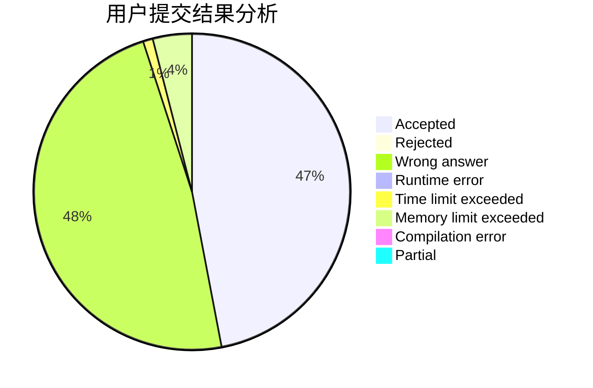
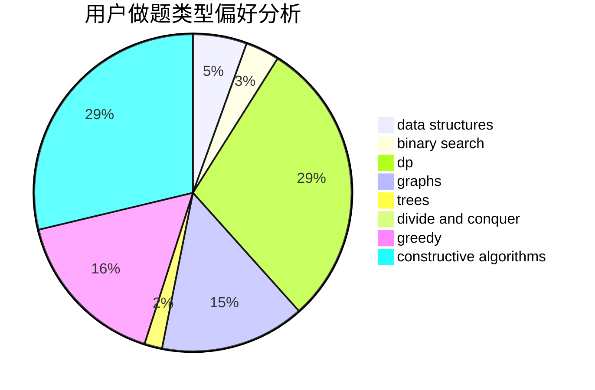

# Hello_BABY_OvO

<!-- tabs:start -->

#### **用户提交结果分析**

#### **用户做题类型偏好分析**

#### **用户错题知识点分析**

<!-- tabs:end -->
# 推荐题目
[14791](https://codeforces.com/contest/1479/problem/1)		dsu,graphs,sortings,trees		  
[1272E](https://codeforces.com/contest/1272/problem/E)		dfs and similar,
                        graphs,
                        shortest paths		  
[629E](https://codeforces.com/contest/629/problem/E)		combinatorics,
                        data structures,
                        dfs and similar,
                        dp,
                        probabilities,
                        trees		  
[575A](https://codeforces.com/contest/575/problem/A)		data structures,
                        math,
                        matrices		  
[14472](https://codeforces.com/contest/1447/problem/2)		dsu,graphs,sortings,trees		  
[1350E](https://codeforces.com/contest/1350/problem/E)		dsu,graphs,sortings,trees		  
[1009E](https://codeforces.com/contest/1009/problem/E)		combinatorics,
                        math,
                        probabilities		  
[455A](https://codeforces.com/contest/455/problem/A)		dp		  
[551E](https://codeforces.com/contest/551/problem/E)		binary search,
                        data structures,
                        implementation		  
[101D](https://codeforces.com/contest/101/problem/D)		dp,
                        greedy,
                        probabilities,
                        sortings,
                        trees		  
