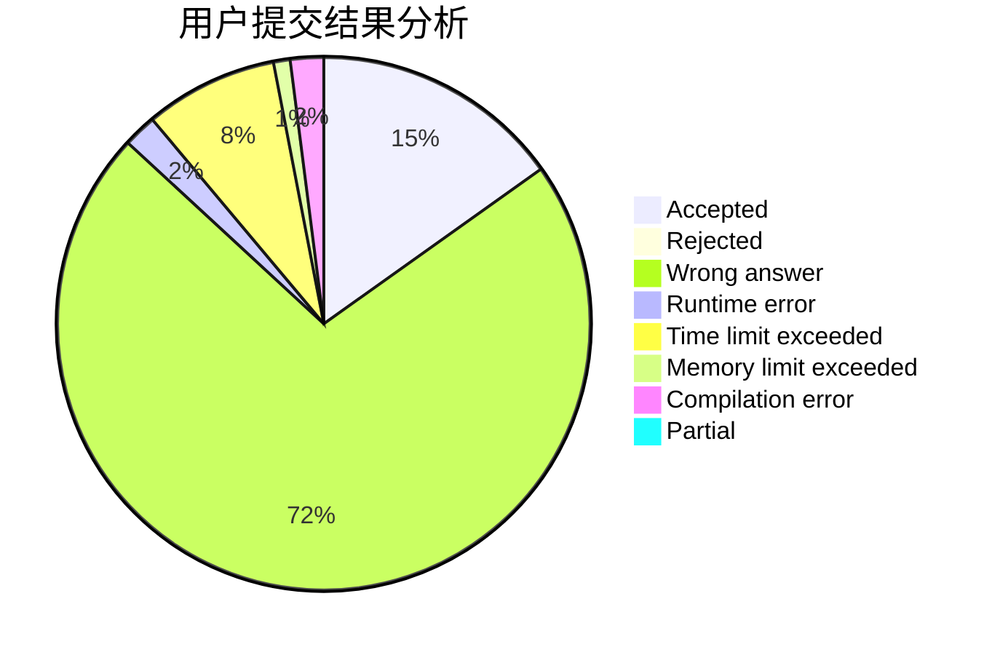
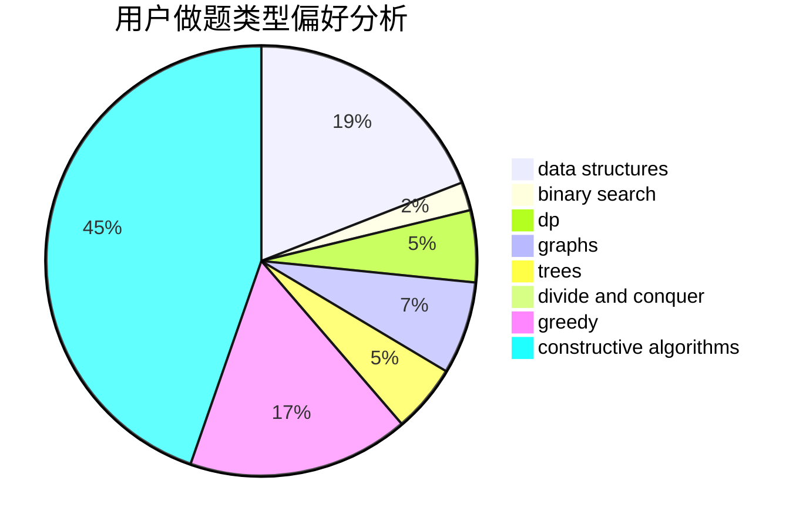
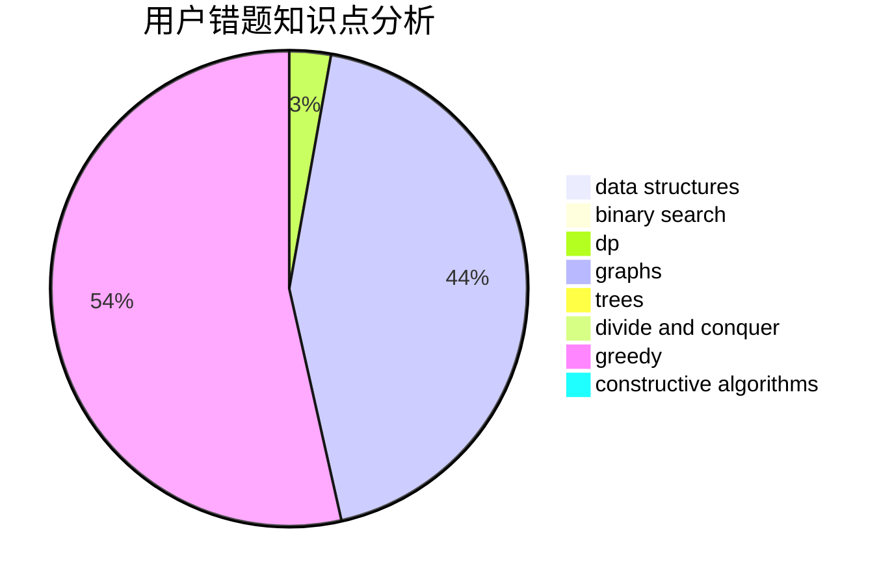

# Hello_at_123

<!-- tabs:start -->

#### **用户提交结果分析**

#### **用户做题类型偏好分析**

#### **用户错题知识点分析**

<!-- tabs:end -->
# 推荐题目
[61E](https://codeforces.com/contest/61/problem/E)		data structures,
                        trees		  
[922C](https://codeforces.com/contest/922/problem/C)		brute force,
                        number theory		  
[1045J](https://codeforces.com/contest/1045/problem/J)		data structures,
                        strings,
                        trees		  
[298D](https://codeforces.com/contest/298/problem/D)		dsu,graphs,sortings,trees		  
[919D](https://codeforces.com/contest/919/problem/D)		dfs and similar,
                        dp,
                        graphs		  
[767D](https://codeforces.com/contest/767/problem/D)		binary search,
                        data structures,
                        greedy,
                        sortings,
                        two pointers		  
[312C](https://codeforces.com/contest/312/problem/C)		dsu,graphs,sortings,trees		  
[12131](https://codeforces.com/contest/1213/problem/1)		dsu,graphs,sortings,trees		  
[1284E](https://codeforces.com/contest/1284/problem/E)		combinatorics,
                        geometry,
                        math,
                        sortings		  
[918D](https://codeforces.com/contest/918/problem/D)		dsu,graphs,sortings,trees		  
