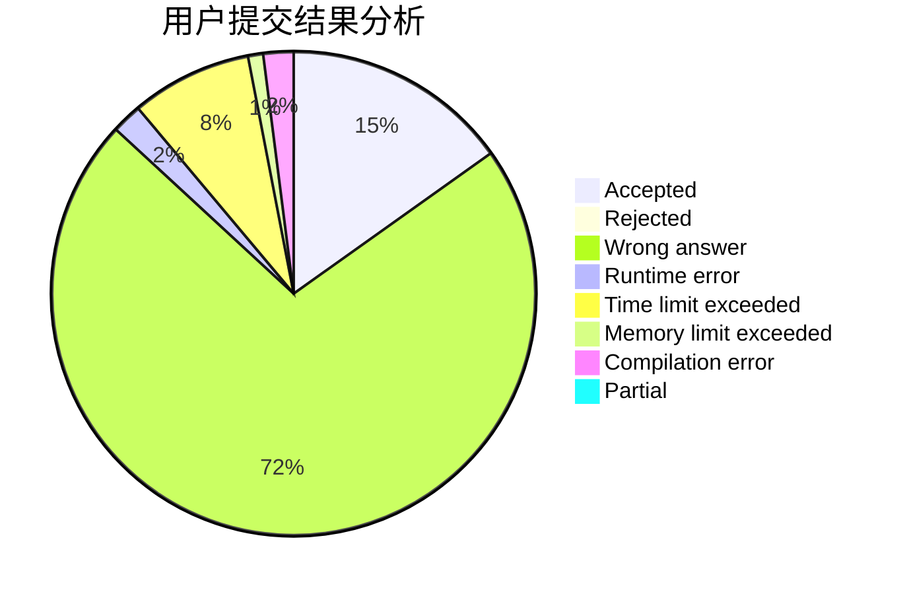
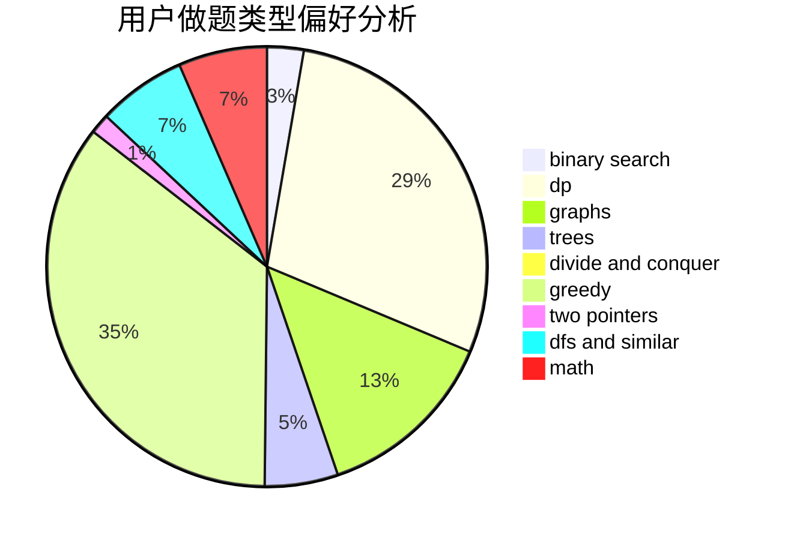

# Hello_at_123

<!-- tabs:start -->

#### **用户提交结果分析**

#### **用户做题类型偏好分析**

<!-- tabs:end -->
# 推荐题目
[61E](https://codeforces.com/contest/61/problem/E)
[922C](https://codeforces.com/contest/922/problem/C)
[1045J](https://codeforces.com/contest/1045/problem/J)
[298D](https://codeforces.com/contest/298/problem/D)
[919D](https://codeforces.com/contest/919/problem/D)
[767D](https://codeforces.com/contest/767/problem/D)
[312C](https://codeforces.com/contest/312/problem/C)
[12131](https://codeforces.com/contest/1213/problem/1)
[1284E](https://codeforces.com/contest/1284/problem/E)
[918D](https://codeforces.com/contest/918/problem/D)
