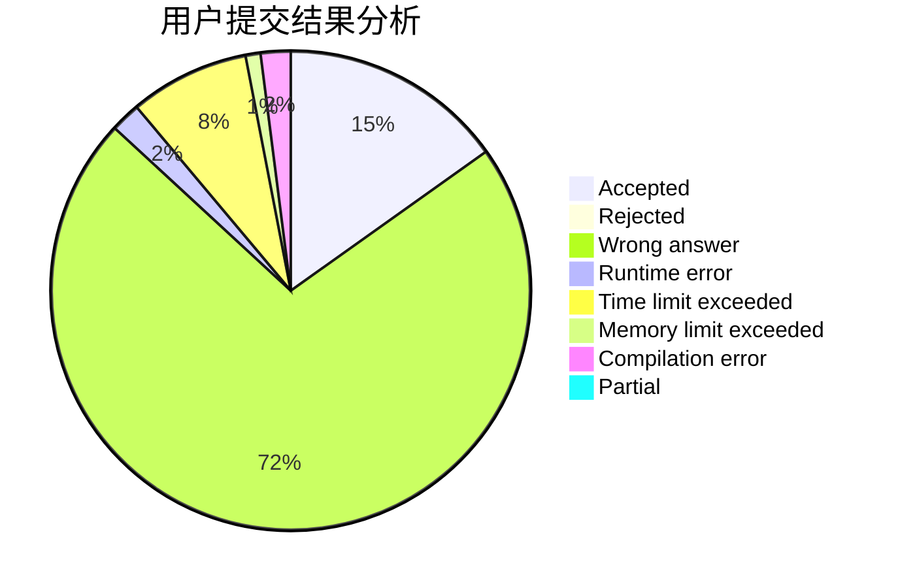
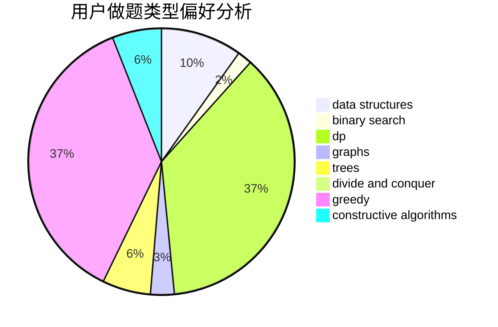
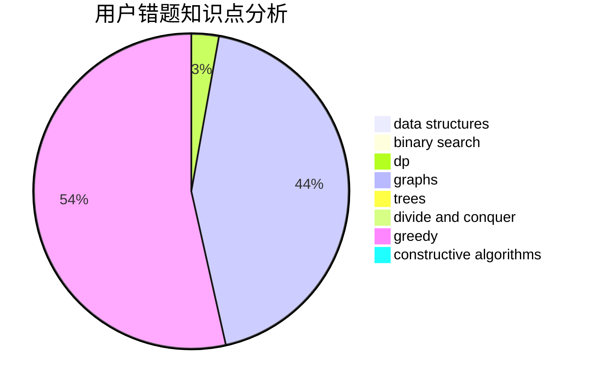

# Hello_at_123
<!-- tabs:start -->
#### **用户提交结果分析**

#### **用户做题类型偏好分析**

#### **用户错题知识点分析**

<!-- tabs:end -->
# 推荐题目
[Omkar and Bed Wars](http://codeforces.com/problemset/problem/1392/D)		dp,
                        greedy		  
[Anu Has a Function](https://codeforces.com/contest/1300/problem/C)		brute force,
                        greedy,
                        math		  
[Construct a tree](http://codeforces.com/problemset/problem/1098/C)		binary search,
                        constructive algorithms,
                        dfs and similar,
                        graphs,
                        greedy,
                        trees		  
[New Year and Curling](http://codeforces.com/problemset/problem/908/C)		brute force,
                        geometry,
                        implementation,
                        math		  
[Zigzag Game](http://codeforces.com/problemset/problem/1147/F)		games,
                        interactive		  
[Poman Numbers](https://codeforces.com/contest/1465/problem/E)		bitmasks,
                        greedy,
                        math,
                        strings		  
[Doe Graphs](http://codeforces.com/problemset/problem/232/C)		constructive algorithms,
                        divide and conquer,
                        dp,
                        graphs,
                        shortest paths		  
[Santa Claus and Robot](http://codeforces.com/problemset/problem/748/C)		constructive algorithms,
                        math		  
[Subsegments](http://codeforces.com/problemset/problem/69/E)		data structures,
                        implementation		  
[New Year and Buggy Bot](http://codeforces.com/problemset/problem/908/B)		brute force,
                        implementation		  
<!-- tabs:start -->
#### **data structures**
[Omkar and Bed Wars](http://codeforces.com/problemset/problem/69/E)		data structures,
                        implementation		  
[Anu Has a Function](http://codeforces.com/problemset/problem/1167/F)		combinatorics,
                        data structures,
                        math,
                        sortings		  
[Construct a tree](http://codeforces.com/problemset/problem/1342/D)		binary search,
                        constructive algorithms,
                        data structures,
                        greedy,
                        sortings,
                        two pointers		  
[New Year and Curling](http://codeforces.com/problemset/problem/878/B)		data structures,
                        implementation		  
[Zigzag Game](http://codeforces.com/problemset/problem/1037/F)		combinatorics,
                        data structures,
                        math		  
[Poman Numbers](http://codeforces.com/problemset/problem/1045/G)		data structures		  
[Doe Graphs](http://codeforces.com/problemset/problem/903/D)		data structures,
                        math		  
[Santa Claus and Robot](http://codeforces.com/problemset/problem/1452/G)		data structures,
                        dfs and similar,
                        greedy,
                        trees		  
[Subsegments](http://codeforces.com/problemset/problem/295/E)		data structures		  
[New Year and Buggy Bot](http://codeforces.com/problemset/problem/420/D)		data structures		  
#### **binary search**
[Omkar and Bed Wars](http://codeforces.com/problemset/problem/1098/C)		binary search,
                        constructive algorithms,
                        dfs and similar,
                        graphs,
                        greedy,
                        trees		  
[Anu Has a Function](http://codeforces.com/problemset/problem/1342/D)		binary search,
                        constructive algorithms,
                        data structures,
                        greedy,
                        sortings,
                        two pointers		  
[Construct a tree](http://codeforces.com/problemset/problem/180/E)		binary search,
                        dp,
                        two pointers		  
[New Year and Curling](http://codeforces.com/problemset/problem/1198/B)		binary search,
                        brute force,
                        data structures,
                        sortings		  
[Zigzag Game](https://codeforces.com/contest/1291/problem/D)		binary search,
                        constructive algorithms,
                        data structures,
                        strings,
                        two pointers		  
[Poman Numbers](http://codeforces.com/problemset/problem/1492/C)		binary search,
                        data structures,
                        dp,
                        greedy,
                        two pointers		  
[Doe Graphs](http://codeforces.com/problemset/problem/1463/D)		binary search,
                        constructive algorithms,
                        greedy,
                        two pointers		  
[Santa Claus and Robot](http://codeforces.com/problemset/problem/1490/G)		binary search,
                        data structures,
                        math		  
[Subsegments](http://codeforces.com/problemset/problem/1479/D)		binary search,
                        bitmasks,
                        brute force,
                        data structures,
                        probabilities,
                        trees		  
[New Year and Buggy Bot](http://codeforces.com/problemset/problem/1436/E)		binary search,
                        data structures,
                        two pointers		  
#### **dp**
[Omkar and Bed Wars](http://codeforces.com/problemset/problem/1392/D)		dp,
                        greedy		  
[Anu Has a Function](http://codeforces.com/problemset/problem/232/C)		constructive algorithms,
                        divide and conquer,
                        dp,
                        graphs,
                        shortest paths		  
[Construct a tree](http://codeforces.com/problemset/problem/1207/C)		dp,
                        greedy		  
[New Year and Curling](http://codeforces.com/problemset/problem/798/B)		brute force,
                        dp,
                        strings		  
[Zigzag Game](http://codeforces.com/problemset/problem/180/E)		binary search,
                        dp,
                        two pointers		  
[Poman Numbers](http://codeforces.com/problemset/problem/839/D)		combinatorics,
                        dp,
                        math,
                        number theory		  
[Doe Graphs](http://codeforces.com/problemset/problem/1278/C)		data structures,
                        dp,
                        greedy,
                        implementation		  
[Santa Claus and Robot](http://codeforces.com/problemset/problem/687/C)		dp		  
[Subsegments](http://codeforces.com/problemset/problem/512/D)		dp,
                        trees		  
[New Year and Buggy Bot](http://codeforces.com/problemset/problem/908/D)		dp,
                        math,
                        probabilities		  
#### **graph**
[Omkar and Bed Wars](http://codeforces.com/problemset/problem/1098/C)		binary search,
                        constructive algorithms,
                        dfs and similar,
                        graphs,
                        greedy,
                        trees		  
[Anu Has a Function](http://codeforces.com/problemset/problem/232/C)		constructive algorithms,
                        divide and conquer,
                        dp,
                        graphs,
                        shortest paths		  
[Construct a tree](http://codeforces.com/problemset/problem/908/F)		graphs,
                        greedy,
                        implementation		  
[New Year and Curling](http://codeforces.com/problemset/problem/1070/I)		flows,
                        graph matchings,
                        graphs		  
[Zigzag Game](http://codeforces.com/problemset/problem/103/E)		flows,
                        graph matchings		  
[Poman Numbers](http://codeforces.com/problemset/problem/525/D)		constructive algorithms,
                        data structures,
                        graphs,
                        greedy,
                        shortest paths		  
[Doe Graphs](http://codeforces.com/problemset/problem/1278/D)		data structures,
                        dsu,
                        graphs,
                        trees		  
[Santa Claus and Robot](http://codeforces.com/problemset/problem/1487/C)		brute force,
                        constructive algorithms,
                        dfs and similar,
                        graphs,
                        greedy,
                        implementation,
                        math		  
[Subsegments](http://codeforces.com/problemset/problem/1437/C)		dp,
                        flows,
                        graph matchings,
                        greedy,
                        math,
                        sortings		  
[New Year and Buggy Bot](http://codeforces.com/problemset/problem/1470/D)		constructive algorithms,
                        dfs and similar,
                        graph matchings,
                        graphs,
                        greedy		  
#### **trees**
[Omkar and Bed Wars](http://codeforces.com/problemset/problem/1098/C)		binary search,
                        constructive algorithms,
                        dfs and similar,
                        graphs,
                        greedy,
                        trees		  
[Anu Has a Function](http://codeforces.com/problemset/problem/1452/G)		data structures,
                        dfs and similar,
                        greedy,
                        trees		  
[Construct a tree](http://codeforces.com/problemset/problem/1278/D)		data structures,
                        dsu,
                        graphs,
                        trees		  
[New Year and Curling](http://codeforces.com/problemset/problem/512/D)		dp,
                        trees		  
[Zigzag Game](http://codeforces.com/problemset/problem/1479/D)		binary search,
                        bitmasks,
                        brute force,
                        data structures,
                        probabilities,
                        trees		  
[Poman Numbers](http://codeforces.com/problemset/problem/1511/C)		brute force,
                        data structures,
                        implementation,
                        trees		  
[Doe Graphs](http://codeforces.com/problemset/problem/1499/F)		combinatorics,
                        dfs and similar,
                        dp,
                        trees		  
[Santa Claus and Robot](http://codeforces.com/problemset/problem/1491/E)		brute force,
                        dfs and similar,
                        divide and conquer,
                        number theory,
                        trees		  
[Subsegments](http://codeforces.com/problemset/problem/1466/D)		data structures,
                        greedy,
                        sortings,
                        trees		  
[New Year and Buggy Bot](http://codeforces.com/problemset/problem/1495/D)		combinatorics,
                        dfs and similar,
                        graphs,
                        math,
                        shortest paths,
                        trees		  
#### **divide and conquer**
[Omkar and Bed Wars](http://codeforces.com/problemset/problem/232/C)		constructive algorithms,
                        divide and conquer,
                        dp,
                        graphs,
                        shortest paths		  
[Anu Has a Function](http://codeforces.com/problemset/problem/1461/D)		binary search,
                        brute force,
                        data structures,
                        divide and conquer,
                        implementation,
                        sortings		  
[Construct a tree](http://codeforces.com/problemset/problem/1466/G)		combinatorics,
                        divide and conquer,
                        hashing,
                        math,
                        string suffix structures,
                        strings		  
[New Year and Curling](http://codeforces.com/problemset/problem/1490/D)		dfs and similar,
                        divide and conquer,
                        implementation		  
[Zigzag Game](https://codeforces.com/contest/1483/problem/C)		data structures,
                        divide and conquer,
                        dp		  
[Poman Numbers](http://codeforces.com/problemset/problem/1491/E)		brute force,
                        dfs and similar,
                        divide and conquer,
                        number theory,
                        trees		  
[Doe Graphs](http://codeforces.com/problemset/problem/1303/G)		data structures,
                        divide and conquer,
                        geometry,
                        trees		  
[Santa Claus and Robot](http://codeforces.com/problemset/problem/1494/D)		constructive algorithms,
                        data structures,
                        dfs and similar,
                        divide and conquer,
                        dsu,
                        greedy,
                        sortings,
                        trees		  
[Subsegments](http://codeforces.com/problemset/problem/1482/E)		data structures,
                        divide and conquer,
                        dp		  
[New Year and Buggy Bot](http://codeforces.com/problemset/problem/566/C)		dfs and similar,
                        divide and conquer,
                        trees		  
#### **greedy**
[Omkar and Bed Wars](http://codeforces.com/problemset/problem/1392/D)		dp,
                        greedy		  
[Anu Has a Function](https://codeforces.com/contest/1300/problem/C)		brute force,
                        greedy,
                        math		  
[Construct a tree](http://codeforces.com/problemset/problem/1098/C)		binary search,
                        constructive algorithms,
                        dfs and similar,
                        graphs,
                        greedy,
                        trees		  
[New Year and Curling](https://codeforces.com/contest/1465/problem/E)		bitmasks,
                        greedy,
                        math,
                        strings		  
[Zigzag Game](http://codeforces.com/problemset/problem/908/F)		graphs,
                        greedy,
                        implementation		  
[Poman Numbers](http://codeforces.com/problemset/problem/1342/D)		binary search,
                        constructive algorithms,
                        data structures,
                        greedy,
                        sortings,
                        two pointers		  
[Doe Graphs](http://codeforces.com/problemset/problem/1207/C)		dp,
                        greedy		  
[Santa Claus and Robot](http://codeforces.com/problemset/problem/1452/G)		data structures,
                        dfs and similar,
                        greedy,
                        trees		  
[Subsegments](http://codeforces.com/problemset/problem/282/B)		greedy,
                        math		  
[New Year and Buggy Bot](http://codeforces.com/problemset/problem/1278/C)		data structures,
                        dp,
                        greedy,
                        implementation		  
#### **constructive algorithms**
[Omkar and Bed Wars](http://codeforces.com/problemset/problem/1098/C)		binary search,
                        constructive algorithms,
                        dfs and similar,
                        graphs,
                        greedy,
                        trees		  
[Anu Has a Function](http://codeforces.com/problemset/problem/232/C)		constructive algorithms,
                        divide and conquer,
                        dp,
                        graphs,
                        shortest paths		  
[Construct a tree](http://codeforces.com/problemset/problem/748/C)		constructive algorithms,
                        math		  
[New Year and Curling](http://codeforces.com/problemset/problem/1342/D)		binary search,
                        constructive algorithms,
                        data structures,
                        greedy,
                        sortings,
                        two pointers		  
[Zigzag Game](http://codeforces.com/problemset/problem/746/C)		constructive algorithms,
                        implementation,
                        math		  
[Poman Numbers](http://codeforces.com/problemset/problem/525/D)		constructive algorithms,
                        data structures,
                        graphs,
                        greedy,
                        shortest paths		  
[Doe Graphs](https://codeforces.com/contest/1291/problem/D)		binary search,
                        constructive algorithms,
                        data structures,
                        strings,
                        two pointers		  
[Santa Claus and Robot](http://codeforces.com/problemset/problem/805/B)		constructive algorithms		  
[Subsegments](http://codeforces.com/problemset/problem/1364/C)		brute force,
                        constructive algorithms,
                        greedy		  
[New Year and Buggy Bot](http://codeforces.com/problemset/problem/1493/A)		constructive algorithms,
                        greedy		  
#### **sortings**
[Omkar and Bed Wars](http://codeforces.com/problemset/problem/1167/F)		combinatorics,
                        data structures,
                        math,
                        sortings		  
[Anu Has a Function](http://codeforces.com/problemset/problem/1342/D)		binary search,
                        constructive algorithms,
                        data structures,
                        greedy,
                        sortings,
                        two pointers		  
[Construct a tree](http://codeforces.com/problemset/problem/1198/B)		binary search,
                        brute force,
                        data structures,
                        sortings		  
[New Year and Curling](https://codeforces.com/contest/1496/problem/C)		geometry,
                        greedy,
                        math,
                        sortings		  
[Zigzag Game](http://codeforces.com/problemset/problem/1495/A)		geometry,
                        greedy,
                        math,
                        sortings		  
[Poman Numbers](http://codeforces.com/problemset/problem/1497/A)		brute force,
                        data structures,
                        greedy,
                        sortings		  
[Doe Graphs](http://codeforces.com/problemset/problem/1427/A)		math,
                        sortings		  
[Santa Claus and Robot](http://codeforces.com/problemset/problem/1461/D)		binary search,
                        brute force,
                        data structures,
                        divide and conquer,
                        implementation,
                        sortings		  
[Subsegments](http://codeforces.com/problemset/problem/1437/C)		dp,
                        flows,
                        graph matchings,
                        greedy,
                        math,
                        sortings		  
[New Year and Buggy Bot](http://codeforces.com/problemset/problem/1473/A)		greedy,
                        implementation,
                        math,
                        sortings		  
<!-- tabs:end -->
