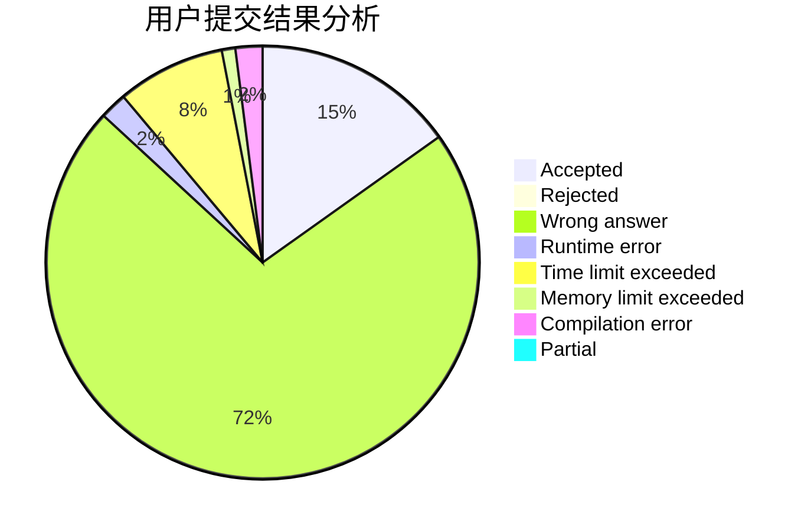
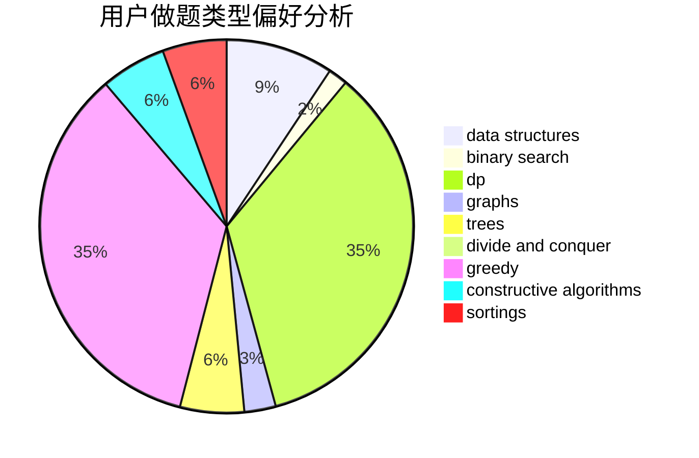
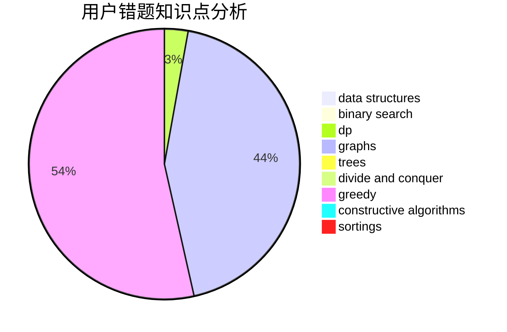

# Hello_at_123
<!-- tabs:start -->
#### **用户提交结果分析**

#### **用户做题类型偏好分析**

#### **用户错题知识点分析**

<!-- tabs:end -->
# 推荐题目
[1392D](http://codeforces.com/problemset/problem/1392/D)		dp,
                        greedy		  
[1300C](https://codeforces.com/contest/1300/problem/C)		brute force,
                        greedy,
                        math		  
[1098C](http://codeforces.com/problemset/problem/1098/C)		binary search,
                        constructive algorithms,
                        dfs and similar,
                        graphs,
                        greedy,
                        trees		  
[908C](http://codeforces.com/problemset/problem/908/C)		brute force,
                        geometry,
                        implementation,
                        math		  
[1147F](http://codeforces.com/problemset/problem/1147/F)		games,
                        interactive		  
[1465E](https://codeforces.com/contest/1465/problem/E)		bitmasks,
                        greedy,
                        math,
                        strings		  
[232C](http://codeforces.com/problemset/problem/232/C)		constructive algorithms,
                        divide and conquer,
                        dp,
                        graphs,
                        shortest paths		  
[748C](http://codeforces.com/problemset/problem/748/C)		constructive algorithms,
                        math		  
[69E](http://codeforces.com/problemset/problem/69/E)		data structures,
                        implementation		  
[908B](http://codeforces.com/problemset/problem/908/B)		brute force,
                        implementation		  
<!-- tabs:start -->
#### **data structures**
[69E](http://codeforces.com/problemset/problem/69/E)		data structures,
                        implementation		  
[1167F](http://codeforces.com/problemset/problem/1167/F)		combinatorics,
                        data structures,
                        math,
                        sortings		  
[1342D](http://codeforces.com/problemset/problem/1342/D)		binary search,
                        constructive algorithms,
                        data structures,
                        greedy,
                        sortings,
                        two pointers		  
[878B](http://codeforces.com/problemset/problem/878/B)		data structures,
                        implementation		  
[1037F](http://codeforces.com/problemset/problem/1037/F)		combinatorics,
                        data structures,
                        math		  
[1045G](http://codeforces.com/problemset/problem/1045/G)		data structures		  
[903D](http://codeforces.com/problemset/problem/903/D)		data structures,
                        math		  
[1452G](http://codeforces.com/problemset/problem/1452/G)		data structures,
                        dfs and similar,
                        greedy,
                        trees		  
[295E](http://codeforces.com/problemset/problem/295/E)		data structures		  
[420D](http://codeforces.com/problemset/problem/420/D)		data structures		  
#### **binary search**
[1098C](http://codeforces.com/problemset/problem/1098/C)		binary search,
                        constructive algorithms,
                        dfs and similar,
                        graphs,
                        greedy,
                        trees		  
[1342D](http://codeforces.com/problemset/problem/1342/D)		binary search,
                        constructive algorithms,
                        data structures,
                        greedy,
                        sortings,
                        two pointers		  
[180E](http://codeforces.com/problemset/problem/180/E)		binary search,
                        dp,
                        two pointers		  
[1198B](http://codeforces.com/problemset/problem/1198/B)		binary search,
                        brute force,
                        data structures,
                        sortings		  
[1291D](https://codeforces.com/contest/1291/problem/D)		binary search,
                        constructive algorithms,
                        data structures,
                        strings,
                        two pointers		  
[1492C](http://codeforces.com/problemset/problem/1492/C)		binary search,
                        data structures,
                        dp,
                        greedy,
                        two pointers		  
[1463D](http://codeforces.com/problemset/problem/1463/D)		binary search,
                        constructive algorithms,
                        greedy,
                        two pointers		  
[1490G](http://codeforces.com/problemset/problem/1490/G)		binary search,
                        data structures,
                        math		  
[1479D](http://codeforces.com/problemset/problem/1479/D)		binary search,
                        bitmasks,
                        brute force,
                        data structures,
                        probabilities,
                        trees		  
[1436E](http://codeforces.com/problemset/problem/1436/E)		binary search,
                        data structures,
                        two pointers		  
#### **dp**
[1392D](http://codeforces.com/problemset/problem/1392/D)		dp,
                        greedy		  
[232C](http://codeforces.com/problemset/problem/232/C)		constructive algorithms,
                        divide and conquer,
                        dp,
                        graphs,
                        shortest paths		  
[1207C](http://codeforces.com/problemset/problem/1207/C)		dp,
                        greedy		  
[798B](http://codeforces.com/problemset/problem/798/B)		brute force,
                        dp,
                        strings		  
[180E](http://codeforces.com/problemset/problem/180/E)		binary search,
                        dp,
                        two pointers		  
[839D](http://codeforces.com/problemset/problem/839/D)		combinatorics,
                        dp,
                        math,
                        number theory		  
[1278C](http://codeforces.com/problemset/problem/1278/C)		data structures,
                        dp,
                        greedy,
                        implementation		  
[687C](http://codeforces.com/problemset/problem/687/C)		dp		  
[512D](http://codeforces.com/problemset/problem/512/D)		dp,
                        trees		  
[908D](http://codeforces.com/problemset/problem/908/D)		dp,
                        math,
                        probabilities		  
#### **graph**
[1098C](http://codeforces.com/problemset/problem/1098/C)		binary search,
                        constructive algorithms,
                        dfs and similar,
                        graphs,
                        greedy,
                        trees		  
[232C](http://codeforces.com/problemset/problem/232/C)		constructive algorithms,
                        divide and conquer,
                        dp,
                        graphs,
                        shortest paths		  
[908F](http://codeforces.com/problemset/problem/908/F)		graphs,
                        greedy,
                        implementation		  
[1070I](http://codeforces.com/problemset/problem/1070/I)		flows,
                        graph matchings,
                        graphs		  
[103E](http://codeforces.com/problemset/problem/103/E)		flows,
                        graph matchings		  
[525D](http://codeforces.com/problemset/problem/525/D)		constructive algorithms,
                        data structures,
                        graphs,
                        greedy,
                        shortest paths		  
[1278D](http://codeforces.com/problemset/problem/1278/D)		data structures,
                        dsu,
                        graphs,
                        trees		  
[1487C](http://codeforces.com/problemset/problem/1487/C)		brute force,
                        constructive algorithms,
                        dfs and similar,
                        graphs,
                        greedy,
                        implementation,
                        math		  
[1437C](http://codeforces.com/problemset/problem/1437/C)		dp,
                        flows,
                        graph matchings,
                        greedy,
                        math,
                        sortings		  
[1470D](http://codeforces.com/problemset/problem/1470/D)		constructive algorithms,
                        dfs and similar,
                        graph matchings,
                        graphs,
                        greedy		  
#### **trees**
[1098C](http://codeforces.com/problemset/problem/1098/C)		binary search,
                        constructive algorithms,
                        dfs and similar,
                        graphs,
                        greedy,
                        trees		  
[1452G](http://codeforces.com/problemset/problem/1452/G)		data structures,
                        dfs and similar,
                        greedy,
                        trees		  
[1278D](http://codeforces.com/problemset/problem/1278/D)		data structures,
                        dsu,
                        graphs,
                        trees		  
[512D](http://codeforces.com/problemset/problem/512/D)		dp,
                        trees		  
[1479D](http://codeforces.com/problemset/problem/1479/D)		binary search,
                        bitmasks,
                        brute force,
                        data structures,
                        probabilities,
                        trees		  
[1511C](http://codeforces.com/problemset/problem/1511/C)		brute force,
                        data structures,
                        implementation,
                        trees		  
[1499F](http://codeforces.com/problemset/problem/1499/F)		combinatorics,
                        dfs and similar,
                        dp,
                        trees		  
[1491E](http://codeforces.com/problemset/problem/1491/E)		brute force,
                        dfs and similar,
                        divide and conquer,
                        number theory,
                        trees		  
[1466D](http://codeforces.com/problemset/problem/1466/D)		data structures,
                        greedy,
                        sortings,
                        trees		  
[1495D](http://codeforces.com/problemset/problem/1495/D)		combinatorics,
                        dfs and similar,
                        graphs,
                        math,
                        shortest paths,
                        trees		  
#### **divide and conquer**
[232C](http://codeforces.com/problemset/problem/232/C)		constructive algorithms,
                        divide and conquer,
                        dp,
                        graphs,
                        shortest paths		  
[1461D](http://codeforces.com/problemset/problem/1461/D)		binary search,
                        brute force,
                        data structures,
                        divide and conquer,
                        implementation,
                        sortings		  
[1466G](http://codeforces.com/problemset/problem/1466/G)		combinatorics,
                        divide and conquer,
                        hashing,
                        math,
                        string suffix structures,
                        strings		  
[1490D](http://codeforces.com/problemset/problem/1490/D)		dfs and similar,
                        divide and conquer,
                        implementation		  
[1483C](https://codeforces.com/contest/1483/problem/C)		data structures,
                        divide and conquer,
                        dp		  
[1491E](http://codeforces.com/problemset/problem/1491/E)		brute force,
                        dfs and similar,
                        divide and conquer,
                        number theory,
                        trees		  
[1303G](http://codeforces.com/problemset/problem/1303/G)		data structures,
                        divide and conquer,
                        geometry,
                        trees		  
[1494D](http://codeforces.com/problemset/problem/1494/D)		constructive algorithms,
                        data structures,
                        dfs and similar,
                        divide and conquer,
                        dsu,
                        greedy,
                        sortings,
                        trees		  
[1482E](http://codeforces.com/problemset/problem/1482/E)		data structures,
                        divide and conquer,
                        dp		  
[566C](http://codeforces.com/problemset/problem/566/C)		dfs and similar,
                        divide and conquer,
                        trees		  
#### **greedy**
[1392D](http://codeforces.com/problemset/problem/1392/D)		dp,
                        greedy		  
[1300C](https://codeforces.com/contest/1300/problem/C)		brute force,
                        greedy,
                        math		  
[1098C](http://codeforces.com/problemset/problem/1098/C)		binary search,
                        constructive algorithms,
                        dfs and similar,
                        graphs,
                        greedy,
                        trees		  
[1465E](https://codeforces.com/contest/1465/problem/E)		bitmasks,
                        greedy,
                        math,
                        strings		  
[908F](http://codeforces.com/problemset/problem/908/F)		graphs,
                        greedy,
                        implementation		  
[1342D](http://codeforces.com/problemset/problem/1342/D)		binary search,
                        constructive algorithms,
                        data structures,
                        greedy,
                        sortings,
                        two pointers		  
[1207C](http://codeforces.com/problemset/problem/1207/C)		dp,
                        greedy		  
[1452G](http://codeforces.com/problemset/problem/1452/G)		data structures,
                        dfs and similar,
                        greedy,
                        trees		  
[282B](http://codeforces.com/problemset/problem/282/B)		greedy,
                        math		  
[1278C](http://codeforces.com/problemset/problem/1278/C)		data structures,
                        dp,
                        greedy,
                        implementation		  
#### **constructive algorithms**
[1098C](http://codeforces.com/problemset/problem/1098/C)		binary search,
                        constructive algorithms,
                        dfs and similar,
                        graphs,
                        greedy,
                        trees		  
[232C](http://codeforces.com/problemset/problem/232/C)		constructive algorithms,
                        divide and conquer,
                        dp,
                        graphs,
                        shortest paths		  
[748C](http://codeforces.com/problemset/problem/748/C)		constructive algorithms,
                        math		  
[1342D](http://codeforces.com/problemset/problem/1342/D)		binary search,
                        constructive algorithms,
                        data structures,
                        greedy,
                        sortings,
                        two pointers		  
[746C](http://codeforces.com/problemset/problem/746/C)		constructive algorithms,
                        implementation,
                        math		  
[525D](http://codeforces.com/problemset/problem/525/D)		constructive algorithms,
                        data structures,
                        graphs,
                        greedy,
                        shortest paths		  
[1291D](https://codeforces.com/contest/1291/problem/D)		binary search,
                        constructive algorithms,
                        data structures,
                        strings,
                        two pointers		  
[805B](http://codeforces.com/problemset/problem/805/B)		constructive algorithms		  
[1364C](http://codeforces.com/problemset/problem/1364/C)		brute force,
                        constructive algorithms,
                        greedy		  
[1493A](http://codeforces.com/problemset/problem/1493/A)		constructive algorithms,
                        greedy		  
#### **sortings**
[1167F](http://codeforces.com/problemset/problem/1167/F)		combinatorics,
                        data structures,
                        math,
                        sortings		  
[1342D](http://codeforces.com/problemset/problem/1342/D)		binary search,
                        constructive algorithms,
                        data structures,
                        greedy,
                        sortings,
                        two pointers		  
[1198B](http://codeforces.com/problemset/problem/1198/B)		binary search,
                        brute force,
                        data structures,
                        sortings		  
[1496C](https://codeforces.com/contest/1496/problem/C)		geometry,
                        greedy,
                        math,
                        sortings		  
[1495A](http://codeforces.com/problemset/problem/1495/A)		geometry,
                        greedy,
                        math,
                        sortings		  
[1497A](http://codeforces.com/problemset/problem/1497/A)		brute force,
                        data structures,
                        greedy,
                        sortings		  
[1427A](http://codeforces.com/problemset/problem/1427/A)		math,
                        sortings		  
[1461D](http://codeforces.com/problemset/problem/1461/D)		binary search,
                        brute force,
                        data structures,
                        divide and conquer,
                        implementation,
                        sortings		  
[1437C](http://codeforces.com/problemset/problem/1437/C)		dp,
                        flows,
                        graph matchings,
                        greedy,
                        math,
                        sortings		  
[1473A](http://codeforces.com/problemset/problem/1473/A)		greedy,
                        implementation,
                        math,
                        sortings		  
<!-- tabs:end -->
