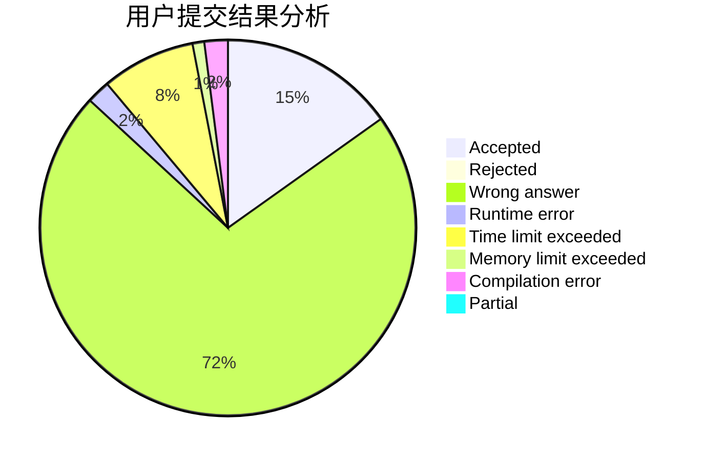
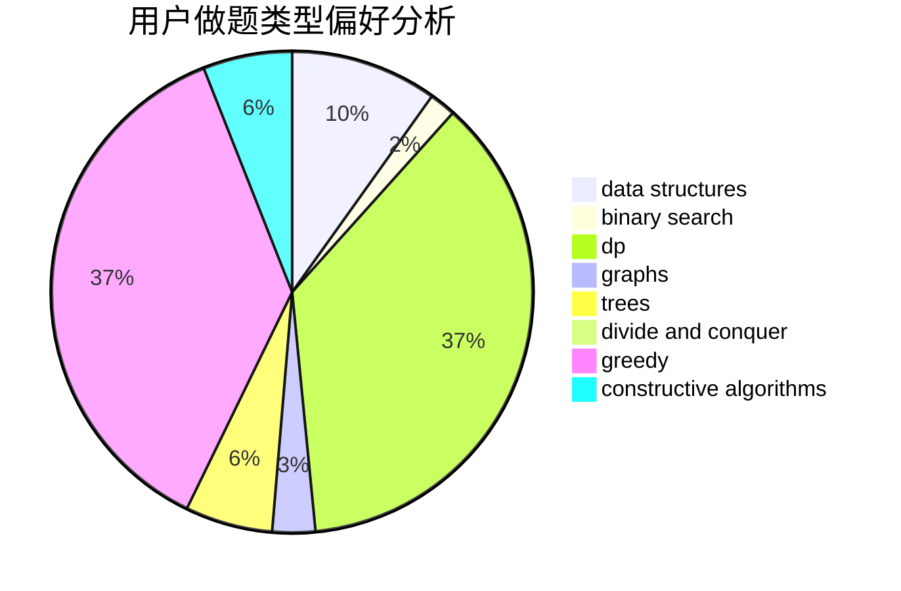
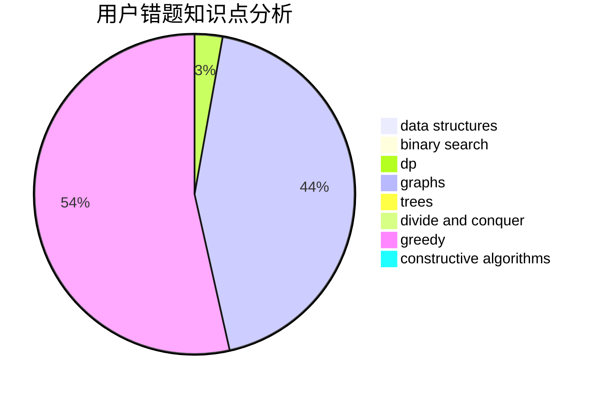

# Hello_at_123

<!-- tabs:start -->

#### **用户提交结果分析**

#### **用户做题类型偏好分析**

#### **用户错题知识点分析**

<!-- tabs:end -->
# 推荐题目
[600D](https://codeforces.com/contest/600/problem/D)		geometry		  
[908B](https://codeforces.com/contest/908/problem/B)		brute force,
                        implementation		  
[1045G](https://codeforces.com/contest/1045/problem/G)		data structures		  
[282B](https://codeforces.com/contest/282/problem/B)		greedy,
                        math		  
[903D](https://codeforces.com/contest/903/problem/D)		data structures,
                        math		  
[748C](https://codeforces.com/contest/748/problem/C)		constructive algorithms,
                        math		  
[295E](https://codeforces.com/contest/295/problem/E)		data structures		  
[1207C](https://codeforces.com/contest/1207/problem/C)		dp,
                        greedy		  
[1278C](https://codeforces.com/contest/1278/problem/C)		data structures,
                        dp,
                        greedy,
                        implementation		  
[902B](https://codeforces.com/contest/902/problem/B)		dfs and similar,
                        dsu,
                        greedy		  
