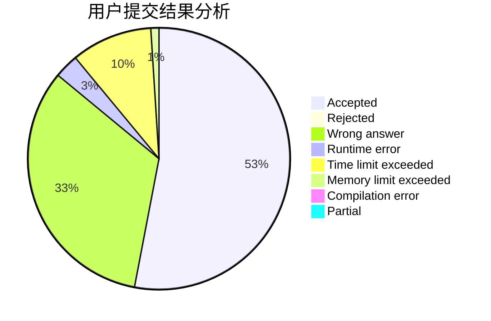
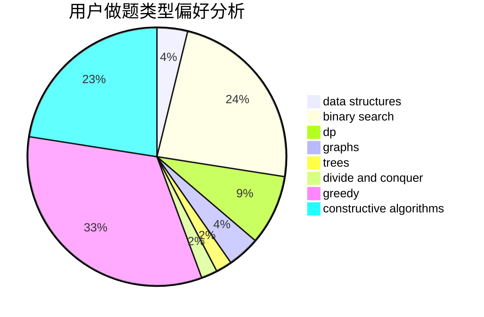
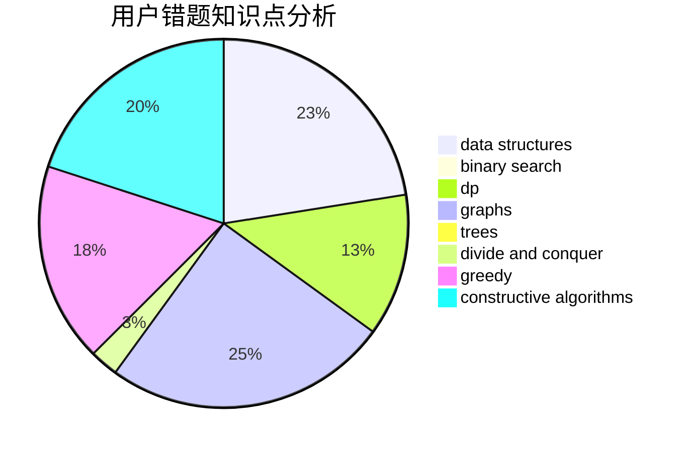

# Heltion

<!-- tabs:start -->

#### **用户提交结果分析**

#### **用户做题类型偏好分析**

#### **用户错题知识点分析**

<!-- tabs:end -->
# 推荐题目
[356D](https://codeforces.com/contest/356/problem/D)		bitmasks,
                        constructive algorithms,
                        dp,
                        greedy		  
[1099D](https://codeforces.com/contest/1099/problem/D)		dsu,graphs,sortings,trees		  
[377E](https://codeforces.com/contest/377/problem/E)		dp,
                        geometry		  
[1015A](https://codeforces.com/contest/1015/problem/A)		implementation		  
[463A](https://codeforces.com/contest/463/problem/A)		brute force,
                        implementation		  
[1355A](https://codeforces.com/contest/1355/problem/A)		brute force,
                        implementation,
                        math		  
[127A](https://codeforces.com/contest/127/problem/A)		geometry		  
[803G](https://codeforces.com/contest/803/problem/G)		data structures		  
[623A](https://codeforces.com/contest/623/problem/A)		constructive algorithms,
                        graphs		  
[774C](https://codeforces.com/contest/774/problem/C)		*special problem,
                        constructive algorithms,
                        greedy,
                        implementation		  
