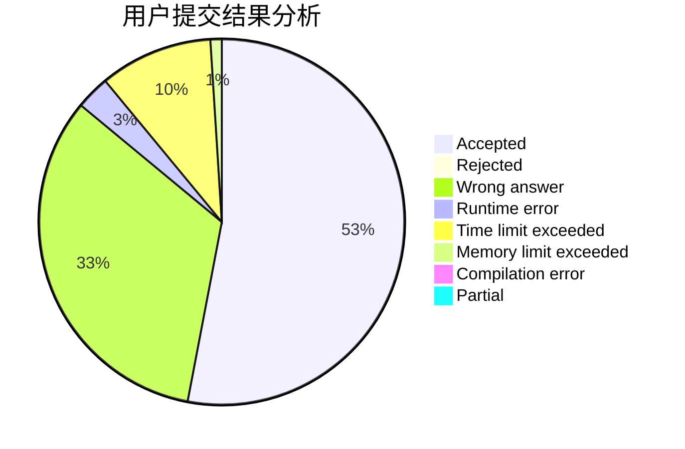
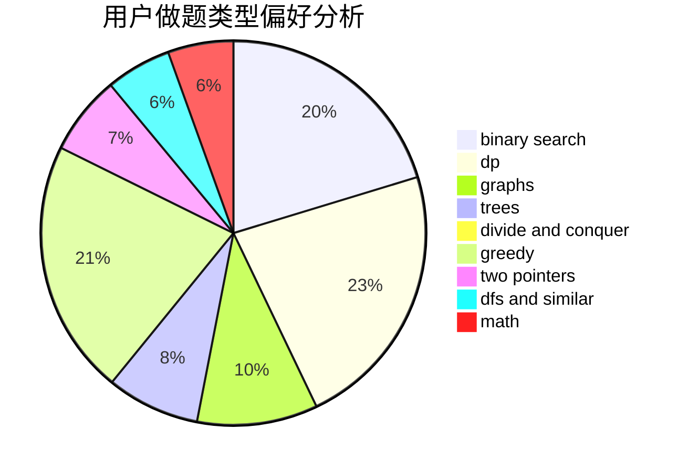

# Heltion

<!-- tabs:start -->

#### **用户提交结果分析**

#### **用户做题类型偏好分析**

<!-- tabs:end -->
# 推荐题目
[382E](https://codeforces.com/contest/382/problem/E)
[109A](https://codeforces.com/contest/109/problem/A)
[407B](https://codeforces.com/contest/407/problem/B)
[1015B](https://codeforces.com/contest/1015/problem/B)
[482E](https://codeforces.com/contest/482/problem/E)
[1361E](https://codeforces.com/contest/1361/problem/E)
[12862](https://codeforces.com/contest/1286/problem/2)
[81C](https://codeforces.com/contest/81/problem/C)
[651A](https://codeforces.com/contest/651/problem/A)
[793D](https://codeforces.com/contest/793/problem/D)
