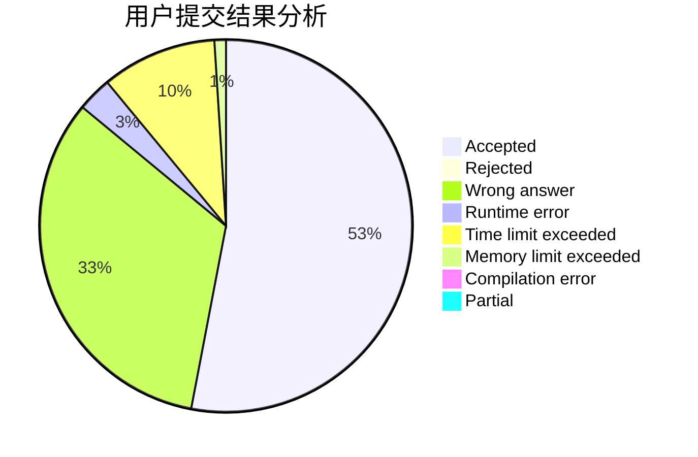
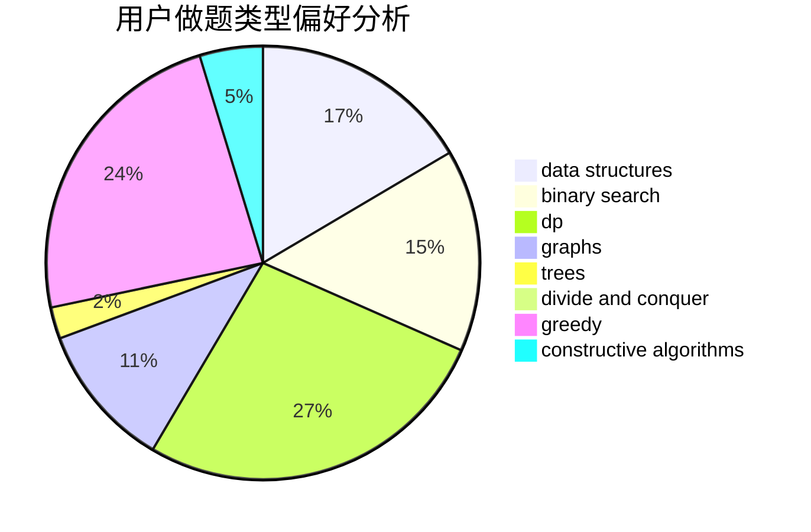
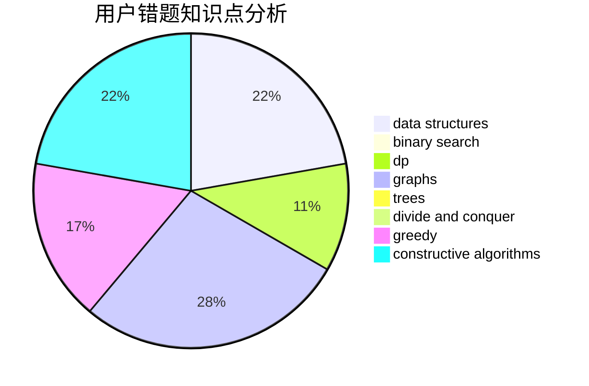

# Heltion

<!-- tabs:start -->

#### **用户提交结果分析**

#### **用户做题类型偏好分析**

#### **用户错题知识点分析**

<!-- tabs:end -->
# 推荐题目
[382E](https://codeforces.com/contest/382/problem/E)		combinatorics,
                        dp		  
[109A](https://codeforces.com/contest/109/problem/A)		brute force,
                        implementation		  
[407B](https://codeforces.com/contest/407/problem/B)		dp,
                        implementation		  
[1015B](https://codeforces.com/contest/1015/problem/B)		implementation		  
[482E](https://codeforces.com/contest/482/problem/E)		data structures,
                        trees		  
[1361E](https://codeforces.com/contest/1361/problem/E)		dfs and similar,
                        graphs,
                        probabilities,
                        trees		  
[12862](https://codeforces.com/contest/1286/problem/2)		dsu,graphs,sortings,trees		  
[81C](https://codeforces.com/contest/81/problem/C)		greedy,
                        math,
                        sortings		  
[651A](https://codeforces.com/contest/651/problem/A)		dp,
                        greedy,
                        implementation,
                        math		  
[793D](https://codeforces.com/contest/793/problem/D)		dp,
                        graphs,
                        shortest paths		  
