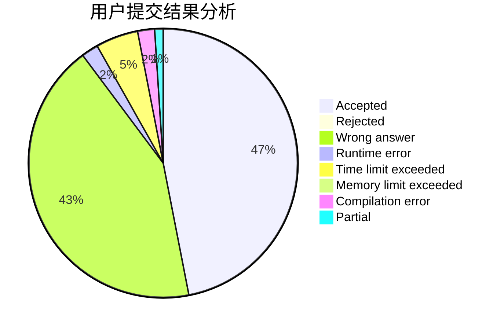
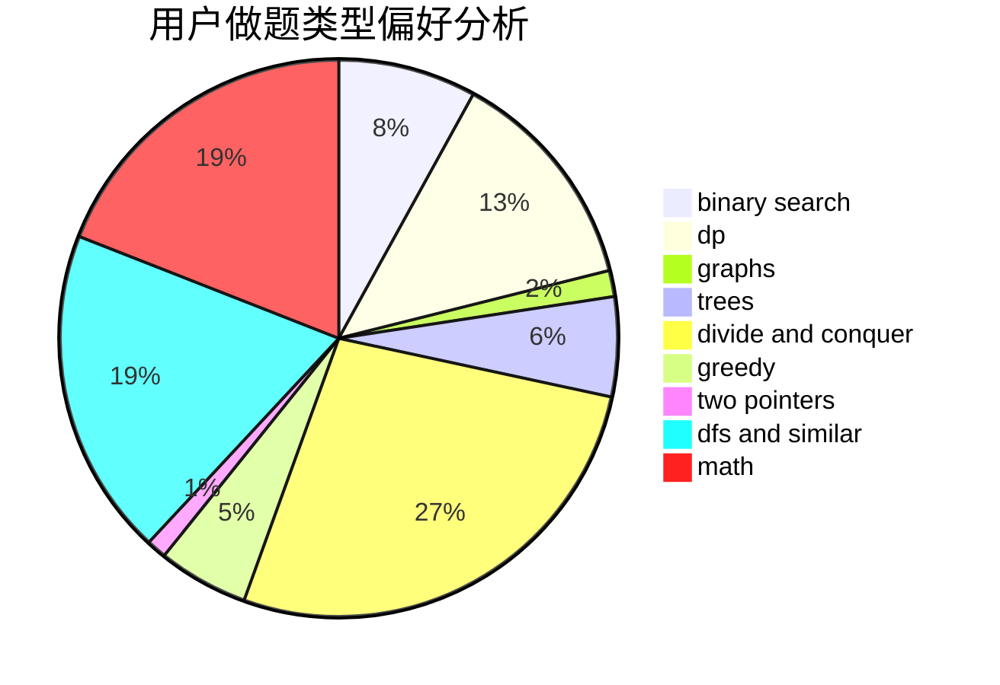

# Henry_Huang

<!-- tabs:start -->

#### **用户提交结果分析**

#### **用户做题类型偏好分析**

<!-- tabs:end -->
# 推荐题目
[274D](https://codeforces.com/contest/274/problem/D)
[700D](https://codeforces.com/contest/700/problem/D)
[1059B](https://codeforces.com/contest/1059/problem/B)
[286D](https://codeforces.com/contest/286/problem/D)
[453D](https://codeforces.com/contest/453/problem/D)
[667B](https://codeforces.com/contest/667/problem/B)
[772D](https://codeforces.com/contest/772/problem/D)
[238C](https://codeforces.com/contest/238/problem/C)
[570E](https://codeforces.com/contest/570/problem/E)
[13042](https://codeforces.com/contest/1304/problem/2)
