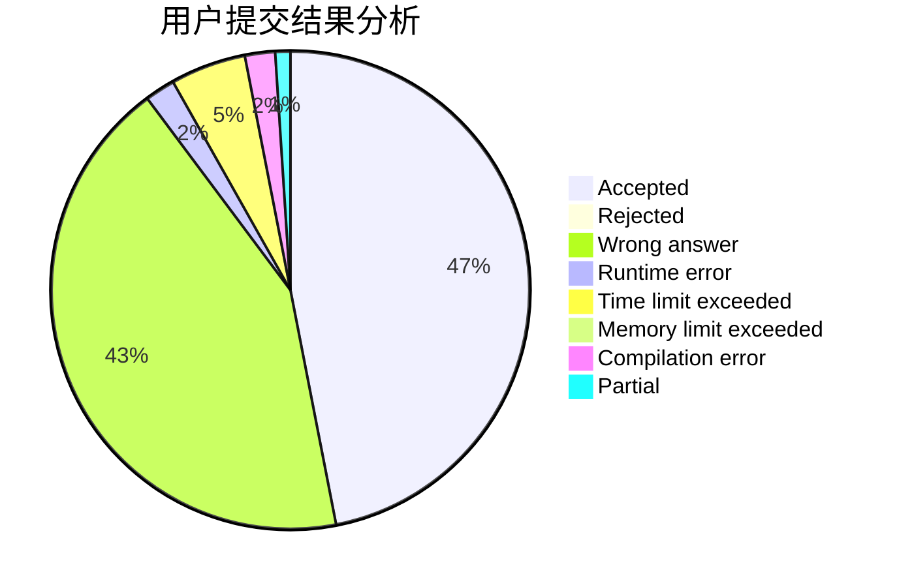
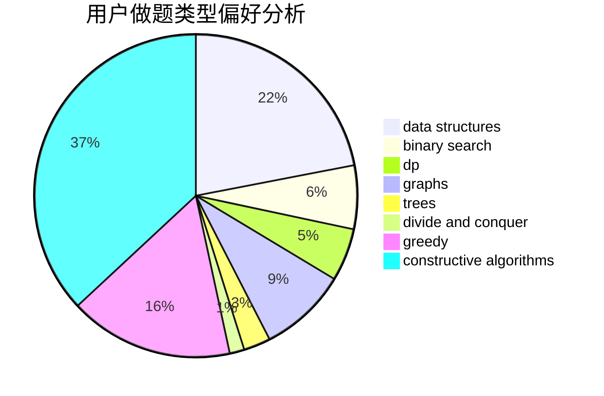
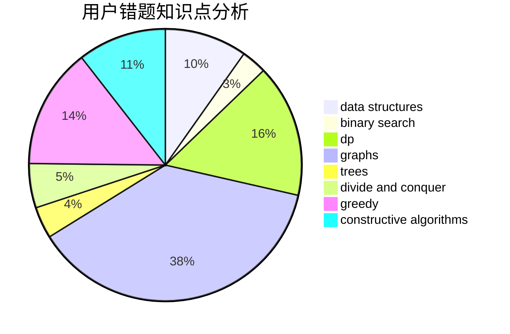

# Henry_Huang
<!-- tabs:start -->
#### **用户提交结果分析**

#### **用户做题类型偏好分析**

#### **用户错题知识点分析**

<!-- tabs:end -->
# 推荐题目
[Tickets](http://codeforces.com/problemset/problem/26/D)		combinatorics,
                        math,
                        probabilities		  
[Sum](http://codeforces.com/problemset/problem/257/D)		greedy,
                        math		  
[Berland Beauty](http://codeforces.com/problemset/problem/1296/F)		constructive algorithms,
                        dfs and similar,
                        greedy,
                        sortings,
                        trees		  
[Useful Edges](http://codeforces.com/problemset/problem/1482/F)		graphs,
                        shortest paths		  
[Vasya and Triangle](https://codeforces.com/contest/1058/problem/D)		geometry,
                        number theory		  
[Rectangles and Square](http://codeforces.com/problemset/problem/335/D)		brute force,
                        dp		  
[Theseus and labyrinth](http://codeforces.com/problemset/problem/676/D)		graphs,
                        implementation,
                        shortest paths		  
[Dune II: Battle For Arrakis](http://codeforces.com/problemset/problem/1346/F)		*special problem,
                        data structures,
                        greedy,
                        math		  
[Feed with Candy](http://codeforces.com/problemset/problem/436/A)		greedy		  
[k-String](http://codeforces.com/problemset/problem/219/A)		implementation,
                        strings		  
<!-- tabs:start -->
#### **data structures**
[Tickets](http://codeforces.com/problemset/problem/1346/F)		*special problem,
                        data structures,
                        greedy,
                        math		  
[Sum](http://codeforces.com/problemset/problem/362/C)		data structures,
                        dp,
                        implementation,
                        math		  
[Berland Beauty](http://codeforces.com/problemset/problem/1426/D)		constructive algorithms,
                        data structures,
                        greedy,
                        sortings		  
[Useful Edges](http://codeforces.com/problemset/problem/1485/F)		combinatorics,
                        data structures,
                        dp,
                        sortings		  
[Vasya and Triangle](http://codeforces.com/problemset/problem/549/F)		data structures,
                        divide and conquer		  
[Rectangles and Square](http://codeforces.com/problemset/problem/1213/F)		data structures,
                        dfs and similar,
                        dsu,
                        graphs,
                        greedy,
                        implementation,
                        strings		  
[Theseus and labyrinth](http://codeforces.com/problemset/problem/19/D)		data structures		  
[Dune II: Battle For Arrakis](http://codeforces.com/problemset/problem/1492/C)		binary search,
                        data structures,
                        dp,
                        greedy,
                        two pointers		  
[Feed with Candy](http://codeforces.com/problemset/problem/1490/G)		binary search,
                        data structures,
                        math		  
[k-String](http://codeforces.com/problemset/problem/1479/D)		binary search,
                        bitmasks,
                        brute force,
                        data structures,
                        probabilities,
                        trees		  
#### **binary search**
[Tickets](https://codeforces.com/contest/737/problem/A)		binary search,
                        greedy,
                        sortings		  
[Sum](http://codeforces.com/problemset/problem/883/D)		binary search,
                        dp,
                        math		  
[Berland Beauty](http://codeforces.com/problemset/problem/1492/C)		binary search,
                        data structures,
                        dp,
                        greedy,
                        two pointers		  
[Useful Edges](http://codeforces.com/problemset/problem/1463/D)		binary search,
                        constructive algorithms,
                        greedy,
                        two pointers		  
[Vasya and Triangle](http://codeforces.com/problemset/problem/1490/G)		binary search,
                        data structures,
                        math		  
[Rectangles and Square](http://codeforces.com/problemset/problem/1479/D)		binary search,
                        bitmasks,
                        brute force,
                        data structures,
                        probabilities,
                        trees		  
[Theseus and labyrinth](http://codeforces.com/problemset/problem/1436/E)		binary search,
                        data structures,
                        two pointers		  
[Dune II: Battle For Arrakis](http://codeforces.com/problemset/problem/1461/D)		binary search,
                        brute force,
                        data structures,
                        divide and conquer,
                        implementation,
                        sortings		  
[Feed with Candy](http://codeforces.com/problemset/problem/1493/C)		binary search,
                        brute force,
                        constructive algorithms,
                        greedy,
                        strings		  
[k-String](http://codeforces.com/problemset/problem/1487/D)		binary search,
                        brute force,
                        math,
                        number theory		  
#### **dp**
[Tickets](http://codeforces.com/problemset/problem/335/D)		brute force,
                        dp		  
[Sum](http://codeforces.com/problemset/problem/754/C)		brute force,
                        constructive algorithms,
                        dp,
                        implementation,
                        strings		  
[Berland Beauty](http://codeforces.com/problemset/problem/362/C)		data structures,
                        dp,
                        implementation,
                        math		  
[Useful Edges](http://codeforces.com/problemset/problem/546/D)		constructive algorithms,
                        dp,
                        math,
                        number theory		  
[Vasya and Triangle](http://codeforces.com/problemset/problem/432/D)		dp,
                        string suffix structures,
                        strings,
                        two pointers		  
[Rectangles and Square](http://codeforces.com/problemset/problem/463/D)		dfs and similar,
                        dp,
                        graphs,
                        implementation		  
[Theseus and labyrinth](http://codeforces.com/problemset/problem/1485/F)		combinatorics,
                        data structures,
                        dp,
                        sortings		  
[Dune II: Battle For Arrakis](http://codeforces.com/problemset/problem/883/D)		binary search,
                        dp,
                        math		  
[Feed with Candy](http://codeforces.com/problemset/problem/1492/C)		binary search,
                        data structures,
                        dp,
                        greedy,
                        two pointers		  
[k-String](https://codeforces.com/contest/1457/problem/C)		brute force,
                        dp,
                        implementation		  
#### **graph**
[Tickets](http://codeforces.com/problemset/problem/1482/F)		graphs,
                        shortest paths		  
[Sum](http://codeforces.com/problemset/problem/676/D)		graphs,
                        implementation,
                        shortest paths		  
[Berland Beauty](http://codeforces.com/problemset/problem/243/B)		graphs,
                        sortings		  
[Useful Edges](http://codeforces.com/problemset/problem/193/A)		constructive algorithms,
                        graphs,
                        trees		  
[Vasya and Triangle](http://codeforces.com/problemset/problem/463/D)		dfs and similar,
                        dp,
                        graphs,
                        implementation		  
[Rectangles and Square](http://codeforces.com/problemset/problem/1093/D)		dfs and similar,
                        graphs		  
[Theseus and labyrinth](http://codeforces.com/problemset/problem/1213/F)		data structures,
                        dfs and similar,
                        dsu,
                        graphs,
                        greedy,
                        implementation,
                        strings		  
[Dune II: Battle For Arrakis](http://codeforces.com/problemset/problem/1487/C)		brute force,
                        constructive algorithms,
                        dfs and similar,
                        graphs,
                        greedy,
                        implementation,
                        math		  
[Feed with Candy](http://codeforces.com/problemset/problem/1437/C)		dp,
                        flows,
                        graph matchings,
                        greedy,
                        math,
                        sortings		  
[k-String](http://codeforces.com/problemset/problem/1470/D)		constructive algorithms,
                        dfs and similar,
                        graph matchings,
                        graphs,
                        greedy		  
#### **trees**
[Tickets](http://codeforces.com/problemset/problem/1296/F)		constructive algorithms,
                        dfs and similar,
                        greedy,
                        sortings,
                        trees		  
[Sum](http://codeforces.com/problemset/problem/193/A)		constructive algorithms,
                        graphs,
                        trees		  
[Berland Beauty](http://codeforces.com/problemset/problem/1479/D)		binary search,
                        bitmasks,
                        brute force,
                        data structures,
                        probabilities,
                        trees		  
[Useful Edges](http://codeforces.com/problemset/problem/1511/C)		brute force,
                        data structures,
                        implementation,
                        trees		  
[Vasya and Triangle](http://codeforces.com/problemset/problem/1499/F)		combinatorics,
                        dfs and similar,
                        dp,
                        trees		  
[Rectangles and Square](http://codeforces.com/problemset/problem/1491/E)		brute force,
                        dfs and similar,
                        divide and conquer,
                        number theory,
                        trees		  
[Theseus and labyrinth](http://codeforces.com/problemset/problem/1466/D)		data structures,
                        greedy,
                        sortings,
                        trees		  
[Dune II: Battle For Arrakis](http://codeforces.com/problemset/problem/1495/D)		combinatorics,
                        dfs and similar,
                        graphs,
                        math,
                        shortest paths,
                        trees		  
[Feed with Candy](http://codeforces.com/problemset/problem/1303/G)		data structures,
                        divide and conquer,
                        geometry,
                        trees		  
[k-String](http://codeforces.com/problemset/problem/1454/E)		combinatorics,
                        dfs and similar,
                        graphs,
                        trees		  
#### **divide and conquer**
[Tickets](http://codeforces.com/problemset/problem/1257/G)		divide and conquer,
                        fft,
                        greedy,
                        math,
                        number theory		  
[Sum](http://codeforces.com/problemset/problem/549/F)		data structures,
                        divide and conquer		  
[Berland Beauty](http://codeforces.com/problemset/problem/1461/D)		binary search,
                        brute force,
                        data structures,
                        divide and conquer,
                        implementation,
                        sortings		  
[Useful Edges](http://codeforces.com/problemset/problem/1466/G)		combinatorics,
                        divide and conquer,
                        hashing,
                        math,
                        string suffix structures,
                        strings		  
[Vasya and Triangle](http://codeforces.com/problemset/problem/1490/D)		dfs and similar,
                        divide and conquer,
                        implementation		  
[Rectangles and Square](https://codeforces.com/contest/1483/problem/C)		data structures,
                        divide and conquer,
                        dp		  
[Theseus and labyrinth](http://codeforces.com/problemset/problem/1491/E)		brute force,
                        dfs and similar,
                        divide and conquer,
                        number theory,
                        trees		  
[Dune II: Battle For Arrakis](http://codeforces.com/problemset/problem/1303/G)		data structures,
                        divide and conquer,
                        geometry,
                        trees		  
[Feed with Candy](http://codeforces.com/problemset/problem/1494/D)		constructive algorithms,
                        data structures,
                        dfs and similar,
                        divide and conquer,
                        dsu,
                        greedy,
                        sortings,
                        trees		  
[k-String](http://codeforces.com/problemset/problem/1482/E)		data structures,
                        divide and conquer,
                        dp		  
#### **greedy**
[Tickets](http://codeforces.com/problemset/problem/257/D)		greedy,
                        math		  
[Sum](http://codeforces.com/problemset/problem/1296/F)		constructive algorithms,
                        dfs and similar,
                        greedy,
                        sortings,
                        trees		  
[Berland Beauty](http://codeforces.com/problemset/problem/1346/F)		*special problem,
                        data structures,
                        greedy,
                        math		  
[Useful Edges](http://codeforces.com/problemset/problem/436/A)		greedy		  
[Vasya and Triangle](https://codeforces.com/contest/737/problem/A)		binary search,
                        greedy,
                        sortings		  
[Rectangles and Square](http://codeforces.com/problemset/problem/909/A)		brute force,
                        greedy,
                        sortings		  
[Theseus and labyrinth](http://codeforces.com/problemset/problem/1257/G)		divide and conquer,
                        fft,
                        greedy,
                        math,
                        number theory		  
[Dune II: Battle For Arrakis](http://codeforces.com/problemset/problem/1051/B)		greedy,
                        math,
                        number theory		  
[Feed with Candy](http://codeforces.com/problemset/problem/1426/D)		constructive algorithms,
                        data structures,
                        greedy,
                        sortings		  
[k-String](http://codeforces.com/problemset/problem/1367/D)		constructive algorithms,
                        greedy,
                        implementation,
                        sortings		  
#### **constructive algorithms**
[Tickets](http://codeforces.com/problemset/problem/1296/F)		constructive algorithms,
                        dfs and similar,
                        greedy,
                        sortings,
                        trees		  
[Sum](http://codeforces.com/problemset/problem/754/C)		brute force,
                        constructive algorithms,
                        dp,
                        implementation,
                        strings		  
[Berland Beauty](http://codeforces.com/problemset/problem/193/A)		constructive algorithms,
                        graphs,
                        trees		  
[Useful Edges](http://codeforces.com/problemset/problem/546/D)		constructive algorithms,
                        dp,
                        math,
                        number theory		  
[Vasya and Triangle](http://codeforces.com/problemset/problem/1426/D)		constructive algorithms,
                        data structures,
                        greedy,
                        sortings		  
[Rectangles and Square](http://codeforces.com/problemset/problem/1367/D)		constructive algorithms,
                        greedy,
                        implementation,
                        sortings		  
[Theseus and labyrinth](http://codeforces.com/problemset/problem/1395/B)		constructive algorithms		  
[Dune II: Battle For Arrakis](http://codeforces.com/problemset/problem/1493/A)		constructive algorithms,
                        greedy		  
[Feed with Candy](http://codeforces.com/problemset/problem/1463/D)		binary search,
                        constructive algorithms,
                        greedy,
                        two pointers		  
[k-String](https://codeforces.com/contest/1456/problem/B)		bitmasks,
                        brute force,
                        constructive algorithms		  
#### **sortings**
[Tickets](http://codeforces.com/problemset/problem/1296/F)		constructive algorithms,
                        dfs and similar,
                        greedy,
                        sortings,
                        trees		  
[Sum](https://codeforces.com/contest/737/problem/A)		binary search,
                        greedy,
                        sortings		  
[Berland Beauty](http://codeforces.com/problemset/problem/243/B)		graphs,
                        sortings		  
[Useful Edges](http://codeforces.com/problemset/problem/909/A)		brute force,
                        greedy,
                        sortings		  
[Vasya and Triangle](http://codeforces.com/problemset/problem/1426/D)		constructive algorithms,
                        data structures,
                        greedy,
                        sortings		  
[Rectangles and Square](http://codeforces.com/problemset/problem/1485/F)		combinatorics,
                        data structures,
                        dp,
                        sortings		  
[Theseus and labyrinth](http://codeforces.com/problemset/problem/1367/D)		constructive algorithms,
                        greedy,
                        implementation,
                        sortings		  
[Dune II: Battle For Arrakis](https://codeforces.com/contest/1496/problem/C)		geometry,
                        greedy,
                        math,
                        sortings		  
[Feed with Candy](http://codeforces.com/problemset/problem/1495/A)		geometry,
                        greedy,
                        math,
                        sortings		  
[k-String](http://codeforces.com/problemset/problem/1497/A)		brute force,
                        data structures,
                        greedy,
                        sortings		  
<!-- tabs:end -->
