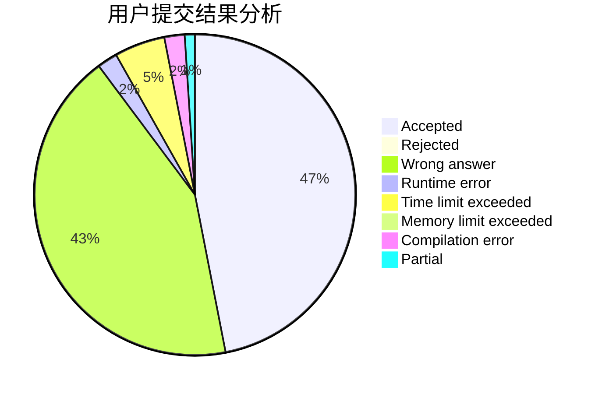
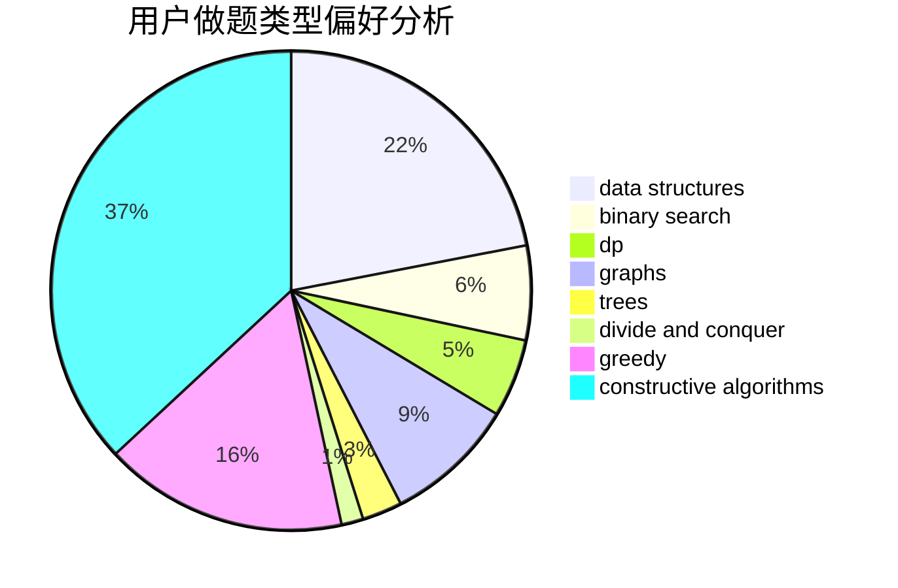
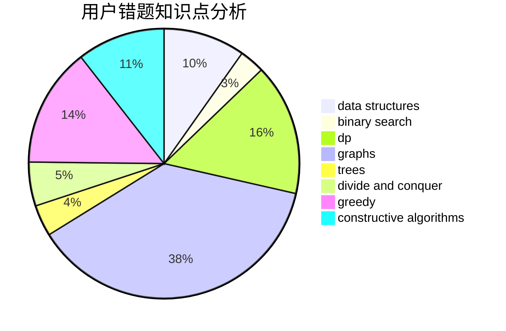

# Henry_Huang

<!-- tabs:start -->

#### **用户提交结果分析**

#### **用户做题类型偏好分析**

#### **用户错题知识点分析**

<!-- tabs:end -->
# 推荐题目
[257D](https://codeforces.com/contest/257/problem/D)		greedy,
                        math		  
[676D](https://codeforces.com/contest/676/problem/D)		graphs,
                        implementation,
                        shortest paths		  
[1058D](https://codeforces.com/contest/1058/problem/D)		dsu,graphs,sortings,trees		  
[26D](https://codeforces.com/contest/26/problem/D)		combinatorics,
                        math,
                        probabilities		  
[432D](https://codeforces.com/contest/432/problem/D)		dp,
                        string suffix structures,
                        strings,
                        two pointers		  
[634F](https://codeforces.com/contest/634/problem/F)		dsu,graphs,sortings,trees		  
[754C](https://codeforces.com/contest/754/problem/C)		brute force,
                        constructive algorithms,
                        dp,
                        implementation,
                        strings		  
[219A](https://codeforces.com/contest/219/problem/A)		implementation,
                        strings		  
[546D](https://codeforces.com/contest/546/problem/D)		constructive algorithms,
                        dp,
                        math,
                        number theory		  
[1296F](https://codeforces.com/contest/1296/problem/F)		constructive algorithms,
                        dfs and similar,
                        greedy,
                        sortings,
                        trees		  
