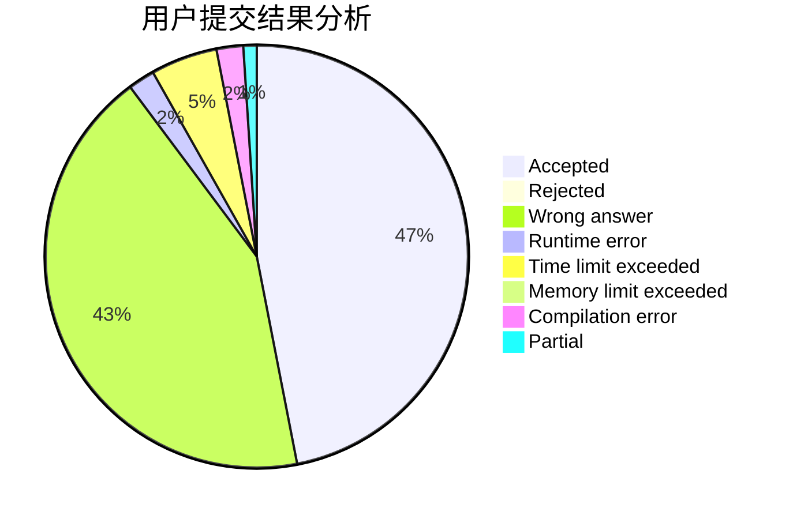
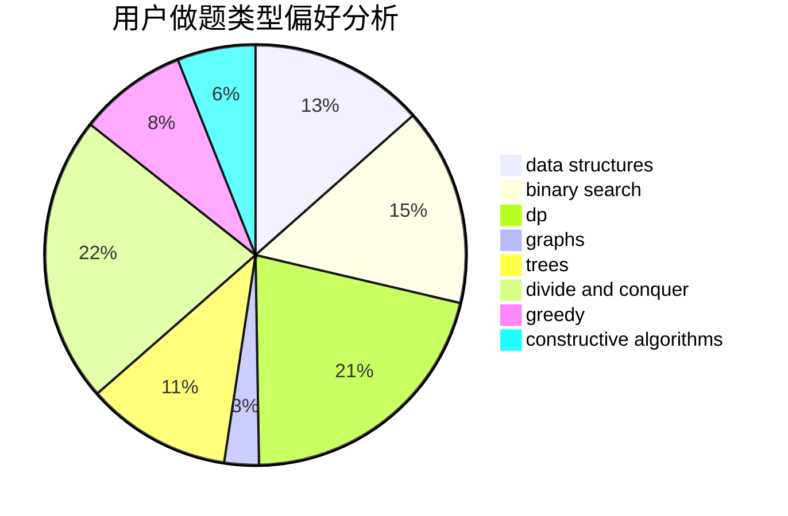
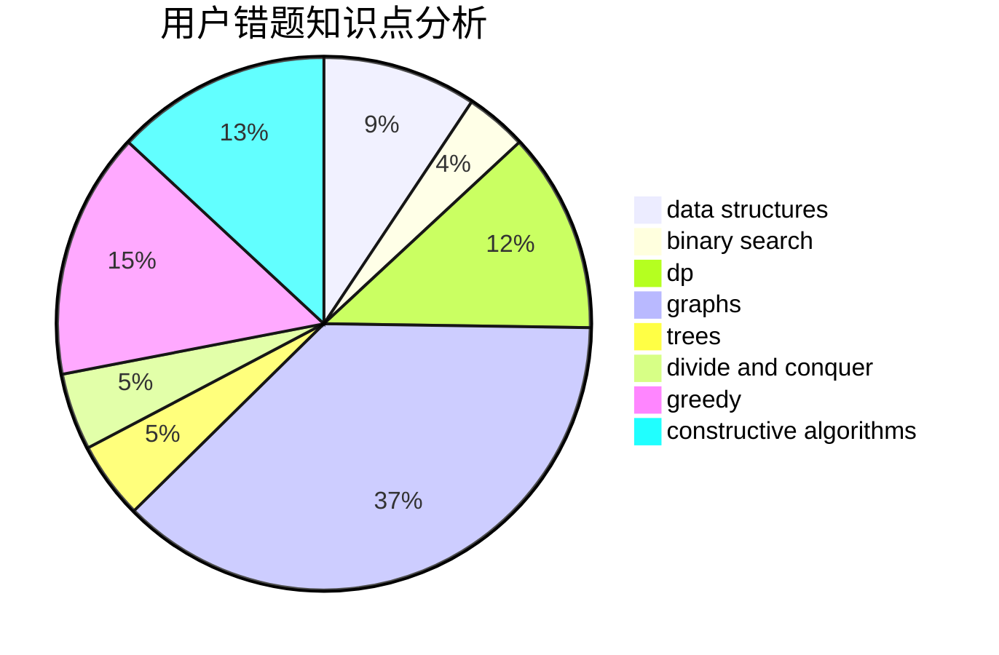

# Henry_Huang

<!-- tabs:start -->

#### **用户提交结果分析**

#### **用户做题类型偏好分析**

#### **用户错题知识点分析**

<!-- tabs:end -->
# 推荐题目
[274D](https://codeforces.com/contest/274/problem/D)		dfs and similar,
                        graphs,
                        greedy,
                        sortings		  
[700D](https://codeforces.com/contest/700/problem/D)		data structures,
                        greedy		  
[1059B](https://codeforces.com/contest/1059/problem/B)		implementation		  
[286D](https://codeforces.com/contest/286/problem/D)		data structures,
                        sortings		  
[453D](https://codeforces.com/contest/453/problem/D)		dp,
                        matrices		  
[667B](https://codeforces.com/contest/667/problem/B)		constructive algorithms,
                        geometry		  
[772D](https://codeforces.com/contest/772/problem/D)		bitmasks,
                        dp		  
[238C](https://codeforces.com/contest/238/problem/C)		dfs and similar,
                        dp,
                        greedy,
                        trees		  
[570E](https://codeforces.com/contest/570/problem/E)		combinatorics,
                        dp		  
[13042](https://codeforces.com/contest/1304/problem/2)		dsu,graphs,sortings,trees		  
