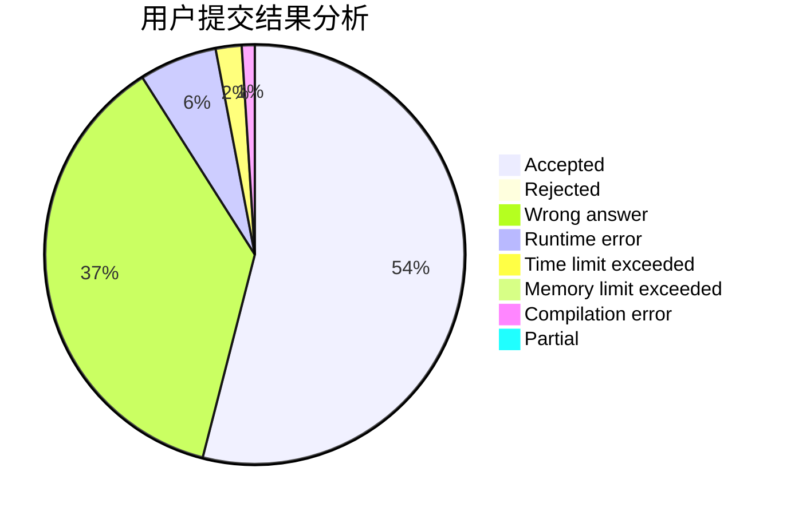
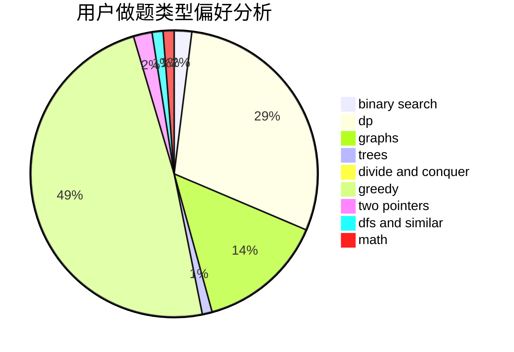

# Hex1234567

<!-- tabs:start -->

#### **用户提交结果分析**

#### **用户做题类型偏好分析**

<!-- tabs:end -->
# 推荐题目
[1162E](https://codeforces.com/contest/1162/problem/E)
[575A](https://codeforces.com/contest/575/problem/A)
[1078C](https://codeforces.com/contest/1078/problem/C)
[1225A](https://codeforces.com/contest/1225/problem/A)
[1027G](https://codeforces.com/contest/1027/problem/G)
[124A](https://codeforces.com/contest/124/problem/A)
[924A](https://codeforces.com/contest/924/problem/A)
[689D](https://codeforces.com/contest/689/problem/D)
[908H](https://codeforces.com/contest/908/problem/H)
[777E](https://codeforces.com/contest/777/problem/E)
