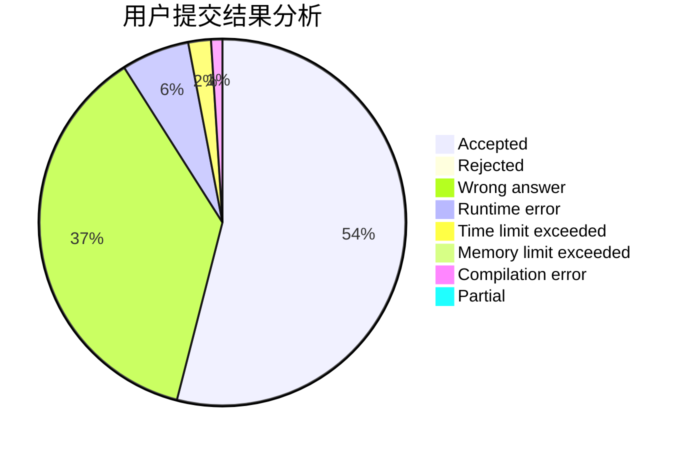
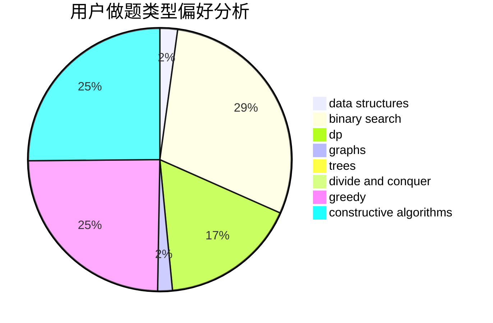
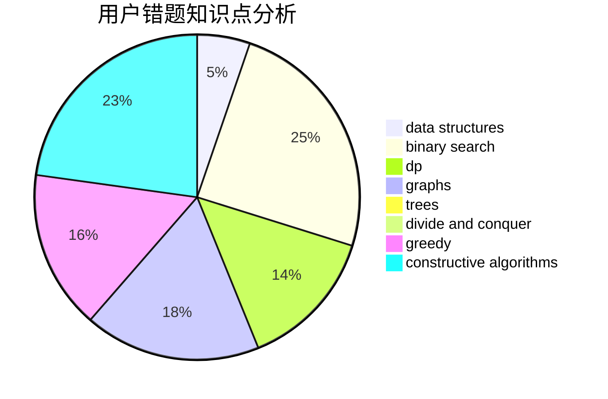

# Hex1234567

<!-- tabs:start -->

#### **用户提交结果分析**

#### **用户做题类型偏好分析**

#### **用户错题知识点分析**

<!-- tabs:end -->
# 推荐题目
[115A](https://codeforces.com/contest/115/problem/A)		dfs and similar,
                        graphs,
                        trees		  
[54A](https://codeforces.com/contest/54/problem/A)		implementation		  
[1077F2](https://codeforces.com/contest/1077F/problem/2)		data structures,
                        dp		  
[1217D](https://codeforces.com/contest/1217/problem/D)		constructive algorithms,
                        dfs and similar,
                        graphs		  
[1027D](https://codeforces.com/contest/1027/problem/D)		dfs and similar,
                        graphs		  
[1244E](https://codeforces.com/contest/1244/problem/E)		binary search,
                        constructive algorithms,
                        greedy,
                        sortings,
                        ternary search,
                        two pointers		  
[909C](https://codeforces.com/contest/909/problem/C)		dp		  
[667C](https://codeforces.com/contest/667/problem/C)		dsu,graphs,sortings,trees		  
[889E](https://codeforces.com/contest/889/problem/E)		binary search,
                        dp,
                        math		  
[758E](https://codeforces.com/contest/758/problem/E)		dfs and similar,
                        dp,
                        graphs,
                        greedy,
                        trees		  
