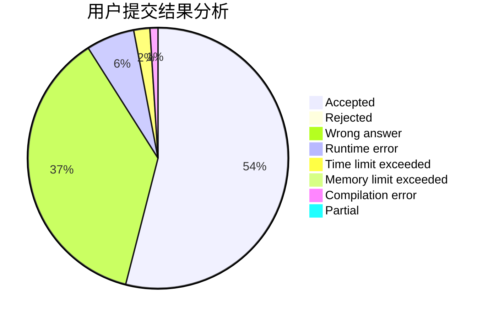
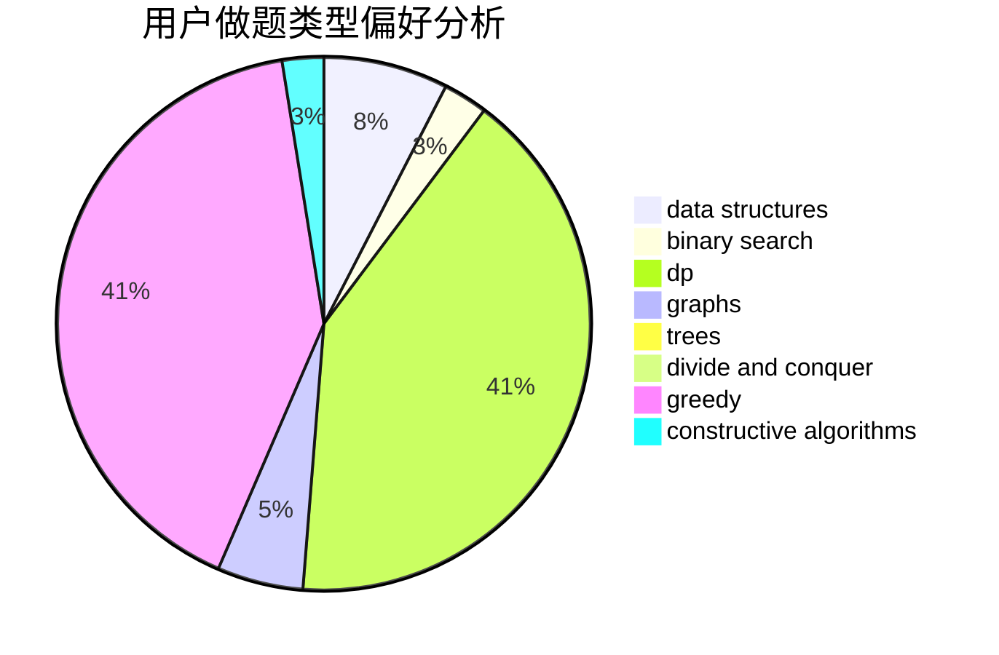
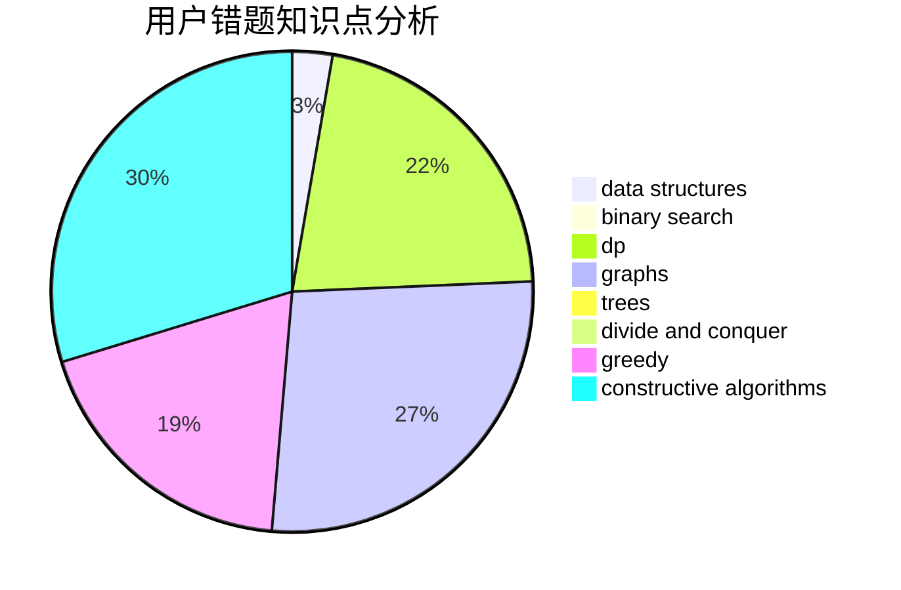

# Hex1234567

<!-- tabs:start -->

#### **用户提交结果分析**

#### **用户做题类型偏好分析**

#### **用户错题知识点分析**

<!-- tabs:end -->
# 推荐题目
[1162E](https://codeforces.com/contest/1162/problem/E)		dsu,graphs,sortings,trees		  
[575A](https://codeforces.com/contest/575/problem/A)		data structures,
                        math,
                        matrices		  
[1078C](https://codeforces.com/contest/1078/problem/C)		dsu,graphs,sortings,trees		  
[1225A](https://codeforces.com/contest/1225/problem/A)		math		  
[1027G](https://codeforces.com/contest/1027/problem/G)		bitmasks,
                        math,
                        number theory		  
[124A](https://codeforces.com/contest/124/problem/A)		math		  
[924A](https://codeforces.com/contest/924/problem/A)		greedy,
                        implementation		  
[689D](https://codeforces.com/contest/689/problem/D)		binary search,
                        data structures		  
[908H](https://codeforces.com/contest/908/problem/H)		nan		  
[777E](https://codeforces.com/contest/777/problem/E)		brute force,
                        data structures,
                        dp,
                        greedy,
                        sortings		  
