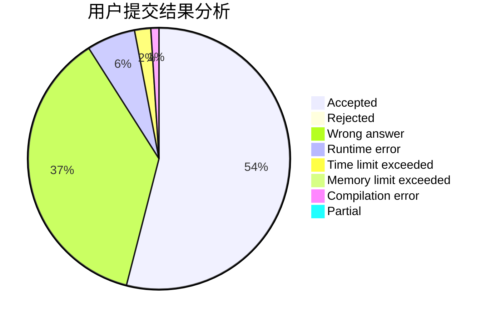
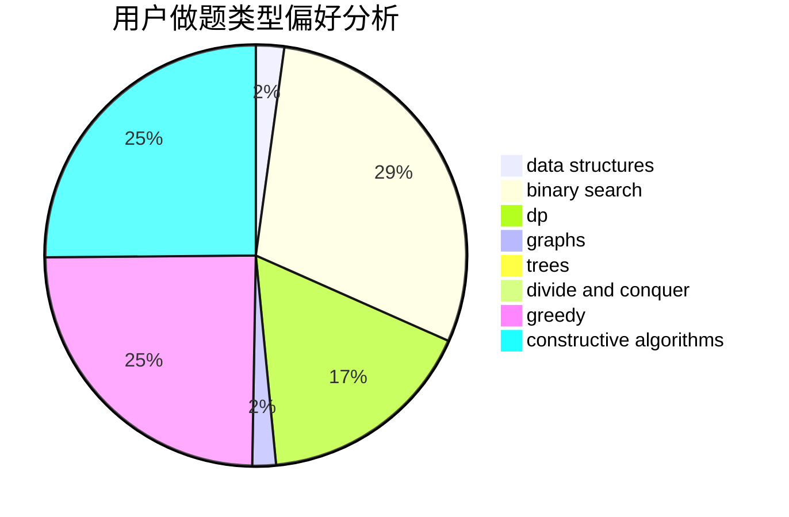
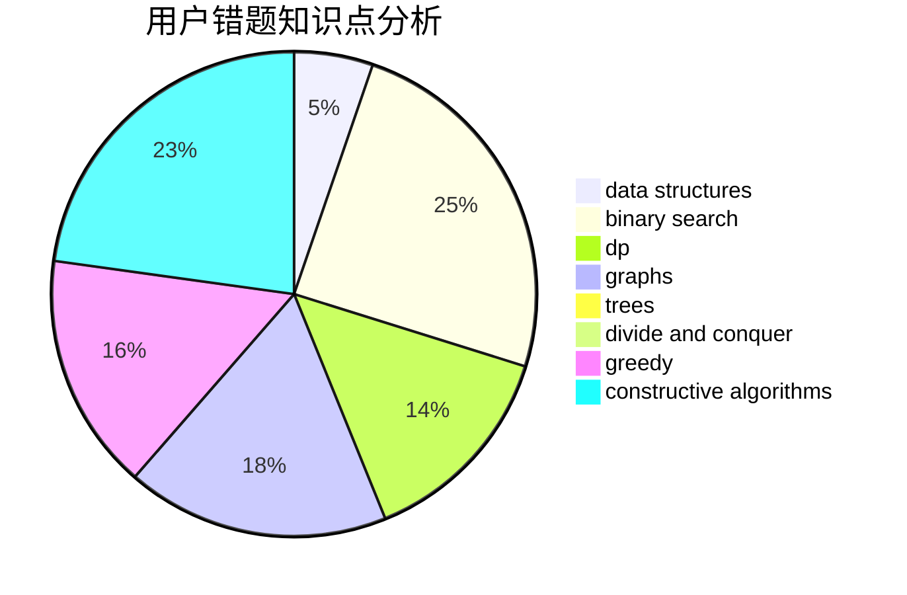

# Hex1234567
<!-- tabs:start -->
#### **用户提交结果分析**

#### **用户做题类型偏好分析**

#### **用户错题知识点分析**

<!-- tabs:end -->
# 推荐题目
[Presents](http://codeforces.com/problemset/problem/54/A)		implementation		  
[Konrad and Company Evaluation](http://codeforces.com/problemset/problem/1210/D)		graphs		  
[Pictures with Kittens (hard version)](http://codeforces.com/problemset/problem/1077/F2)		data structures,
                        dp		  
[Party](http://codeforces.com/problemset/problem/115/A)		dfs and similar,
                        graphs,
                        trees		  
[Minimizing Difference](http://codeforces.com/problemset/problem/1244/E)		binary search,
                        constructive algorithms,
                        greedy,
                        sortings,
                        ternary search,
                        two pointers		  
[Reberland Linguistics](https://codeforces.com/contest/667/problem/C)		dp,
                        implementation,
                        strings		  
[Coloring Edges](http://codeforces.com/problemset/problem/1217/D)		constructive algorithms,
                        dfs and similar,
                        graphs		  
[Segments](http://codeforces.com/problemset/problem/909/B)		constructive algorithms,
                        math		  
[Broken Tree](http://codeforces.com/problemset/problem/758/E)		dfs and similar,
                        dp,
                        graphs,
                        greedy,
                        trees		  
[Distinguish I from Z](http://codeforces.com/problemset/problem/1356/A2)		*special problem		  
<!-- tabs:start -->
#### **data structures**
[Presents](http://codeforces.com/problemset/problem/1077/F2)		data structures,
                        dp		  
[Konrad and Company Evaluation](http://codeforces.com/problemset/problem/459/D)		data structures,
                        divide and conquer,
                        sortings		  
[Pictures with Kittens (hard version)](http://codeforces.com/problemset/problem/1251/E2)		binary search,
                        data structures,
                        greedy		  
[Party](http://codeforces.com/problemset/problem/1396/D)		data structures,
                        sortings,
                        two pointers		  
[Minimizing Difference](http://codeforces.com/problemset/problem/372/C)		data structures,
                        dp,
                        math		  
[Reberland Linguistics](http://codeforces.com/problemset/problem/1468/M)		data structures,
                        graphs,
                        implementation		  
[Coloring Edges](http://codeforces.com/problemset/problem/1492/C)		binary search,
                        data structures,
                        dp,
                        greedy,
                        two pointers		  
[Segments](http://codeforces.com/problemset/problem/1490/G)		binary search,
                        data structures,
                        math		  
[Broken Tree](http://codeforces.com/problemset/problem/1479/D)		binary search,
                        bitmasks,
                        brute force,
                        data structures,
                        probabilities,
                        trees		  
[Distinguish I from Z](http://codeforces.com/problemset/problem/1497/A)		brute force,
                        data structures,
                        greedy,
                        sortings		  
#### **binary search**
[Presents](http://codeforces.com/problemset/problem/1244/E)		binary search,
                        constructive algorithms,
                        greedy,
                        sortings,
                        ternary search,
                        two pointers		  
[Konrad and Company Evaluation](http://codeforces.com/problemset/problem/1251/E2)		binary search,
                        data structures,
                        greedy		  
[Pictures with Kittens (hard version)](http://codeforces.com/problemset/problem/889/E)		binary search,
                        dp,
                        math		  
[Party](http://codeforces.com/problemset/problem/1492/C)		binary search,
                        data structures,
                        dp,
                        greedy,
                        two pointers		  
[Minimizing Difference](http://codeforces.com/problemset/problem/1463/D)		binary search,
                        constructive algorithms,
                        greedy,
                        two pointers		  
[Reberland Linguistics](http://codeforces.com/problemset/problem/1490/G)		binary search,
                        data structures,
                        math		  
[Coloring Edges](http://codeforces.com/problemset/problem/1479/D)		binary search,
                        bitmasks,
                        brute force,
                        data structures,
                        probabilities,
                        trees		  
[Segments](http://codeforces.com/problemset/problem/1436/E)		binary search,
                        data structures,
                        two pointers		  
[Broken Tree](http://codeforces.com/problemset/problem/1461/D)		binary search,
                        brute force,
                        data structures,
                        divide and conquer,
                        implementation,
                        sortings		  
[Distinguish I from Z](http://codeforces.com/problemset/problem/1493/C)		binary search,
                        brute force,
                        constructive algorithms,
                        greedy,
                        strings		  
#### **dp**
[Presents](http://codeforces.com/problemset/problem/1077/F2)		data structures,
                        dp		  
[Konrad and Company Evaluation](https://codeforces.com/contest/667/problem/C)		dp,
                        implementation,
                        strings		  
[Pictures with Kittens (hard version)](http://codeforces.com/problemset/problem/758/E)		dfs and similar,
                        dp,
                        graphs,
                        greedy,
                        trees		  
[Party](http://codeforces.com/problemset/problem/889/E)		binary search,
                        dp,
                        math		  
[Minimizing Difference](http://codeforces.com/problemset/problem/372/C)		data structures,
                        dp,
                        math		  
[Reberland Linguistics](http://codeforces.com/problemset/problem/909/C)		dp		  
[Coloring Edges](https://codeforces.com/contest/764/problem/C)		dfs and similar,
                        dp,
                        dsu,
                        graphs,
                        implementation,
                        trees		  
[Segments](http://codeforces.com/problemset/problem/1392/D)		dp,
                        greedy		  
[Broken Tree](http://codeforces.com/problemset/problem/1492/C)		binary search,
                        data structures,
                        dp,
                        greedy,
                        two pointers		  
[Distinguish I from Z](https://codeforces.com/contest/1457/problem/C)		brute force,
                        dp,
                        implementation		  
#### **graph**
[Presents](http://codeforces.com/problemset/problem/1210/D)		graphs		  
[Konrad and Company Evaluation](http://codeforces.com/problemset/problem/115/A)		dfs and similar,
                        graphs,
                        trees		  
[Pictures with Kittens (hard version)](http://codeforces.com/problemset/problem/1217/D)		constructive algorithms,
                        dfs and similar,
                        graphs		  
[Party](http://codeforces.com/problemset/problem/758/E)		dfs and similar,
                        dp,
                        graphs,
                        greedy,
                        trees		  
[Minimizing Difference](http://codeforces.com/problemset/problem/1027/D)		dfs and similar,
                        graphs		  
[Reberland Linguistics](http://codeforces.com/problemset/problem/1095/F)		dsu,
                        graphs,
                        greedy		  
[Coloring Edges](http://codeforces.com/problemset/problem/1468/M)		data structures,
                        graphs,
                        implementation		  
[Segments](https://codeforces.com/contest/764/problem/C)		dfs and similar,
                        dp,
                        dsu,
                        graphs,
                        implementation,
                        trees		  
[Broken Tree](http://codeforces.com/problemset/problem/1487/C)		brute force,
                        constructive algorithms,
                        dfs and similar,
                        graphs,
                        greedy,
                        implementation,
                        math		  
[Distinguish I from Z](http://codeforces.com/problemset/problem/1437/C)		dp,
                        flows,
                        graph matchings,
                        greedy,
                        math,
                        sortings		  
#### **trees**
[Presents](http://codeforces.com/problemset/problem/115/A)		dfs and similar,
                        graphs,
                        trees		  
[Konrad and Company Evaluation](http://codeforces.com/problemset/problem/758/E)		dfs and similar,
                        dp,
                        graphs,
                        greedy,
                        trees		  
[Pictures with Kittens (hard version)](https://codeforces.com/contest/764/problem/C)		dfs and similar,
                        dp,
                        dsu,
                        graphs,
                        implementation,
                        trees		  
[Party](http://codeforces.com/problemset/problem/1479/D)		binary search,
                        bitmasks,
                        brute force,
                        data structures,
                        probabilities,
                        trees		  
[Minimizing Difference](http://codeforces.com/problemset/problem/1511/C)		brute force,
                        data structures,
                        implementation,
                        trees		  
[Reberland Linguistics](http://codeforces.com/problemset/problem/1499/F)		combinatorics,
                        dfs and similar,
                        dp,
                        trees		  
[Coloring Edges](http://codeforces.com/problemset/problem/1491/E)		brute force,
                        dfs and similar,
                        divide and conquer,
                        number theory,
                        trees		  
[Segments](http://codeforces.com/problemset/problem/1466/D)		data structures,
                        greedy,
                        sortings,
                        trees		  
[Broken Tree](http://codeforces.com/problemset/problem/1495/D)		combinatorics,
                        dfs and similar,
                        graphs,
                        math,
                        shortest paths,
                        trees		  
[Distinguish I from Z](http://codeforces.com/problemset/problem/1303/G)		data structures,
                        divide and conquer,
                        geometry,
                        trees		  
#### **divide and conquer**
[Presents](http://codeforces.com/problemset/problem/459/D)		data structures,
                        divide and conquer,
                        sortings		  
[Konrad and Company Evaluation](http://codeforces.com/problemset/problem/1461/D)		binary search,
                        brute force,
                        data structures,
                        divide and conquer,
                        implementation,
                        sortings		  
[Pictures with Kittens (hard version)](http://codeforces.com/problemset/problem/1466/G)		combinatorics,
                        divide and conquer,
                        hashing,
                        math,
                        string suffix structures,
                        strings		  
[Party](http://codeforces.com/problemset/problem/1490/D)		dfs and similar,
                        divide and conquer,
                        implementation		  
[Minimizing Difference](https://codeforces.com/contest/1483/problem/C)		data structures,
                        divide and conquer,
                        dp		  
[Reberland Linguistics](http://codeforces.com/problemset/problem/1491/E)		brute force,
                        dfs and similar,
                        divide and conquer,
                        number theory,
                        trees		  
[Coloring Edges](http://codeforces.com/problemset/problem/1303/G)		data structures,
                        divide and conquer,
                        geometry,
                        trees		  
[Segments](http://codeforces.com/problemset/problem/1494/D)		constructive algorithms,
                        data structures,
                        dfs and similar,
                        divide and conquer,
                        dsu,
                        greedy,
                        sortings,
                        trees		  
[Broken Tree](http://codeforces.com/problemset/problem/1482/E)		data structures,
                        divide and conquer,
                        dp		  
[Distinguish I from Z](http://codeforces.com/problemset/problem/566/C)		dfs and similar,
                        divide and conquer,
                        trees		  
#### **greedy**
[Presents](http://codeforces.com/problemset/problem/1244/E)		binary search,
                        constructive algorithms,
                        greedy,
                        sortings,
                        ternary search,
                        two pointers		  
[Konrad and Company Evaluation](http://codeforces.com/problemset/problem/758/E)		dfs and similar,
                        dp,
                        graphs,
                        greedy,
                        trees		  
[Pictures with Kittens (hard version)](http://codeforces.com/problemset/problem/1251/E2)		binary search,
                        data structures,
                        greedy		  
[Party](http://codeforces.com/problemset/problem/226/B)		greedy		  
[Minimizing Difference](http://codeforces.com/problemset/problem/1095/F)		dsu,
                        graphs,
                        greedy		  
[Reberland Linguistics](http://codeforces.com/problemset/problem/1418/B)		greedy,
                        sortings		  
[Coloring Edges](http://codeforces.com/problemset/problem/1392/D)		dp,
                        greedy		  
[Segments](http://codeforces.com/problemset/problem/1492/C)		binary search,
                        data structures,
                        dp,
                        greedy,
                        two pointers		  
[Broken Tree](https://codeforces.com/contest/1496/problem/C)		geometry,
                        greedy,
                        math,
                        sortings		  
[Distinguish I from Z](http://codeforces.com/problemset/problem/1493/A)		constructive algorithms,
                        greedy		  
#### **constructive algorithms**
[Presents](http://codeforces.com/problemset/problem/1244/E)		binary search,
                        constructive algorithms,
                        greedy,
                        sortings,
                        ternary search,
                        two pointers		  
[Konrad and Company Evaluation](http://codeforces.com/problemset/problem/1217/D)		constructive algorithms,
                        dfs and similar,
                        graphs		  
[Pictures with Kittens (hard version)](http://codeforces.com/problemset/problem/909/B)		constructive algorithms,
                        math		  
[Party](http://codeforces.com/problemset/problem/1152/B)		bitmasks,
                        constructive algorithms,
                        dfs and similar,
                        math		  
[Minimizing Difference](http://codeforces.com/problemset/problem/1493/A)		constructive algorithms,
                        greedy		  
[Reberland Linguistics](http://codeforces.com/problemset/problem/1463/D)		binary search,
                        constructive algorithms,
                        greedy,
                        two pointers		  
[Coloring Edges](https://codeforces.com/contest/1456/problem/B)		bitmasks,
                        brute force,
                        constructive algorithms		  
[Segments](http://codeforces.com/problemset/problem/1492/D)		bitmasks,
                        constructive algorithms,
                        greedy,
                        math		  
[Broken Tree](https://codeforces.com/contest/1504/problem/D)		constructive algorithms,
                        games,
                        interactive		  
[Distinguish I from Z](https://codeforces.com/contest/1483/problem/A)		brute force,
                        constructive algorithms,
                        greedy,
                        implementation		  
#### **sortings**
[Presents](http://codeforces.com/problemset/problem/1244/E)		binary search,
                        constructive algorithms,
                        greedy,
                        sortings,
                        ternary search,
                        two pointers		  
[Konrad and Company Evaluation](http://codeforces.com/problemset/problem/459/D)		data structures,
                        divide and conquer,
                        sortings		  
[Pictures with Kittens (hard version)](http://codeforces.com/problemset/problem/1396/D)		data structures,
                        sortings,
                        two pointers		  
[Party](http://codeforces.com/problemset/problem/1418/B)		greedy,
                        sortings		  
[Minimizing Difference](https://codeforces.com/contest/1496/problem/C)		geometry,
                        greedy,
                        math,
                        sortings		  
[Reberland Linguistics](http://codeforces.com/problemset/problem/1495/A)		geometry,
                        greedy,
                        math,
                        sortings		  
[Coloring Edges](http://codeforces.com/problemset/problem/1497/A)		brute force,
                        data structures,
                        greedy,
                        sortings		  
[Segments](http://codeforces.com/problemset/problem/1427/A)		math,
                        sortings		  
[Broken Tree](http://codeforces.com/problemset/problem/1461/D)		binary search,
                        brute force,
                        data structures,
                        divide and conquer,
                        implementation,
                        sortings		  
[Distinguish I from Z](http://codeforces.com/problemset/problem/1437/C)		dp,
                        flows,
                        graph matchings,
                        greedy,
                        math,
                        sortings		  
<!-- tabs:end -->
