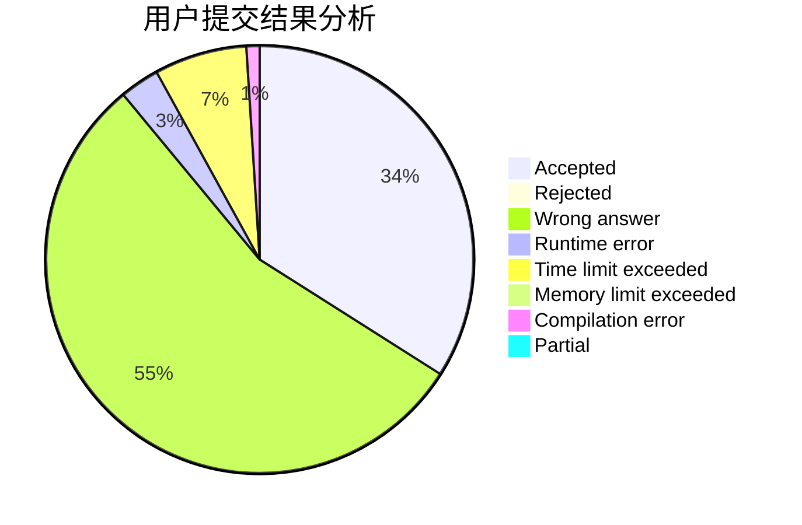
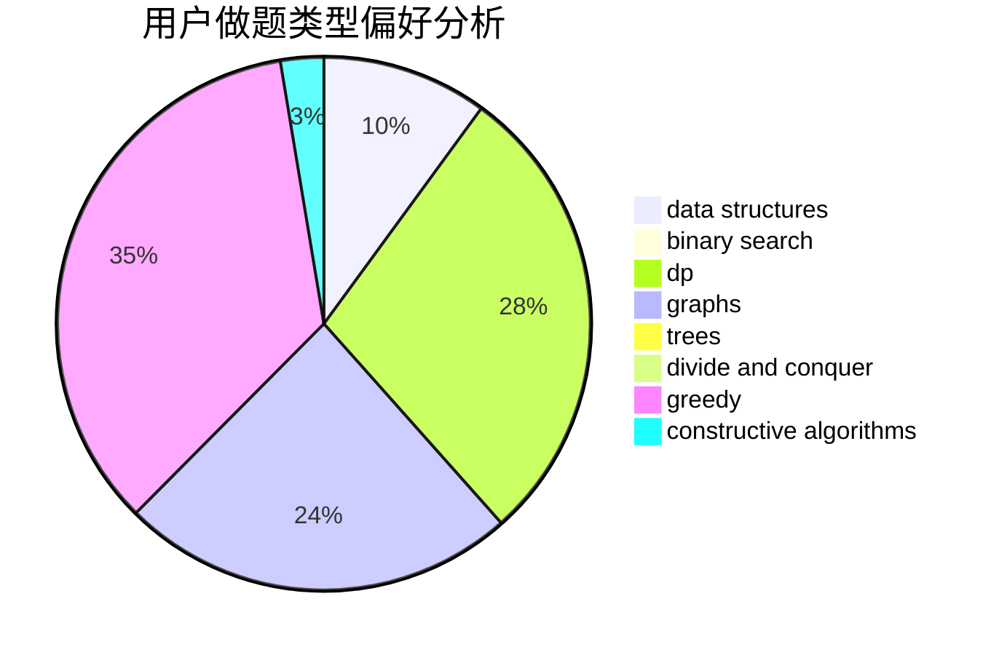
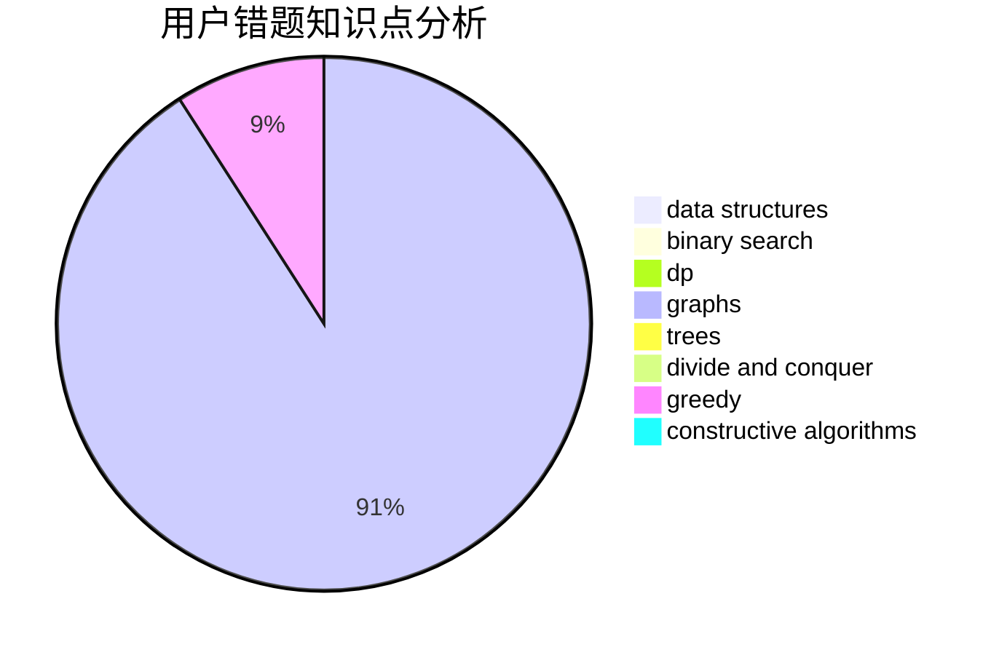

# Hezhu

<!-- tabs:start -->

#### **用户提交结果分析**

#### **用户做题类型偏好分析**

#### **用户错题知识点分析**

<!-- tabs:end -->
# 推荐题目
[893E](https://codeforces.com/contest/893/problem/E)		combinatorics,
                        dp,
                        math,
                        number theory		  
[1238G](https://codeforces.com/contest/1238/problem/G)		data structures,
                        greedy,
                        sortings		  
[785D](https://codeforces.com/contest/785/problem/D)		combinatorics,
                        dp,
                        math,
                        number theory		  
[838C](https://codeforces.com/contest/838/problem/C)		dp,
                        games		  
[280A](https://codeforces.com/contest/280/problem/A)		geometry		  
[1398F](https://codeforces.com/contest/1398/problem/F)		binary search,
                        data structures,
                        dp,
                        greedy,
                        two pointers		  
[622F](https://codeforces.com/contest/622/problem/F)		math		  
[1064A](https://codeforces.com/contest/1064/problem/A)		brute force,
                        geometry,
                        math		  
[860E](https://codeforces.com/contest/860/problem/E)		data structures,
                        dfs and similar,
                        trees		  
[223B](https://codeforces.com/contest/223/problem/B)		data structures,
                        dp,
                        strings		  
