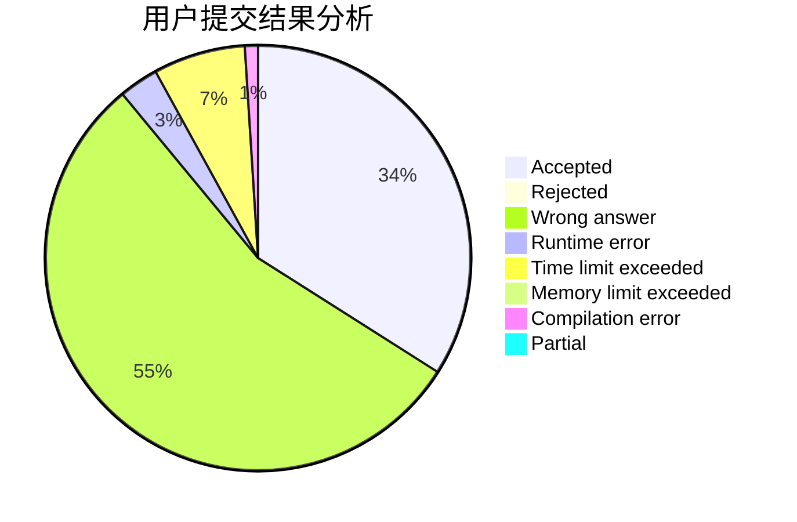
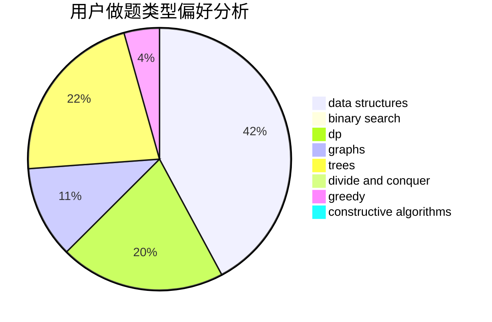
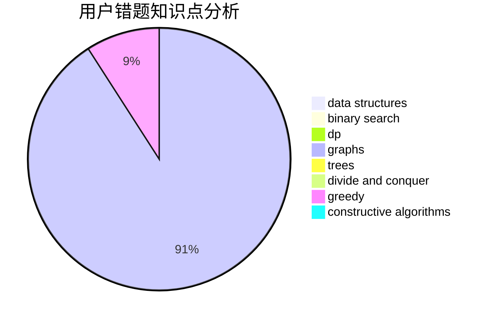

# Hezhu

<!-- tabs:start -->

#### **用户提交结果分析**

#### **用户做题类型偏好分析**

#### **用户错题知识点分析**

<!-- tabs:end -->
# 推荐题目
[872C](https://codeforces.com/contest/872/problem/C)		dsu,graphs,sortings,trees		  
[1230C](https://codeforces.com/contest/1230/problem/C)		dsu,graphs,sortings,trees		  
[766B](https://codeforces.com/contest/766/problem/B)		constructive algorithms,
                        geometry,
                        greedy,
                        math,
                        number theory,
                        sortings		  
[818D](https://codeforces.com/contest/818/problem/D)		data structures,
                        implementation		  
[263E](https://codeforces.com/contest/263/problem/E)		brute force,
                        data structures,
                        dp		  
[1389C](https://codeforces.com/contest/1389/problem/C)		brute force,
                        dp,
                        greedy,
                        two pointers		  
[604C](https://codeforces.com/contest/604/problem/C)		dsu,graphs,sortings,trees		  
[1063D](https://codeforces.com/contest/1063/problem/D)		brute force,
                        math		  
[842A](https://codeforces.com/contest/842/problem/A)		brute force,
                        two pointers		  
[19D](https://codeforces.com/contest/19/problem/D)		data structures		  
