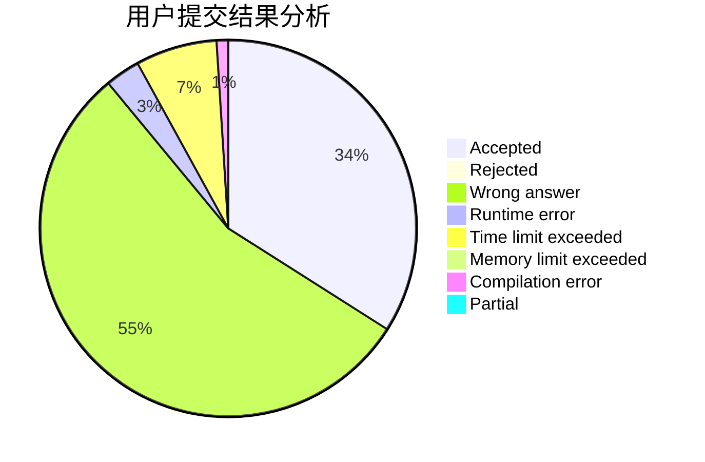
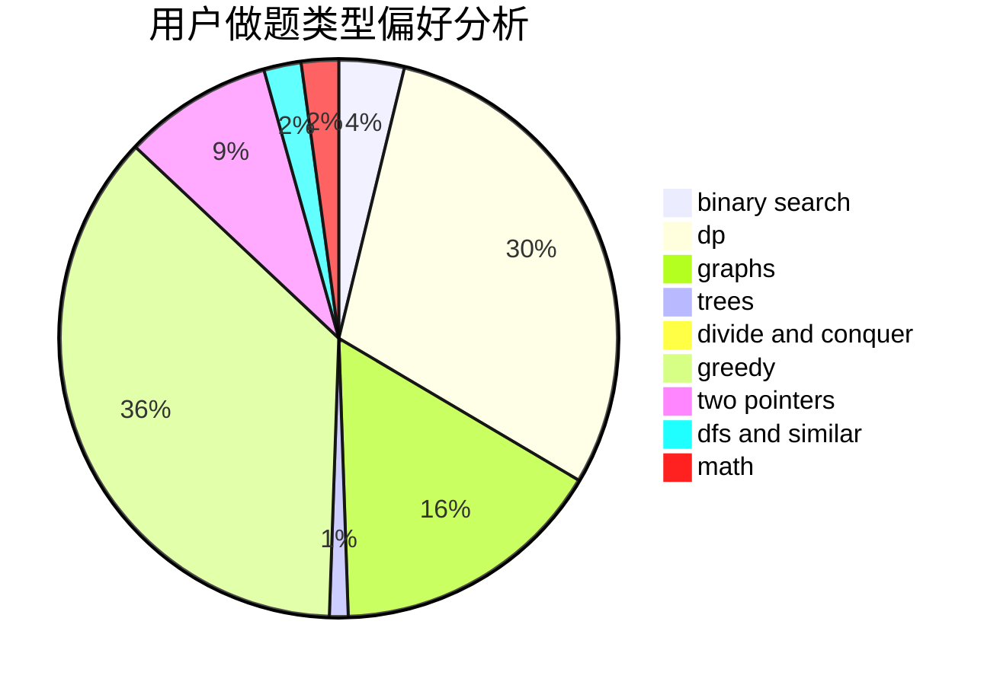

# Hezhu

<!-- tabs:start -->

#### **用户提交结果分析**

#### **用户做题类型偏好分析**

<!-- tabs:end -->
# 推荐题目
[893E](https://codeforces.com/contest/893/problem/E)
[1238G](https://codeforces.com/contest/1238/problem/G)
[785D](https://codeforces.com/contest/785/problem/D)
[838C](https://codeforces.com/contest/838/problem/C)
[280A](https://codeforces.com/contest/280/problem/A)
[1398F](https://codeforces.com/contest/1398/problem/F)
[622F](https://codeforces.com/contest/622/problem/F)
[1064A](https://codeforces.com/contest/1064/problem/A)
[860E](https://codeforces.com/contest/860/problem/E)
[223B](https://codeforces.com/contest/223/problem/B)
