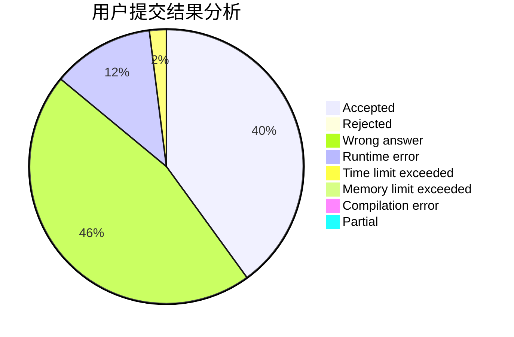
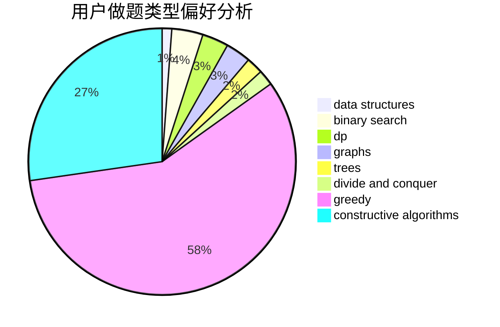

# HideBeyondYou

<!-- tabs:start -->

#### **用户提交结果分析**

#### **用户做题类型偏好分析**

#### **用户错题知识点分析**

<!-- tabs:end -->
# 推荐题目
[1218C](https://codeforces.com/contest/1218/problem/C)		dp		  
[301D](https://codeforces.com/contest/301/problem/D)		data structures		  
[253A](https://codeforces.com/contest/253/problem/A)		greedy		  
[1119G](https://codeforces.com/contest/1119/problem/G)		constructive algorithms,
                        implementation		  
[1051A](https://codeforces.com/contest/1051/problem/A)		greedy,
                        implementation,
                        strings		  
[1216A](https://codeforces.com/contest/1216/problem/A)		strings		  
[474F](https://codeforces.com/contest/474/problem/F)		data structures,
                        math,
                        number theory		  
[842C](https://codeforces.com/contest/842/problem/C)		dfs and similar,
                        graphs,
                        math,
                        number theory,
                        trees		  
[81C](https://codeforces.com/contest/81/problem/C)		greedy,
                        math,
                        sortings		  
[1027F](https://codeforces.com/contest/1027/problem/F)		binary search,
                        dfs and similar,
                        dsu,
                        graph matchings,
                        graphs		  
