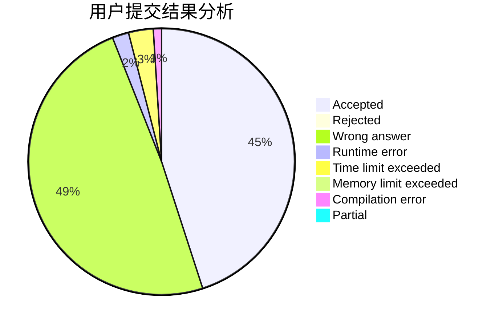
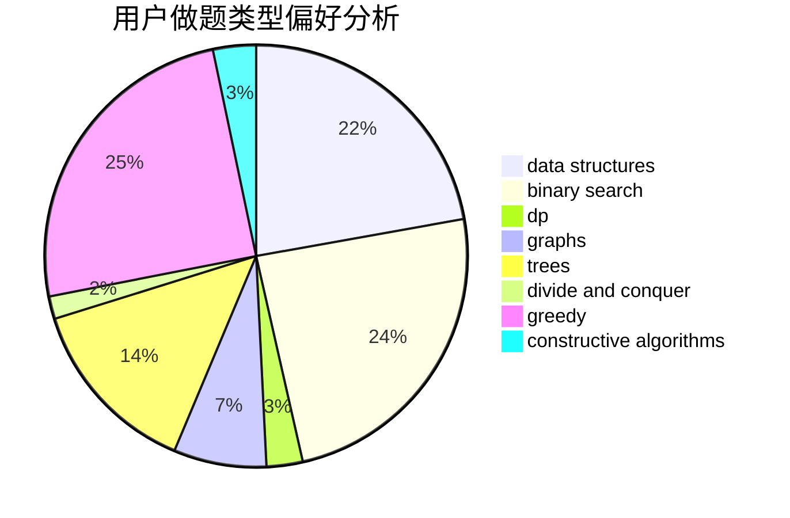
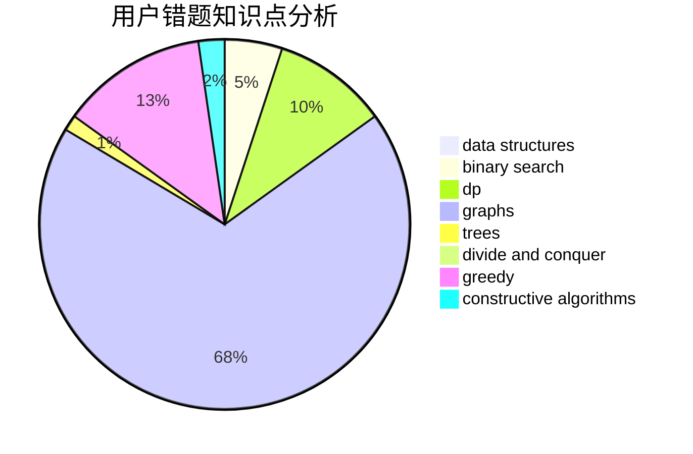

# HighLights
<!-- tabs:start -->
#### **用户提交结果分析**

#### **用户做题类型偏好分析**

#### **用户错题知识点分析**

<!-- tabs:end -->
# 推荐题目
[Build From Suffixes](http://codeforces.com/problemset/problem/1488/H)		*special problem,
                        combinatorics,
                        data structures		  
[Long Colorful Strip](http://codeforces.com/problemset/problem/1178/F2)		dp		  
[Ciel and Robot](http://codeforces.com/problemset/problem/321/A)		binary search,
                        implementation,
                        math		  
[Interactive LowerBound](http://codeforces.com/problemset/problem/843/B)		brute force,
                        interactive,
                        probabilities		  
[Colorful Points](http://codeforces.com/problemset/problem/909/D)		data structures,
                        greedy,
                        implementation		  
[Sereja and Table](http://codeforces.com/problemset/problem/425/B)		bitmasks,
                        greedy		  
[Ivan and Powers of Two](http://codeforces.com/problemset/problem/305/C)		greedy,
                        implementation		  
[Nuts](http://codeforces.com/problemset/problem/402/A)		greedy,
                        math		  
[EKG](http://codeforces.com/problemset/problem/316/B2)		dfs and similar,
                        dp		  
[Vanya and Triangles](http://codeforces.com/problemset/problem/552/D)		brute force,
                        combinatorics,
                        data structures,
                        geometry,
                        math,
                        sortings		  
<!-- tabs:start -->
#### **data structures**
[Build From Suffixes](http://codeforces.com/problemset/problem/1488/H)		*special problem,
                        combinatorics,
                        data structures		  
[Colorful Points](http://codeforces.com/problemset/problem/909/D)		data structures,
                        greedy,
                        implementation		  
[Vanya and Triangles](http://codeforces.com/problemset/problem/552/D)		brute force,
                        combinatorics,
                        data structures,
                        geometry,
                        math,
                        sortings		  
[Sereja and Suffixes](http://codeforces.com/problemset/problem/368/B)		data structures,
                        dp		  
[Function](http://codeforces.com/problemset/problem/455/E)		data structures		  
[Gardener Alex](http://codeforces.com/problemset/problem/1220/F)		binary search,
                        data structures		  
[Little Elephant and Array](http://codeforces.com/problemset/problem/220/B)		constructive algorithms,
                        data structures		  
[Babaei and Birthday Cake](http://codeforces.com/problemset/problem/629/D)		data structures,
                        dp		  
[Power Sockets](http://codeforces.com/problemset/problem/1469/F)		binary search,
                        data structures,
                        greedy		  
[Longest Regular Bracket Sequence](http://codeforces.com/problemset/problem/5/C)		constructive algorithms,
                        data structures,
                        dp,
                        greedy,
                        sortings,
                        strings		  
#### **binary search**
[Ciel and Robot](http://codeforces.com/problemset/problem/321/A)		binary search,
                        implementation,
                        math		  
[Need For Brake](http://codeforces.com/problemset/problem/73/B)		binary search,
                        greedy,
                        sortings		  
[Sereja and Periods](http://codeforces.com/problemset/problem/314/B)		binary search,
                        dfs and similar,
                        strings		  
[Gardener Alex](http://codeforces.com/problemset/problem/1220/F)		binary search,
                        data structures		  
[Bear and Tower of Cubes](http://codeforces.com/problemset/problem/679/B)		binary search,
                        dp,
                        greedy		  
[Nikita and game](http://codeforces.com/problemset/problem/842/E)		binary search,
                        dfs and similar,
                        divide and conquer,
                        graphs,
                        trees		  
[Polycarp's problems](http://codeforces.com/problemset/problem/727/F)		binary search,
                        dp,
                        greedy		  
[Power Sockets](http://codeforces.com/problemset/problem/1469/F)		binary search,
                        data structures,
                        greedy		  
[Eastern Exhibition](http://codeforces.com/problemset/problem/1486/B)		binary search,
                        geometry,
                        shortest paths,
                        sortings		  
[Welfare State](https://codeforces.com/contest/1199/problem/D)		binary search,
                        brute force,
                        data structures,
                        sortings		  
#### **dp**
[Long Colorful Strip](http://codeforces.com/problemset/problem/1178/F2)		dp		  
[EKG](http://codeforces.com/problemset/problem/316/B2)		dfs and similar,
                        dp		  
[Sereja and Suffixes](http://codeforces.com/problemset/problem/368/B)		data structures,
                        dp		  
[Vowels](http://codeforces.com/problemset/problem/383/E)		combinatorics,
                        divide and conquer,
                        dp		  
[Coprocessor](http://codeforces.com/problemset/problem/909/E)		dfs and similar,
                        dp,
                        graphs,
                        greedy		  
[Antichain](http://codeforces.com/problemset/problem/353/E)		dp,
                        graph matchings,
                        greedy		  
[Fox And Jumping](http://codeforces.com/problemset/problem/510/D)		bitmasks,
                        brute force,
                        dp,
                        math		  
[Bear and Tower of Cubes](http://codeforces.com/problemset/problem/679/B)		binary search,
                        dp,
                        greedy		  
[Google Code Jam](http://codeforces.com/problemset/problem/277/D)		dp,
                        probabilities		  
[Babaei and Birthday Cake](http://codeforces.com/problemset/problem/629/D)		data structures,
                        dp		  
#### **graph**
[James and the Chase](http://codeforces.com/problemset/problem/1361/E)		dfs and similar,
                        graphs,
                        probabilities,
                        trees		  
[Coprocessor](http://codeforces.com/problemset/problem/909/E)		dfs and similar,
                        dp,
                        graphs,
                        greedy		  
[Antichain](http://codeforces.com/problemset/problem/353/E)		dp,
                        graph matchings,
                        greedy		  
[Nikita and game](http://codeforces.com/problemset/problem/842/E)		binary search,
                        dfs and similar,
                        divide and conquer,
                        graphs,
                        trees		  
[Minimum Ties](http://codeforces.com/problemset/problem/1487/C)		brute force,
                        constructive algorithms,
                        dfs and similar,
                        graphs,
                        greedy,
                        implementation,
                        math		  
[Chef Monocarp](http://codeforces.com/problemset/problem/1437/C)		dp,
                        flows,
                        graph matchings,
                        greedy,
                        math,
                        sortings		  
[Strange Housing](http://codeforces.com/problemset/problem/1470/D)		constructive algorithms,
                        dfs and similar,
                        graph matchings,
                        graphs,
                        greedy		  
[Longest Simple Cycle](http://codeforces.com/problemset/problem/1476/C)		dp,
                        graphs,
                        greedy		  
[Shortest and Longest LIS](http://codeforces.com/problemset/problem/1304/D)		constructive algorithms,
                        graphs,
                        greedy,
                        two pointers		  
[Ball in Berland](http://codeforces.com/problemset/problem/1475/C)		combinatorics,
                        graphs,
                        math		  
#### **trees**
[James and the Chase](http://codeforces.com/problemset/problem/1361/E)		dfs and similar,
                        graphs,
                        probabilities,
                        trees		  
[Nikita and game](http://codeforces.com/problemset/problem/842/E)		binary search,
                        dfs and similar,
                        divide and conquer,
                        graphs,
                        trees		  
[Maximum Distributed Tree](http://codeforces.com/problemset/problem/1401/D)		dfs and similar,
                        dp,
                        greedy,
                        implementation,
                        math,
                        number theory,
                        sortings,
                        trees		  
[Odd Mineral Resource](http://codeforces.com/problemset/problem/1479/D)		binary search,
                        bitmasks,
                        brute force,
                        data structures,
                        probabilities,
                        trees		  
[Yet Another Card Deck](http://codeforces.com/problemset/problem/1511/C)		brute force,
                        data structures,
                        implementation,
                        trees		  
[Diameter Cuts](http://codeforces.com/problemset/problem/1499/F)		combinatorics,
                        dfs and similar,
                        dp,
                        trees		  
[Fib-tree](http://codeforces.com/problemset/problem/1491/E)		brute force,
                        dfs and similar,
                        divide and conquer,
                        number theory,
                        trees		  
[13th Labour of Heracles](http://codeforces.com/problemset/problem/1466/D)		data structures,
                        greedy,
                        sortings,
                        trees		  
[BFS Trees](http://codeforces.com/problemset/problem/1495/D)		combinatorics,
                        dfs and similar,
                        graphs,
                        math,
                        shortest paths,
                        trees		  
[Sum of Prefix Sums](http://codeforces.com/problemset/problem/1303/G)		data structures,
                        divide and conquer,
                        geometry,
                        trees		  
#### **divide and conquer**
[Vowels](http://codeforces.com/problemset/problem/383/E)		combinatorics,
                        divide and conquer,
                        dp		  
[Nikita and game](http://codeforces.com/problemset/problem/842/E)		binary search,
                        dfs and similar,
                        divide and conquer,
                        graphs,
                        trees		  
[Divide and Summarize](http://codeforces.com/problemset/problem/1461/D)		binary search,
                        brute force,
                        data structures,
                        divide and conquer,
                        implementation,
                        sortings		  
[Song of the Sirens](http://codeforces.com/problemset/problem/1466/G)		combinatorics,
                        divide and conquer,
                        hashing,
                        math,
                        string suffix structures,
                        strings		  
[Permutation Transformation](http://codeforces.com/problemset/problem/1490/D)		dfs and similar,
                        divide and conquer,
                        implementation		  
[Skyline Photo](https://codeforces.com/contest/1483/problem/C)		data structures,
                        divide and conquer,
                        dp		  
[Fib-tree](http://codeforces.com/problemset/problem/1491/E)		brute force,
                        dfs and similar,
                        divide and conquer,
                        number theory,
                        trees		  
[Sum of Prefix Sums](http://codeforces.com/problemset/problem/1303/G)		data structures,
                        divide and conquer,
                        geometry,
                        trees		  
[Dogeforces](http://codeforces.com/problemset/problem/1494/D)		constructive algorithms,
                        data structures,
                        dfs and similar,
                        divide and conquer,
                        dsu,
                        greedy,
                        sortings,
                        trees		  
[Skyline Photo](http://codeforces.com/problemset/problem/1482/E)		data structures,
                        divide and conquer,
                        dp		  
#### **greedy**
[Colorful Points](http://codeforces.com/problemset/problem/909/D)		data structures,
                        greedy,
                        implementation		  
[Sereja and Table](http://codeforces.com/problemset/problem/425/B)		bitmasks,
                        greedy		  
[Ivan and Powers of Two](http://codeforces.com/problemset/problem/305/C)		greedy,
                        implementation		  
[Nuts](http://codeforces.com/problemset/problem/402/A)		greedy,
                        math		  
[Coprocessor](http://codeforces.com/problemset/problem/909/E)		dfs and similar,
                        dp,
                        graphs,
                        greedy		  
[Antichain](http://codeforces.com/problemset/problem/353/E)		dp,
                        graph matchings,
                        greedy		  
[Recover the String](https://codeforces.com/contest/709/problem/D)		constructive algorithms,
                        greedy,
                        implementation,
                        math		  
[Need For Brake](http://codeforces.com/problemset/problem/73/B)		binary search,
                        greedy,
                        sortings		  
[Bear and Tower of Cubes](http://codeforces.com/problemset/problem/679/B)		binary search,
                        dp,
                        greedy		  
[Chocolates](http://codeforces.com/problemset/problem/1139/B)		greedy,
                        implementation		  
#### **constructive algorithms**
[Recover the String](https://codeforces.com/contest/709/problem/D)		constructive algorithms,
                        greedy,
                        implementation,
                        math		  
[Tricky Interactor](http://codeforces.com/problemset/problem/1081/F)		constructive algorithms,
                        implementation,
                        interactive		  
[Little Elephant and Array](http://codeforces.com/problemset/problem/220/B)		constructive algorithms,
                        data structures		  
[GCD of Polynomials](http://codeforces.com/problemset/problem/901/B)		constructive algorithms,
                        math		  
[Longest Regular Bracket Sequence](http://codeforces.com/problemset/problem/5/C)		constructive algorithms,
                        data structures,
                        dp,
                        greedy,
                        sortings,
                        strings		  
[Nezzar and Board](http://codeforces.com/problemset/problem/1477/A)		constructive algorithms,
                        math,
                        number theory		  
[Anti-knapsack](http://codeforces.com/problemset/problem/1493/A)		constructive algorithms,
                        greedy		  
[Pairs](http://codeforces.com/problemset/problem/1463/D)		binary search,
                        constructive algorithms,
                        greedy,
                        two pointers		  
[XOR-gun](https://codeforces.com/contest/1456/problem/B)		bitmasks,
                        brute force,
                        constructive algorithms		  
[Genius's Gambit](http://codeforces.com/problemset/problem/1492/D)		bitmasks,
                        constructive algorithms,
                        greedy,
                        math		  
#### **sortings**
[Vanya and Triangles](http://codeforces.com/problemset/problem/552/D)		brute force,
                        combinatorics,
                        data structures,
                        geometry,
                        math,
                        sortings		  
[Need For Brake](http://codeforces.com/problemset/problem/73/B)		binary search,
                        greedy,
                        sortings		  
[Balanced Team](http://codeforces.com/problemset/problem/1133/C)		sortings,
                        two pointers		  
[Longest Regular Bracket Sequence](http://codeforces.com/problemset/problem/5/C)		constructive algorithms,
                        data structures,
                        dp,
                        greedy,
                        sortings,
                        strings		  
[Maximum Distributed Tree](http://codeforces.com/problemset/problem/1401/D)		dfs and similar,
                        dp,
                        greedy,
                        implementation,
                        math,
                        number theory,
                        sortings,
                        trees		  
[The Child and Set](http://codeforces.com/problemset/problem/437/B)		bitmasks,
                        greedy,
                        implementation,
                        sortings		  
[Eastern Exhibition](http://codeforces.com/problemset/problem/1486/B)		binary search,
                        geometry,
                        shortest paths,
                        sortings		  
[Welfare State](https://codeforces.com/contest/1199/problem/D)		binary search,
                        brute force,
                        data structures,
                        sortings		  
[Diamond Miner](https://codeforces.com/contest/1496/problem/C)		geometry,
                        greedy,
                        math,
                        sortings		  
[Diamond Miner](http://codeforces.com/problemset/problem/1495/A)		geometry,
                        greedy,
                        math,
                        sortings		  
<!-- tabs:end -->
