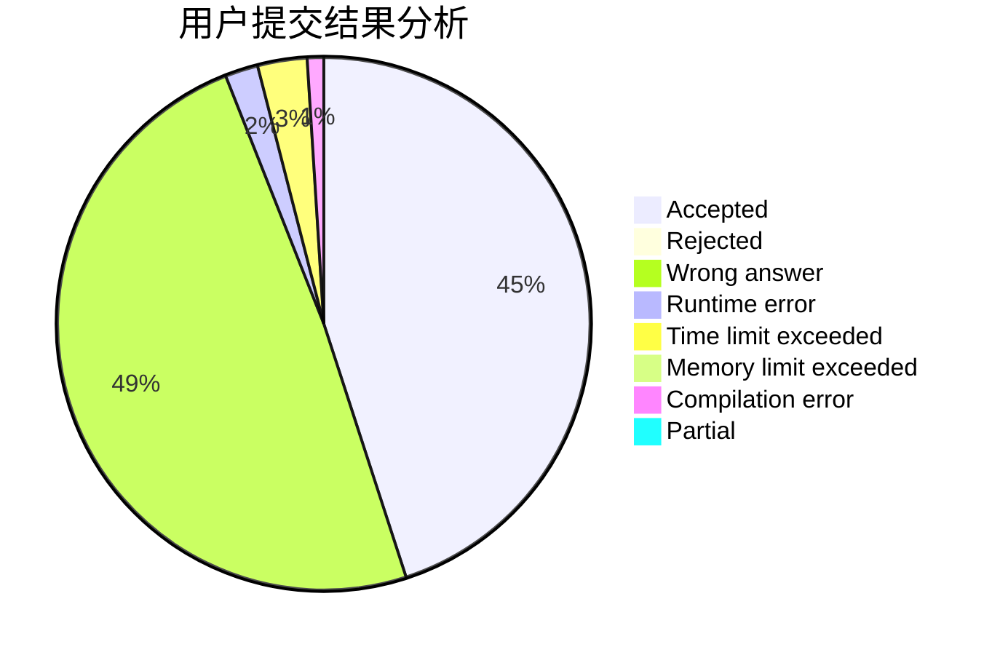
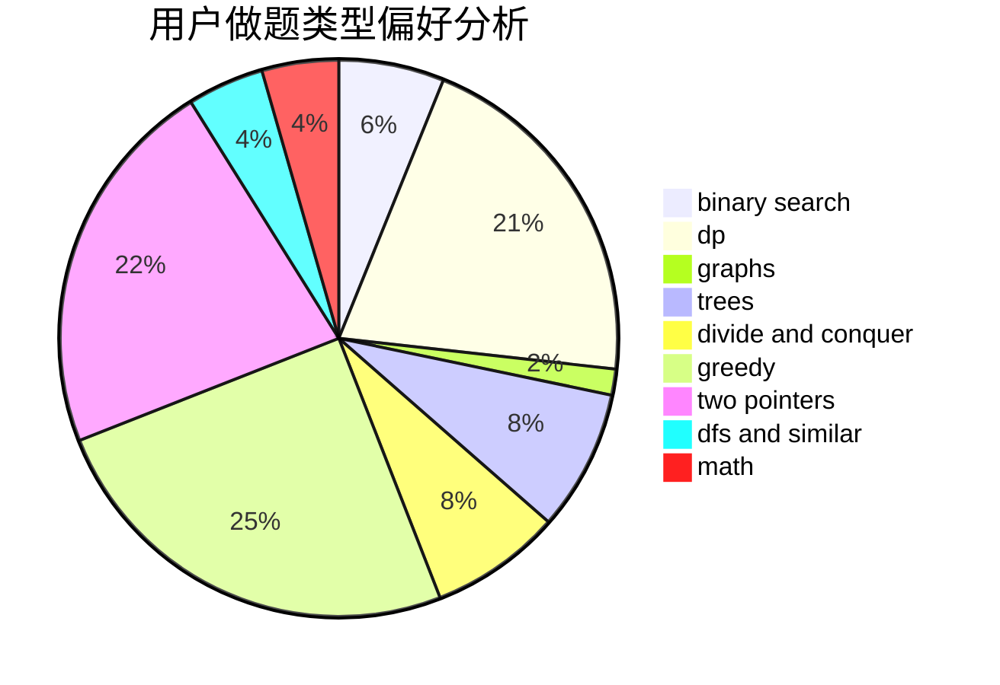

# HighLights

<!-- tabs:start -->

#### **用户提交结果分析**

#### **用户做题类型偏好分析**

<!-- tabs:end -->
# 推荐题目
[414E](https://codeforces.com/contest/414/problem/E)
[862D](https://codeforces.com/contest/862/problem/D)
[448D](https://codeforces.com/contest/448/problem/D)
[1411G](https://codeforces.com/contest/1411/problem/G)
[755G](https://codeforces.com/contest/755/problem/G)
[843B](https://codeforces.com/contest/843/problem/B)
[917E](https://codeforces.com/contest/917/problem/E)
[33D](https://codeforces.com/contest/33/problem/D)
[703A](https://codeforces.com/contest/703/problem/A)
[477A](https://codeforces.com/contest/477/problem/A)
