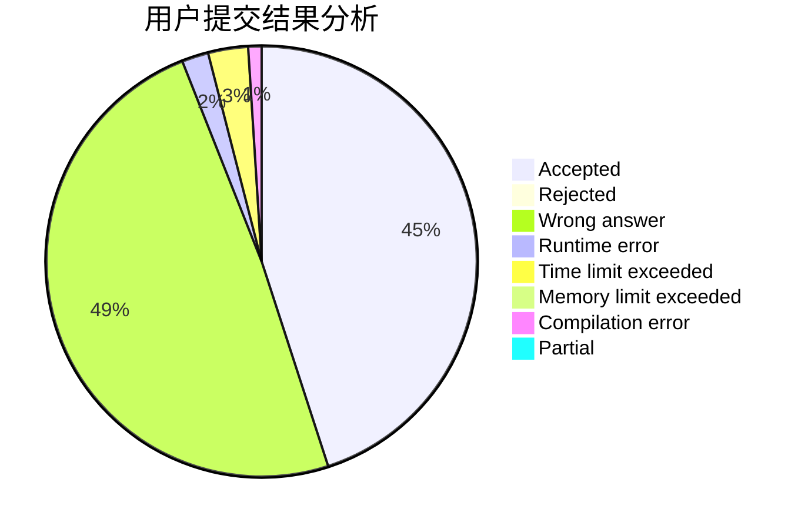
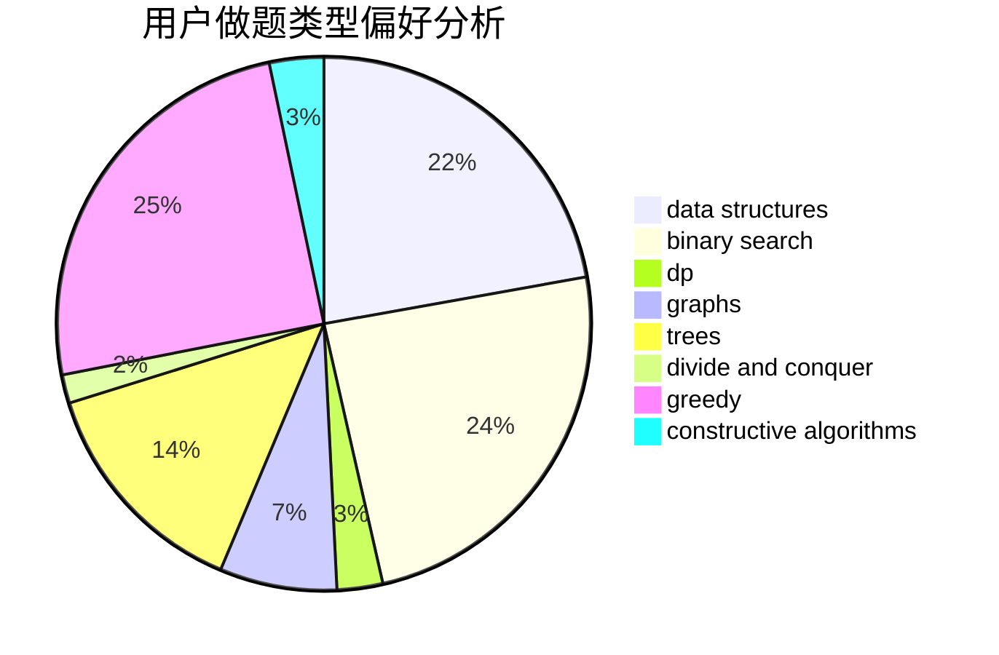
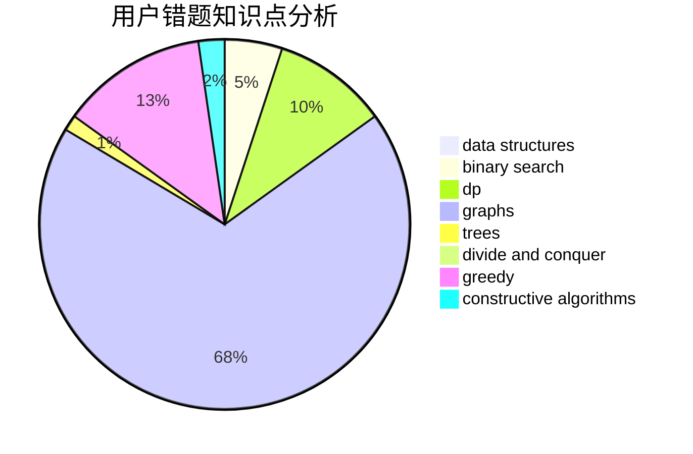

# HighLights

<!-- tabs:start -->

#### **用户提交结果分析**

#### **用户做题类型偏好分析**

#### **用户错题知识点分析**

<!-- tabs:end -->
# 推荐题目
[383E](https://codeforces.com/contest/383/problem/E)		combinatorics,
                        divide and conquer,
                        dp		  
[843B](https://codeforces.com/contest/843/problem/B)		brute force,
                        interactive,
                        probabilities		  
[425B](https://codeforces.com/contest/425/problem/B)		bitmasks,
                        greedy		  
[1401D](https://codeforces.com/contest/1401/problem/D)		dfs and similar,
                        dp,
                        greedy,
                        implementation,
                        math,
                        number theory,
                        sortings,
                        trees		  
[735A](https://codeforces.com/contest/735/problem/A)		implementation,
                        strings		  
[825B](https://codeforces.com/contest/825/problem/B)		brute force,
                        implementation		  
[901B](https://codeforces.com/contest/901/problem/B)		constructive algorithms,
                        math		  
[316B2](https://codeforces.com/contest/316B/problem/2)		dfs and similar,
                        dp		  
[679B](https://codeforces.com/contest/679/problem/B)		binary search,
                        dp,
                        greedy		  
[455E](https://codeforces.com/contest/455/problem/E)		data structures		  
